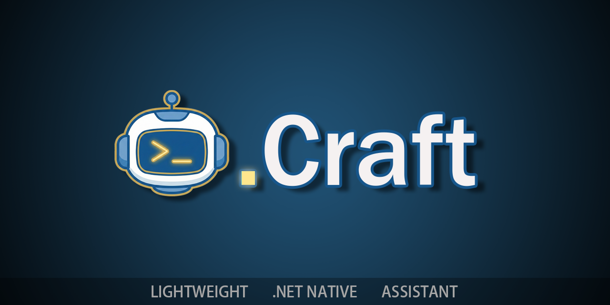
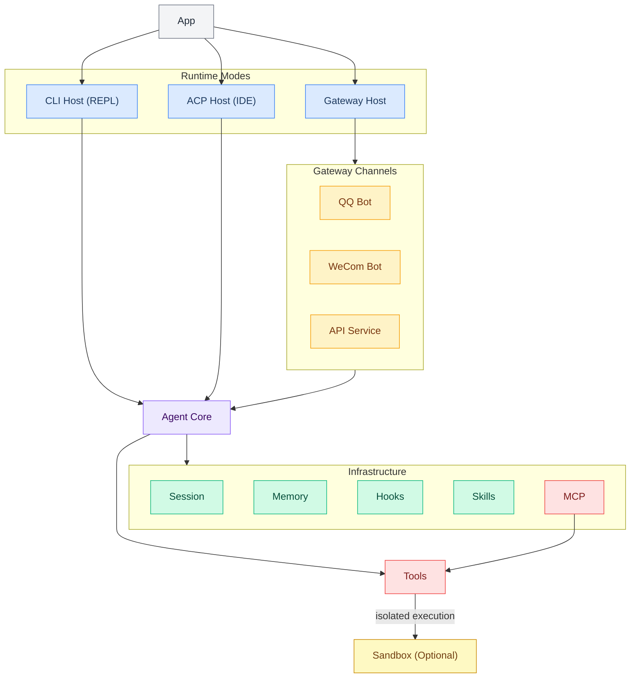

<div align="center">

[](https://deepwiki.com/DotCraftDev/DotCraft)

**[中文](./README_ZH.md) | English**

# DotCraft

**DotCraft** is a lightweight .NET assistant crafting your intelligent workspace across editors, CLI, and chat bots.



</div>

## ✨ Features

<table>
<tr>
<td width="33%" align="center"><b>🚀 Start Your Way</b><br/>Terminal, Gateway, or IDE — pick what fits you</td>
<td width="33%" align="center"><b>🔗 Seamless IDE Integration</b><br/>ACP-native support for JetBrains, Obsidian, Unity and more</td>
<td width="33%" align="center"><b>🔐 Secure & Controlled</b><br/>Workspace isolation + approval flow for sensitive operations</td>
</tr>
</table>

- 🛠️ **Tool Capabilities**: File read/write (workspace-scoped), controlled Shell commands, Web scraping, optional SubAgent delegation
- 🐳 **Sandbox Isolation**: Run Shell and File tools inside [OpenSandbox](https://github.com/alibaba/OpenSandbox) containers — the container boundary is the security boundary, no regex guards or path blacklists needed
- 🔌 **MCP Integration**: Connect external tool services via [Model Context Protocol](https://modelcontextprotocol.io/)
- 🖥️ **ACP Editor Integration**: Works as a native coding agent inside any [ACP](https://agentclientprotocol.com/)-compatible editor (JetBrains IDEs, Obsidian, and more) via stdio JSON-RPC — no cloud dependency, no lock-in
- 🎮 **Multiple Runtime Modes**: Local REPL, QQ Bot (OneBot V11), WeCom Bot, API Service (OpenAI-compatible), ACP Editor Integration, **Gateway multi-channel concurrent mode**
- 🎯 **Unity Integration**: Built-in Unity Editor extension with AI-powered scene manipulation, asset management, and console monitoring via ACP protocol
- 📊 **Dashboard**: Built-in Web UI for real-time monitoring of token usage, session history, and tool call traces; includes a **Settings page** for visually editing all configuration options directly in the browser
- 🧩 **Skills System**: Dynamically load Skills from workspace
- 🔗 **Hooks**: Lifecycle event hooks that run Shell commands at key agent execution points (pre/post tool use, session start, prompt filtering, etc.) — inspired by Claude Code and Cursor
- 📢 **Notification Push**: WeCom group bot and Webhook notifications

## 🏗️ Architecture



## 🧬 Design

### Session Isolation Between Channels

Each channel derives its own session ID so conversations never collide:

- **QQ**: `qq_{groupId}` (group chat) or `qq_{userId}` (private chat)
- **WeCom**: `wecom_{chatId}_{userId}`
- **API**: resolved from `X-Session-Key` header, `user` field in body, or content fingerprint
- **ACP**: `acp_{sessionId}` (managed by the editor)

`SessionGate` provides per-session mutual exclusion — concurrent requests to the same session are serialized, while different sessions run fully in parallel. `MaxSessionQueueSize` controls how many requests can queue per session before the oldest is evicted.

### Shared Workspace & Memory

All channels running in Gateway mode share the **same workspace**:

- **MemoryStore**: `memory/MEMORY.md` (structured long-term facts, always in context) + `memory/HISTORY.md` (append-only grep-searchable event log)
- **File tools, Shell commands, Skills, and Commands** all operate within the same workspace directory
- Knowledge learned through one channel (e.g., a QQ group conversation) is accessible from any other channel (e.g., WeCom)

### Multi-Workspace Support

DotCraft uses a **two-level configuration** model:

| Level | Path | Purpose |
|-------|------|---------|
| Global | `~/.craft/config.json` | API keys, default model, shared settings |
| Workspace | `<workspace>/.craft/config.json` | Per-project overrides, channel config, MCP servers |

Each workspace is a fully independent working directory with its own `.craft/` folder containing sessions, memory, skills, commands, and configuration. Run multiple DotCraft instances pointed at different workspace directories for complete isolation.

## 🚀 Quick Start

### Prerequisites

- [.NET 10 SDK](https://dotnet.microsoft.com/download) (only required for building)
- Supported LLM API Key (OpenAI-compatible format)

### Build & Install

```bash
# Build the Release package (all modules included by default)
build.bat

# Configure the path to environment variables (optional)
cd Release/DotCraft
powershell -File install_to_path.ps1
```

You can exclude optional modules (QQ, WeCom, Unity) to produce a lighter build:

```bash
# Exclude specific modules
build.bat --no-qq --no-unity

# Or with dotnet directly
dotnet publish src/DotCraft.App/DotCraft.App.csproj -c Release ^
  -p:IncludeModuleQQ=false -p:IncludeModuleUnity=false
```

| Flag | MSBuild Property | Module |
|------|-----------------|--------|
| `--no-qq` | `IncludeModuleQQ=false` | QQ Bot channel |
| `--no-wecom` | `IncludeModuleWeCom=false` | WeCom channel |
| `--no-unity` | `IncludeModuleUnity=false` | Unity Editor extension |

### Configuration

DotCraft uses a two-level configuration: **Global config** (`~/.craft/config.json`) and **Workspace config** (`<workspace>/.craft/config.json`).

For first-time use, create the global config file:

```json
{
    "ApiKey": "sk-your-api-key",
    "Model": "gpt-4o-mini",
    "EndPoint": "https://api.openai.com/v1"
}
```

> 💡 Storing API Key in global config prevents it from leaking into workspace Git repositories.

> 🚀 You can also edit all configuration visually through the **Dashboard Settings page** (`http://127.0.0.1:8080/dashboard`, open the Settings tab in the left nav) — no need to edit JSON by hand. Save your changes and restart DotCraft to apply them. See the [DashBoard Guide](./docs/en/dash_board_guide.md) for details.

### Launch

```bash
# Enter the workspace
cd Workspace

# Start DotCraft (CLI mode)
dotcraft
```

### Enable Runtime Modes

| Mode | Enable Condition | Usage |
|------|------------------|-------|
| CLI Mode | Default | Local REPL interaction |
| API Mode | `Api.Enabled = true` | OpenAI-compatible HTTP service |
| QQ Bot | `QQBot.Enabled = true` | OneBot V11 protocol bot |
| WeCom Bot | `WeComBot.Enabled = true` | WeChat Work bot |
| ACP Mode | `Acp.Enabled = true` | Editor/IDE integration ([ACP](https://agentclientprotocol.com/)) |

### Sandbox Isolation (Optional)

DotCraft supports running Shell and File tools inside isolated [OpenSandbox](https://github.com/alibaba/OpenSandbox) containers. When enabled, the container boundary becomes the security boundary — commands execute in a disposable Linux environment instead of on the host machine.

**Prerequisites**: Python 3.10+, Docker

```bash
# Install the OpenSandbox server
uv pip install opensandbox-server --system

# Generate the base config
opensandbox-server init-config ~/.sandbox.toml --example docker
```

Enable sandbox in your workspace config (`.craft/config.json`):

```json
{
  "tools": {
    "Sandbox": {
      "Enabled": true,
      "Domain": "localhost:5880",
      "NetworkPolicy": "allow"
    }
  }
}
```

Start the sandbox server before launching DotCraft:

```bash
# From the workspace directory
.\start-sandbox.ps1
```

The startup script reads the port from `config.json`, pre-pulls Docker images, and generates a local `sandbox.toml` automatically. See the [Sandbox Configuration Guide](./docs/en/config_guide.md) for advanced options (network policies, resource limits, idle timeouts, workspace sync).

### Customizing with Bootstrap Files

Place any of these files in `.craft/` to inject instructions into the agent's system prompt:

| File | Purpose |
|------|---------|
| `AGENTS.md` | Project-specific agent behavior and conventions |
| `SOUL.md` | Personality and tone guidelines |
| `USER.md` | Information about the user |
| `TOOLS.md` | Tool usage instructions and preferences |
| `IDENTITY.md` | Custom identity override |

**Example** — `.craft/AGENTS.md`:

```markdown
# Project Conventions

- This is a C# .NET 10 project using minimal APIs
- Always run `dotnet test` before committing
- Follow the existing code style: file-scoped namespaces, primary constructors
- Use Chinese for user-facing messages, English for code comments
```

### Custom Command Example

Custom commands are markdown files in `.craft/commands/`. Users invoke them with `/command-name [args]`.

**Example**:

```markdown
---
description: Test subagent functionality by creating, listing, and verifying a file
---

Please test the subagent feature. Spawn a subagent to complete the following tasks:
1. Create a test file `test_subagent_result.txt` in the workspace with content "Hello from Subagent! Time: " followed by the current time
2. List the workspace root directory files to confirm the file was created
3. Read the created file and verify the content is correct

Report the subagent execution result when done.

$ARGUMENTS
```

Invoke it with: `/test-subagent`

Placeholders: `$ARGUMENTS` expands to the full argument string, `$1`, `$2`, etc. expand to positional arguments.

### Unity Editor Integration

DotCraft provides seamless integration with the Unity Editor through the Agent Client Protocol (ACP). The integration consists of two components:

1. **Server-side Module** (`DotCraft.Unity`): Provides 4 read-only tools for understanding Unity project state
2. **Unity Client Package** (`com.dotcraft.unityclient`): Unity Editor extension with in-editor chat interface

#### Installing the Unity Client Package

**Prerequisites**: Unity 2022.3 or later, [NuGetForUnity](https://github.com/GlitchEnzo/NuGetForUnity) with `System.Text.Json 9.0.10`

Install the package via Unity Package Manager:

**Option A — Git URL**:

In **Window → Package Manager**, click **+ → Add package from git URL** and enter:

```
https://github.com/DotCraftDev/DotCraft.git?path=src/DotCraft.UnityClient/Packages/com.dotcraft.unityclient
```

**Option B — Local path**:

Clone the repository and add from disk: **+ → Add package from disk**, select `src/DotCraft.UnityClient/Packages/com.dotcraft.unityclient/package.json`.

#### Quick Start

1. Open **Tools → DotCraft Assistant** in Unity
2. Click **Connect** to launch DotCraft and establish an ACP session
3. Start chatting with the AI assistant

#### Features

- **Scene Tools**: Query scene hierarchy, get current selection
- **Console Tools**: Retrieve Unity Console log entries
- **Project Tools**: Get Unity version, project name, and packages
- **Permission Approval**: Interactive approval panel for high-risk operations
- **Asset Attachment**: Drag Unity assets to attach them to messages
- **Auto Reconnect**: Automatically reconnects after Domain Reload

For full Unity manipulation capabilities (create, modify, delete GameObjects, etc.), install [SkillsForUnity](https://github.com/BestyAIGC/Unity-Skills) or [unity-mcp](https://github.com/CoplayDev/unity-mcp).

For detailed configuration and troubleshooting, see the [Unity Integration Guide](./docs/en/unity_guide.md).

## 📚 Documentation

| Document | Description |
|----------|-------------|
| [Configuration Guide](./docs/en/config_guide.md) | Tools, security, blacklists, approval, MCP, Gateway |
| [API Mode Guide](./docs/en/api_guide.md) | OpenAI-compatible API, tool filtering, SDK examples |
| [QQ Bot Guide](./docs/en/qq_bot_guide.md) | NapCat / permissions / approval |
| [WeCom Guide](./docs/en/wecom_guide.md) | WeCom push notifications / bot mode |
| [ACP Mode Guide](./docs/en/acp_guide.md) | Agent Client Protocol editor/IDE integration (JetBrains, Obsidian, and more) |
| [Unity Integration Guide](./docs/en/unity_guide.md) | Unity Editor extension with AI-powered scene and asset tools |
| [Hooks Guide](./docs/en/hooks_guide.md) | Lifecycle event hooks, Shell command extensions, security guards |
| [DashBoard Guide](./docs/en/dash_board_guide.md) | Built-in Web debugging UI, Trace data viewer |
| [Documentation Index](./docs/en/index.md) | Full documentation navigation |

## 🤝 Contributing

We welcome contributions! Whether you're fixing bugs, adding features, or improving documentation, your help is appreciated.

**Getting Started**: See [CONTRIBUTING.md](./CONTRIBUTING.md) for development guidelines covering:
- C# code style and conventions
- Architecture patterns and module development
- Bilingual documentation requirements

You can contribute with or without AI assistance - the guidelines support both approaches.

## 🙏 Credits

Inspired by nanobot and built on the Microsoft Agent Framework.

Thanks to [Devin AI](https://devin.ai/) for providing free ACU credits to facilitate development.

- [HKUDS/nanobot](https://github.com/HKUDS/nanobot)
- [microsoft/agent-framework](https://github.com/microsoft/agent-framework)
- [alibaba/OpenSandbox](https://github.com/alibaba/OpenSandbox)
- [NapNeko/NapCatQQ](https://github.com/NapNeko/NapCatQQ)
- [spectreconsole/spectre.console](https://github.com/spectreconsole/spectre.console)
- [modelcontextprotocol/csharp-sdk](https://github.com/modelcontextprotocol/csharp-sdk)
- [agentclientprotocol/agent-client-protocol](https://github.com/agentclientprotocol/agent-client-protocol)

## 📄 License

Apache License 2.0
