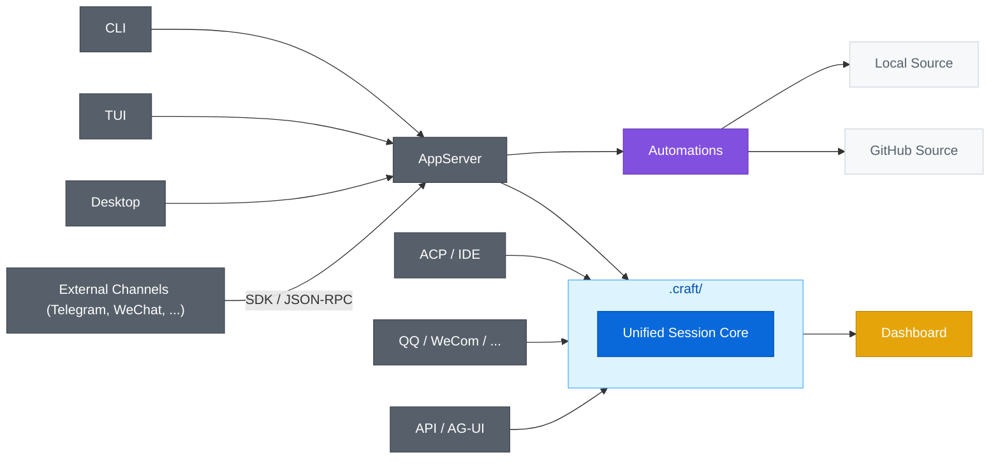

<div align="center">

[](https://deepwiki.com/DotCraftDev/DotCraft)
[](LICENSE)

**[中文](./README_ZH.md) | English**

# DotCraft

**Craft around your project.**

An Agent Harness crafting a persistent AI workspace around your project.

From Desktop, CLI, editors, chatbots, APIs — everywhere you work.


</div>

## ✨ Highlights

<table>
<tr>
<td width="33%" align="center"><b>📁 Project-First</b><br/>Sessions, memory, skills, and config live under <code>.craft/</code> and follow the project</td>
<td width="33%" align="center"><b>⚡ Unified Session Core</b><br/>Desktop, CLI, editors and bots share one session model</td>
<td width="33%" align="center"><b>🛡️ Observable</b><br/>Built-in approvals, traces, Dashboard, and optional sandbox isolation</td>
</tr>
</table>


- ⚡ **Unified Session Core**: unified execution path across all channels
- 💻 **Rich Client Matrix**: C# CLI, Rust TUI, Electron Desktop — full coverage from terminal to desktop
- 🛠️ **Modern Agent Infrastructure**: File, Shell, Web, SubAgent tools with full MCP, Skills, Hooks, and slash commands support
- 🖥️ **ACP Editor Integration**: native integration with Unity, JetBrains IDEs, and Obsidian
- 🔗 **Server Capabilities**: OpenAI-compatible API and AG-UI protocol to use DotCraft as an Agent backend
- 🌐 **Extensible Channel Integration**: Python and TypeScript SDKs for quick integration with Telegram, WeChat, Discord, and other social platforms
- 👥 **Automation Pipeline**: support for local tasks and GitHub issue/PR orchestration
- ⚗️ **Context-Friendly**: auto-compaction, memory consolidation, deferred MCP tool loading for efficient long sessions

## 🚀 Quick Start

**Prerequisites**:

- A supported LLM API key (OpenAI-compatible format)

**Option 1 — Download from Releases** (no build required):

Download the latest pre-built binary from [GitHub Releases](https://github.com/DotCraftDev/DotCraft/releases):

| Platform | Archive |
|----------|---------|
| Windows  | `DotCraft-win-x64.zip` |
| Linux    | `DotCraft-linux-x64.tar.gz` |
| macOS    | `DotCraft-macos-x64.tar.gz` |

Extract the archive and optionally add the directory to your PATH:

```bash
# Windows — extract DotCraft-win-x64.zip, then (optional) add to PATH
powershell -File install_to_path.ps1

# Linux / macOS — extract and (optional) move to a directory on $PATH
tar -xzf DotCraft-linux-x64.tar.gz   # or DotCraft-macos-x64.tar.gz
```

**Option 2 — Build from Source**:

Requires [.NET 10 SDK](https://dotnet.microsoft.com/download).

```bash
# Windows
build.bat

# Linux / macOS
bash build-linux.bat

# Add to PATH (optional, Windows)
cd Release/DotCraft
powershell -File install_to_path.ps1
```

**First launch**:

```bash
cd my-project
dotcraft
```

On the first run, DotCraft initializes `.craft/` for the workspace. If no `ApiKey` is configured, it opens a local Dashboard to guide setup. After saving, run `dotcraft` again to enter the CLI.

**Example session**:

```
You > Summarize the recent changes in this repo

DotCraft is thinking...

I've reviewed the recent git history. Here is a summary of the
changes in the last week: ...
```

For manual editing or the full configuration reference, see the [Configuration Guide](./docs/en/config_guide.md).

## ⚙️ Configuration

For first-time setup, use the built-in Dashboard for visual configuration. Later, you can continue using the Dashboard Settings page for workspace adjustments.

For the full configuration reference, config layering details, or manual editing, see the [Configuration Guide](./docs/en/config_guide.md).

## 🔌 Entry Points

All entry points share one execution engine — the **Unified Session Core**. Here is how that differs from a traditional gateway-style architecture:

| Dimension | Gateway-style (nanobot / OpenClaw) | DotCraft |
|-----------|-----------------------------------|----------|
| Session model | Flattened `MessageBus` (`InboundMessage` / `OutboundMessage`) | Unified Session Core |
| Channel integration | Gateway routes events to a generic message bus | Each adapter is a full bidirectional Wire Protocol client |
| Platform-native UX | Lost after flattening into bus messages | Preserved — each adapter owns its own platform rendering |
| Approval / HITL | Cannot express platform-native approval flows | Bidirectional: server issues approval requests, adapter renders native UX (Telegram inline keyboard, QQ reply, etc.) |
| Cross-channel resume | Not supported | Server-managed threads resumable across channels |
| Workspace persistence | Not defined at framework level | `.craft/` — sessions, memory, skills, and config scoped to the project |




| If you want to... | Start here |
|---|---|
| Work in a local terminal | [CLI](#cli) |
| Use a rich terminal UI | [TUI](#tui) |
| Run DotCraft as a headless server | [AppServer](#appserver) |
| Use a graphical desktop client | [Desktop](#desktop) |
| Use DotCraft in an editor or IDE | [Editors and ACP](#editors-and-acp) |
| Expose DotCraft as a service | [API / AG-UI](#api--ag-ui) |
| Connect a chat bot | [QQ / WeCom](#qq--wecom) |
| Build a custom channel adapter | [External Channels](#external-channels) |
| Run automations (Local / GitHub) | [Automations](#automations) |

### CLI

CLI mode is the default starting point for working directly in a project directory.


### TUI

TUI is a terminal interface built on Ratatui, connecting to AppServer over Wire Protocol.


### AppServer

AppServer exposes DotCraft's Agent capabilities as a wire protocol (JSON-RPC) server over stdio or WebSocket, enabling remote CLI connections, multi-client access, and custom integrations in any language. See the [AppServer Guide](./docs/en/appserver_guide.md).

### Desktop

DotCraft Desktop is an Electron + React application that acts as a graphical client for AppServer. Over the Wire Protocol it consumes server-side session, approval, plan, cron, and automation capabilities, providing a three-panel workspace with multi-session management, real-time streaming conversation, and inline diff review with one-click revert.

See the [Desktop Client README](./desktop/README.md) for details.


### Editors And ACP

DotCraft supports ACP-compatible editors including Unity, Obsidian, and JetBrains IDEs. Start with the [ACP Mode Guide](./docs/en/acp_guide.md); for Unity specifically, see the [Unity Integration Guide](./docs/en/unity_guide.md) and the [Unity Client README](./src/DotCraft.UnityClient/Packages/com.dotcraft.unityclient/README.md).


### API / AG-UI

Expose DotCraft as a service or connect it to frontend experiences. See the [API Mode Guide](./docs/en/api_guide.md) and [AG-UI Mode Guide](./docs/en/agui_guide.md).


### QQ / WeCom

Connect the same workspace to chat bot entry points. See the [QQ Bot Guide](./docs/en/qq_bot_guide.md) and [WeCom Guide](./docs/en/wecom_guide.md).


### External Channels

DotCraft can also integrate with external channels over the AppServer wire protocol, so you can connect platforms such as Telegram, Discord, Slack, or your own internal chat system without embedding the adapter into the main process.

The Python and TypeScript SDKs (`DotCraftClient`, `ChannelAdapter`) make it easier to wire up external channels. Adapters can show approval flows with each platform's native UI, so integration stays flexible.

The repository includes two reference adapters:

- **Telegram** (Python SDK): long polling, inline-keyboard approvals, and full end-to-end integration. See the [Python SDK](./sdk/python/README.md).

    
    
- **WeChat** (TypeScript SDK): WebSocket transport, QR-code login, text-keyword approvals. See the [TypeScript SDK](./sdk/typescript/README.md).

    

### Automations

DotCraft Automations uses a shared `AutomationOrchestrator` to run automation tasks across multiple sources, currently `Local` and `GitHub`. Enabling the `Automations` module runs local tasks; enabling `GitHubTracker` additionally contributes `GitHubAutomationSource`, so GitHub issues and pull requests are polled, dispatched, and reviewed through the same AppServer-hosted pipeline and appear alongside local tasks in the Desktop Automations panel. See the [Automations Guide](./docs/en/automations_guide.md).


<div align="center"> 
View automated tasks using the desktop application.
</div>


<div align="center"> 
PR Automatic Review.
</div>

## 🛡️ Operations And Governance

### Dashboard

DotCraft includes a built-in Dashboard for inspecting sessions, traces, and configuration. When `ApiKey` is missing, it can also run in setup-only mode as the initial configuration entry point. See the [Dashboard Guide](./docs/en/dash_board_guide.md) for details.


<div align="center">
Usage and session statistics, aggregated by channel.
</div>


<div align="center">
Complete record of tool calls and session history.
</div>

### Sandbox Isolation

If you want Shell and File tools to run in an isolated environment, DotCraft supports [OpenSandbox](https://github.com/alibaba/OpenSandbox). Installation, configuration, and security details are covered in the [Configuration Guide](./docs/en/config_guide.md).

### MCP Deferred Loading

When many MCP servers are connected, injecting all tool definitions upfront adds significant token overhead and can reduce tool selection accuracy. Deferred Loading keeps MCP tools out of the initial context — the Agent discovers and activates them on demand via `SearchTools`. Once activated, tools are available immediately and the tool list grows monotonically within a session to keep the prompt cache stable.

For configuration details and the recommended Skill-based guidance pattern, see the [Configuration Guide](./docs/en/config_guide.md#mcp-tool-deferred-loading).

### Workspace Customization

You can customize agent behavior through files such as `.craft/AGENTS.md`, `.craft/USER.md`, `.craft/SOUL.md`, `.craft/TOOLS.md`, and `.craft/IDENTITY.md`, and add custom slash commands under `.craft/commands/`. Detailed usage belongs in the dedicated docs and examples.

## 📚 Documentation

**Setup and operations**

- [Configuration Guide](./docs/en/config_guide.md): configuration, tools, security, approvals, MCP, sandbox, Gateway
- [Dashboard Guide](./docs/en/dash_board_guide.md): Dashboard pages, debugging, and visual configuration
- [Automations Guide](./docs/en/automations_guide.md): local tasks and GitHub issue/PR orchestration, agent dispatch, and human review flow

**Entry points**

- [AppServer Guide](./docs/en/appserver_guide.md): wire protocol server, WebSocket transport, remote CLI
- [Desktop Client Guide](./desktop/README.md): Electron desktop application, build, launch, and feature overview
- [API Mode Guide](./docs/en/api_guide.md): OpenAI-compatible API, tool filtering, SDK examples
- [AG-UI Mode Guide](./docs/en/agui_guide.md): AG-UI SSE server and CopilotKit integration
- [QQ Bot Guide](./docs/en/qq_bot_guide.md): NapCat, permissions, and approvals
- [WeCom Guide](./docs/en/wecom_guide.md): WeCom push notifications and bot mode
- [ACP Mode Guide](./docs/en/acp_guide.md): editor/IDE integration (JetBrains, Obsidian, and more)
- [External Channel Adapter Spec](./specs/external-channel-adapter.md): wire protocol contract for out-of-process channel adapters
- [Python SDK](./sdk/python/README.md): build external adapters with `dotcraft-wire` and the Telegram reference example
- [TypeScript SDK](./sdk/typescript/README.md): build external adapters with `dotcraft-wire` (TypeScript) and the WeChat reference example

**Editor integrations and extension points**

- [Unity Integration Guide](./docs/en/unity_guide.md): Unity Editor extension and AI-powered scene and asset tools
- [Hooks Guide](./docs/en/hooks_guide.md): lifecycle hooks, shell extensions, and security guards
- [Documentation Index](./docs/en/index.md): full documentation navigation

**TUI**

- [Rust TUI Guide](./tui/README.md): build, launch modes, key bindings, slash commands, and theme configuration

## 🤝 Contributing

We welcome contributions! Whether you're fixing bugs, adding features, or improving documentation, your help is appreciated.

**Getting Started**: See [CONTRIBUTING.md](./CONTRIBUTING.md) for development guidelines.

You can contribute with or without AI assistance - the guidelines support both approaches.

## 🙏 Credits

Inspired by nanobot and Codex, and built on the Microsoft Agent Framework.

Thanks to [Devin AI](https://devin.ai/) for providing free ACU credits to facilitate development.

- [HKUDS/nanobot](https://github.com/HKUDS/nanobot)
- [openai/codex](https://github.com/openai/codex)
- [microsoft/agent-framework](https://github.com/microsoft/agent-framework)
- [alibaba/OpenSandbox](https://github.com/alibaba/OpenSandbox)
- [modelcontextprotocol/csharp-sdk](https://github.com/modelcontextprotocol/csharp-sdk)
- [agentclientprotocol/agent-client-protocol](https://github.com/agentclientprotocol/agent-client-protocol)
- [ag-ui-protocol/ag-ui](https://github.com/ag-ui-protocol/ag-ui)
- [openai/symphony](https://github.com/openai/symphony)

## 📄 License

Apache License 2.0
