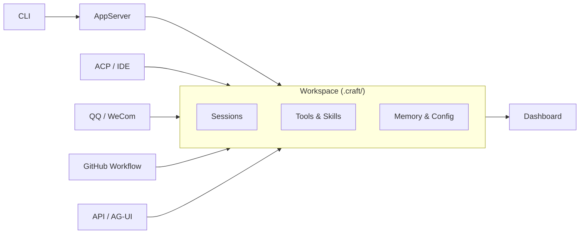

<div align="center">

[](https://deepwiki.com/DotCraftDev/DotCraft)
[](LICENSE)

**[中文](./README_ZH.md) | English**

# DotCraft

**Craft around your project.**

An Agent Harness that turns your directory into a persistent, inspectable workspace.

From CLI, editors, chatbots, APIs — everywhere you work.


https://github.com/user-attachments/assets/9a495e51-5bd9-4ed6-8723-28904545db3a

</div>

> **Note:** The project is currently in the early stages of development and may experience breaking changes.

## ✨ Highlights

<table>
<tr>
<td width="33%" align="center"><b>📁 Project-First</b><br/>Sessions, memory, skills, and config live under <code>.craft/</code> and follow the project</td>
<td width="33%" align="center"><b>🔌 Multi-Entry</b><br/>CLI, editors, bots, APIs, and GitHub workflows connect to the same workspace</td>
<td width="33%" align="center"><b>🛡️ Observable</b><br/>Built-in approvals, traces, Dashboard, and optional sandbox isolation</td>
</tr>
</table>


- 🛠️ File, Shell, Web, and SubAgent tools for real workflows
- 🔗 MCP, ACP, AG-UI, and OpenAI-compatible API support
- 🖥️ Native editor integration for Unity, JetBrains IDEs, and Obsidian
- 👥 GitHub-driven issue and PR orchestration via GitHubTracker
- 🧩 Skills, Hooks, slash commands, and workspace customization
- ⚗️ Deferred MCP tool loading for efficient large-tool-surface usage

## 🚀 Quick Start

**Prerequisites**:

- [.NET 10 SDK](https://dotnet.microsoft.com/download) (preview; only required for building)
- A supported LLM API key (OpenAI-compatible format)

**Build and install**:

```bash
# Windows
build.bat

# Linux / macOS
bash build-linux.bat

# Add to PATH (optional, Windows)
cd Release/DotCraft
powershell -File install_to_path.ps1
```

**First launch**:

```bash
cd my-project
dotcraft
```

On the first run, DotCraft initializes `.craft/` for the workspace. If no `ApiKey` is configured, it opens a local Dashboard to guide setup. After saving, run `dotcraft` again to enter the CLI.

**Example session**:

```
You > Summarize the recent changes in this repo

DotCraft is thinking...

I've reviewed the recent git history. Here is a summary of the
changes in the last week: ...
```

**Command-line reference**:

| Command | Description |
|---------|-------------|
| `dotcraft` | Interactive CLI (default) |
| `dotcraft app-server` | Start AppServer in stdio mode |
| `dotcraft app-server --listen ws://host:port` | Start AppServer in WebSocket mode |
| `dotcraft app-server --listen ws+stdio://host:port` | Start AppServer in dual mode (stdio + WebSocket) |
| `dotcraft --remote ws://host:port/ws` | CLI connecting to a remote AppServer |
| `dotcraft -acp` | ACP mode for editor/IDE integration |

Use `--token <secret>` with `--listen` or `--remote` for WebSocket authentication. See the [AppServer Guide](./docs/en/appserver_guide.md) for details.

For manual editing or the full configuration reference, see the [Configuration Guide](./docs/en/config_guide.md).

## ⚙️ Configuration

For first-time setup, use the built-in Dashboard for visual configuration. Later, you can continue using the Dashboard Settings page for workspace adjustments.

For the full configuration reference, config layering details, or manual editing, see the [Configuration Guide](./docs/en/config_guide.md).

## 🔌 Entry Points

The same workspace can be reached from multiple surfaces. Sessions stay separate so conversations do not overwrite each other, but they share the same project context, tools, memory, and skills.



| If you want to... | Start here |
|---|---|
| Work in a local terminal | [CLI](#local-cli) |
| Run DotCraft as a headless server | [AppServer](#appserver) |
| Use DotCraft in an editor or IDE | [Editors and ACP](#editors-and-acp) |
| Expose DotCraft as a service | [API / AG-UI](#api--ag-ui) |
| Connect a chat bot | [QQ / WeCom](#qq--wecom) |
| Automate GitHub issues and PRs | [GitHub Workflow](#github-workflow-automation) |

### Local CLI

CLI mode is the default starting point for working directly in a project directory.


### AppServer

AppServer exposes DotCraft's Agent capabilities as a wire protocol (JSON-RPC) server over stdio or WebSocket, enabling remote CLI connections, multi-client access, and custom integrations in any language. See the [AppServer Guide](./docs/en/appserver_guide.md).

### Editors And ACP

DotCraft supports ACP-compatible editors including Unity, Obsidian, and JetBrains IDEs. Start with the [ACP Mode Guide](./docs/en/acp_guide.md); for Unity specifically, see the [Unity Integration Guide](./docs/en/unity_guide.md) and the [Unity Client README](./src/DotCraft.UnityClient/Packages/com.dotcraft.unityclient/README.md).


### API / AG-UI

Expose DotCraft as a service or connect it to frontend experiences. See the [API Mode Guide](./docs/en/api_guide.md) and [AG-UI Mode Guide](./docs/en/agui_guide.md).


### QQ / WeCom

Connect the same workspace to chat bot entry points. See the [QQ Bot Guide](./docs/en/qq_bot_guide.md) and [WeCom Guide](./docs/en/wecom_guide.md).


### GitHub Workflow Automation

DotCraft can poll GitHub issues and pull requests, create isolated workspaces, dispatch coding or review agents, and coordinate handoff across runs. See the [GitHubTracker Guide](./docs/en/github_tracker_guide.md).


## 🛡️ Operations And Governance

### Dashboard

DotCraft includes a built-in Dashboard for inspecting sessions, traces, and configuration. When `ApiKey` is missing, it can also run in setup-only mode as the initial configuration entry point. See the [Dashboard Guide](./docs/en/dash_board_guide.md) for details.


<div align="center">
Usage and session statistics, aggregated by channel.
</div>


<div align="center">
Complete record of tool calls and session history.
</div>

### Sandbox Isolation

If you want Shell and File tools to run in an isolated environment, DotCraft supports [OpenSandbox](https://github.com/alibaba/OpenSandbox). Installation, configuration, and security details are covered in the [Configuration Guide](./docs/en/config_guide.md).

### MCP Deferred Loading

When many MCP servers are connected, injecting all tool definitions upfront adds significant token overhead and can reduce tool selection accuracy. Deferred Loading keeps MCP tools out of the initial context — the Agent discovers and activates them on demand via `SearchTools`. Once activated, tools are available immediately and the tool list grows monotonically within a session to keep the prompt cache stable.

For configuration details and the recommended Skill-based guidance pattern, see the [Configuration Guide](./docs/en/config_guide.md#mcp-tool-deferred-loading).

### Workspace Customization

You can customize agent behavior through files such as `.craft/AGENTS.md`, `.craft/USER.md`, `.craft/SOUL.md`, `.craft/TOOLS.md`, and `.craft/IDENTITY.md`, and add custom slash commands under `.craft/commands/`. Detailed usage belongs in the dedicated docs and examples.

## 📚 Documentation

**Setup and operations**

- [Configuration Guide](./docs/en/config_guide.md): configuration, tools, security, approvals, MCP, sandbox, Gateway
- [Dashboard Guide](./docs/en/dash_board_guide.md): Dashboard pages, debugging, and visual configuration
- [GitHubTracker Guide](./docs/en/github_tracker_guide.md): issue and PR orchestration, isolated workspaces, agent dispatch, and handoff flow

**Entry points**

- [AppServer Guide](./docs/en/appserver_guide.md): wire protocol server, WebSocket transport, remote CLI
- [API Mode Guide](./docs/en/api_guide.md): OpenAI-compatible API, tool filtering, SDK examples
- [AG-UI Mode Guide](./docs/en/agui_guide.md): AG-UI SSE server and CopilotKit integration
- [QQ Bot Guide](./docs/en/qq_bot_guide.md): NapCat, permissions, and approvals
- [WeCom Guide](./docs/en/wecom_guide.md): WeCom push notifications and bot mode
- [ACP Mode Guide](./docs/en/acp_guide.md): editor/IDE integration (JetBrains, Obsidian, and more)

**Editor integrations and extension points**

- [Unity Integration Guide](./docs/en/unity_guide.md): Unity Editor extension and AI-powered scene and asset tools
- [Hooks Guide](./docs/en/hooks_guide.md): lifecycle hooks, shell extensions, and security guards
- [Documentation Index](./docs/en/index.md): full documentation navigation

## 🤝 Contributing

We welcome contributions! Whether you're fixing bugs, adding features, or improving documentation, your help is appreciated.

**Getting Started**: See [CONTRIBUTING.md](./CONTRIBUTING.md) for development guidelines.

You can contribute with or without AI assistance - the guidelines support both approaches.

## 🙏 Credits

Inspired by nanobot and Codex, and built on the Microsoft Agent Framework.

Thanks to [Devin AI](https://devin.ai/) for providing free ACU credits to facilitate development.

- [HKUDS/nanobot](https://github.com/HKUDS/nanobot)
- [openai/codex](https://github.com/openai/codex)
- [microsoft/agent-framework](https://github.com/microsoft/agent-framework)
- [alibaba/OpenSandbox](https://github.com/alibaba/OpenSandbox)
- [modelcontextprotocol/csharp-sdk](https://github.com/modelcontextprotocol/csharp-sdk)
- [agentclientprotocol/agent-client-protocol](https://github.com/agentclientprotocol/agent-client-protocol)
- [ag-ui-protocol/ag-ui](https://github.com/ag-ui-protocol/ag-ui)
- [openai/symphony](https://github.com/openai/symphony)

## 📄 License

Apache License 2.0
