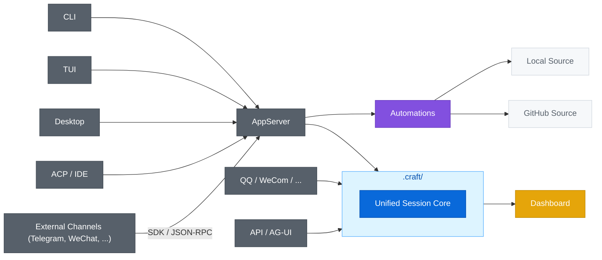

<div align="center">

[](https://deepwiki.com/DotHarness/DotCraft)
[](LICENSE)

**[中文](./README_ZH.md) | English**

# DotCraft

A project-scoped agent harness for persistent AI workspaces.

*Craft a persistent AI workspace around your project.*

Powered by .NET 10 and a Unified Session Core, DotCraft delivers observable AI orchestration across CLI, Desktop, IDEs, APIs, and external channels.


</div>

## ✨ Highlights

<table>
<tr>
<td width="33%" align="center"><b>📁 Project-Scoped</b><br/>Sessions, memory, skills, and config live in <code>.craft/</code> and follow the repo</td>
<td width="33%" align="center"><b>⚡ Unified Session Core</b><br/>One harness across CLI, Desktop, IDEs, bots, and automations</td>
<td width="33%" align="center"><b>🛡️ Observable Orchestration</b><br/>Built-in approvals, traces, dashboard, and optional sandboxing</td>
</tr>
</table>

| Capability Theme | What that means |
|------|------|
| 📁 Project-scoped workspace | `.craft/` keeps sessions, memory, skills, and config with the repo instead of scattering them across clients |
| ⚡ Unified Session Core | CLI, Desktop, IDEs, bots, and automations reuse the same runtime and session model |
| 🛡️ Observability and approvals | Built-in approvals, trace, dashboard, and optional sandboxing support long-running, governable agent work |
| 🔗 Extensibility and integration | AppServer, API, external adapters, SDKs, MCP, and Automations all build on the same harness |

## 🚀 Quick Start

**Prerequisites**:

- A supported LLM API key (OpenAI-compatible format)

**Option 1 — Download from Releases** (no build required):

Download the latest pre-built binary from [GitHub Releases](https://github.com/DotHarness/DotCraft/releases):

| Platform | Archive |
|----------|---------|
| Windows  | `DotCraft-win-x64.zip` |
| Linux    | `DotCraft-linux-x64.tar.gz` |
| macOS    | `DotCraft-macos-x64.tar.gz` |

Extract the archive and optionally add the directory to your PATH:

```bash
# Windows — extract DotCraft-win-x64.zip, then (optional) add to PATH
powershell -File install_to_path.ps1

# Linux / macOS — extract and (optional) move to a directory on $PATH
tar -xzf DotCraft-linux-x64.tar.gz   # or DotCraft-macos-x64.tar.gz
```

**Option 2 — Build from Source**:

Requires [.NET 10 SDK](https://dotnet.microsoft.com/download).

```bash
# Windows
build.bat

# Linux / macOS
bash build_linux.bat

# Add to PATH (optional, Windows)
cd Release/DotCraft
powershell -File install_to_path.ps1
```

**First launch**:

```bash
cd my-project
dotcraft
```

On the first run, DotCraft initializes `.craft/` for the workspace. If no `ApiKey` is configured, it opens a local Dashboard to guide setup. After saving, run `dotcraft` again to enter the CLI.

- `dotcraft` starts the CLI.
- `dotcraft app-server [--listen ...]` starts AppServer.
- `dotcraft gateway` starts the Gateway host.

**Configuration and next steps**:

- For first-time setup, the built-in Dashboard is the recommended visual configuration flow.
- For full configuration reference, layering details, or manual editing, see the [Configuration Guide](./docs/en/config_guide.md).
- For Dashboard usage and inspection workflows, see the [Dashboard Guide](./docs/en/dash_board_guide.md).

## 🔌 Entry Points

DotCraft organizes its entry points around the **Unified Session Core**: CLI, Desktop, IDEs, bots, and automations do not each maintain their own agent loop, but reuse the same execution engine and session model.

Here is how that differs from a traditional gateway-style architecture:

| Dimension | Gateway-style (nanobot / OpenClaw) | DotCraft |
|-----------|-----------------------------------|----------|
| Session model | Flattened `MessageBus` (`InboundMessage` / `OutboundMessage`) | Unified Session Core |
| Channel integration | Gateway routes events to a generic message bus | Each adapter is a full bidirectional Wire Protocol client |
| Platform-native UX | Lost after flattening into bus messages | Preserved — each adapter owns its own platform rendering |
| Approval / HITL | Cannot express platform-native approval flows | Bidirectional: server issues approval requests, adapter renders native UX (Telegram inline keyboard, QQ reply, etc.) |
| Cross-channel resume | Not supported | Server-managed threads resumable across channels |
| Workspace persistence | Not defined at framework level | `.craft/` — sessions, memory, skills, and config scoped to the project |


<div align="center">Different entry points connect to the same project-scoped workspace, while the Unified Session Core handles execution, state, and orchestration.</div>



Based on that structure, you can choose the entry point that best fits your workflow:

| If you want to... | Start here |
|---|---|
| Work in a local terminal | [CLI](#cli) |
| Use a rich terminal UI | [TUI](#tui) |
| Run DotCraft as a headless server | [AppServer](#appserver) |
| Use a graphical desktop client | [Desktop](#desktop) |
| Use DotCraft in an editor or IDE | [Editors and ACP](#editors-and-acp) |
| Expose DotCraft as a service | [API / AG-UI](#api--ag-ui) |
| Connect a chat bot | [QQ / WeCom](#qq--wecom) |
| Build a custom channel adapter | [External Channels](#external-channels) |
| Run automations (Local / GitHub) | [Automations](#automations) |

| **CLI** | **TUI** |
|:---:|:---:|
|  |  |
| **Desktop** | **ACP** |
|  |  |

### CLI

CLI is the most direct entry point for working with DotCraft in a local project directory. It is also the default starting point for understanding the overall workflow before expanding into AppServer, Desktop, or automation scenarios.

### TUI

TUI is for users who want a richer terminal experience. It is built on Ratatui, connects to AppServer over the Wire Protocol, and reuses the same session capabilities.

### AppServer

AppServer is DotCraft's unified backend boundary for exposing capabilities over a JSON-RPC Wire Protocol via stdio or WebSocket. It is the right entry point for remote CLI, multi-client access, and custom integrations in any language. See the [AppServer Guide](./docs/en/appserver_guide.md).

### Desktop

Desktop is for users who want a graphical workspace for conversations, diffs, plans, and automation review. It acts as a graphical AppServer client and consumes the same session, approval, and automation capabilities over the Wire Protocol. See the [Desktop Client README](./desktop/README.md) for details.

### Editors And ACP

Editors and ACP are for users who want DotCraft embedded directly into development tools, including Unity, Obsidian, and JetBrains IDEs. The key idea is not a separate editor-only agent, but an ACP bridge that connects the editor to the same AppServer runtime. Start with the [ACP Mode Guide](./docs/en/acp_guide.md); for Unity specifically, see the [Unity Integration Guide](./docs/en/unity_guide.md) and the [Unity Client README](./src/DotCraft.UnityClient/Packages/com.dotcraft.unityclient/README.md).

### API / AG-UI

API / AG-UI are for exposing DotCraft as a service to other applications or frontend experiences. They provide service-side entry points into the same DotCraft runtime rather than branching off into a separate capability stack. See the [API Mode Guide](./docs/en/api_guide.md) and [AG-UI Mode Guide](./docs/en/agui_guide.md).


### QQ / WeCom

QQ / WeCom are for bringing the same workspace into IM-based bot scenarios, while continuing to reuse the same session, approval, and task flows. See the [QQ Bot Guide](./docs/en/qq_bot_guide.md) and [WeCom Guide](./docs/en/wecom_guide.md).


### External Channels

DotCraft can also integrate with external channels over the AppServer wire protocol, so you can connect platforms such as Telegram, Feishu/Lark, WeChat, Discord, Slack, or your own internal chat system without embedding the adapter into the main process.

The Python and TypeScript SDKs (`DotCraftClient`, `ChannelAdapter`) make it easier to build these adapters, and the repository includes reference implementations:

- **Telegram** (Python SDK): long polling, inline-keyboard approvals, and full end-to-end integration. See the [Python SDK](./sdk/python/README.md).

- **Feishu / Lark** (TypeScript SDK): WebSocket event subscription, interactive approval cards, and a full external-channel integration example. See the [Feishu package](./sdk/typescript/packages/channel-feishu/README.md) and [TypeScript SDK](./sdk/typescript/README.md).

- **WeChat** (TypeScript SDK): WebSocket transport, QR-code login, text-keyword approvals. See the [TypeScript SDK](./sdk/typescript/README.md).

| Telegram (Python SDK) | WeChat (TypeScript SDK) |
|:---:|:---:|
|  |  |

### Automations

Automations are for running local tasks and GitHub-driven workflows. The key optimization here is that automation tasks are orchestrated by a shared `AutomationOrchestrator` and reuse the same session runtime, rather than living as a separate sidecar scripting system. See the [Automations Guide](./docs/en/automations_guide.md).

| Desktop Automations | GitHub tracker |
|:---:|:---:|
|  |  |
| View automated tasks using the desktop application. | PR Automatic Review. |

## 🛡️ Operations And Governance

### Dashboard

Dashboard is DotCraft's visual inspection and configuration surface for sessions, traces, and workspace settings. When `ApiKey` is missing, it also serves as the setup-only entry point for initial configuration. See the [Dashboard Guide](./docs/en/dash_board_guide.md) for details.

| Usage overview | Session trace |
|:---:|:---:|
|  |  |
| Usage and session statistics, aggregated by channel. | Complete record of tool calls and session history. |

### Sandbox Isolation

Sandbox Isolation is for scenarios where Shell and File tools should run inside a controlled execution boundary with stronger host isolation. Installation, configuration, and security details are covered in the [Configuration Guide](./docs/en/config_guide.md).

## 📚 Documentation

**I want to use DotCraft directly in a repo**

- [Configuration Guide](./docs/en/config_guide.md): configuration, tools, security, approvals, MCP, sandbox, startup modes, Gateway
- [Dashboard Guide](./docs/en/dash_board_guide.md): Dashboard pages, debugging, and visual configuration
- [Automations Guide](./docs/en/automations_guide.md): local tasks and GitHub issue/PR orchestration, agent dispatch, and human review flow
- [Rust TUI Guide](./tui/README.md): build, launch modes, key bindings, slash commands, and theme configuration

**I want to connect DotCraft to an editor or client**

- [Desktop Client Guide](./desktop/README.md): Electron desktop application, build, launch, and feature overview
- [ACP Mode Guide](./docs/en/acp_guide.md): editor/IDE integration (JetBrains, Obsidian, and more)
- [Unity Integration Guide](./docs/en/unity_guide.md): Unity Editor extension and AI-powered scene and asset tools

**I want to use DotCraft as a server or backend**

- [AppServer Guide](./docs/en/appserver_guide.md): wire protocol server, WebSocket transport, remote CLI
- [API Mode Guide](./docs/en/api_guide.md): OpenAI-compatible API, tool filtering, SDK examples
- [AG-UI Mode Guide](./docs/en/agui_guide.md): AG-UI SSE server and CopilotKit integration

**I want to build bots, adapters, or extensions**

- [QQ Bot Guide](./docs/en/qq_bot_guide.md): NapCat, permissions, and approvals
- [WeCom Guide](./docs/en/wecom_guide.md): WeCom push notifications and bot mode
- [External Channel Adapter Spec](./specs/external-channel-adapter.md): wire protocol contract for out-of-process channel adapters
- [Python SDK](./sdk/python/README.md): build external adapters with `dotcraft-wire` and the Telegram reference example
- [TypeScript SDK](./sdk/typescript/README.md): build external adapters with `dotcraft-wire` (TypeScript) for WeChat, Feishu, and similar channels
- [Hooks Guide](./docs/en/hooks_guide.md): lifecycle hooks, shell extensions, and security guards

**I want to continue into the full documentation set**

- [Documentation Index](./docs/en/index.md): full documentation navigation

## 🤝 Contributing

We welcome code, documentation, and integration contributions. Start with [CONTRIBUTING.md](./CONTRIBUTING.md).

## 🙏 Credits

Inspired by [nanobot](https://github.com/HKUDS/nanobot) and [codex](https://github.com/openai/codex), and built on [Agent Framework](https://github.com/microsoft/agent-framework).

- [HKUDS/nanobot](https://github.com/HKUDS/nanobot)
- [openai/codex](https://github.com/openai/codex)
- [microsoft/agent-framework](https://github.com/microsoft/agent-framework)
- [alibaba/OpenSandbox](https://github.com/alibaba/OpenSandbox)
- [modelcontextprotocol/csharp-sdk](https://github.com/modelcontextprotocol/csharp-sdk)
- [agentclientprotocol/agent-client-protocol](https://github.com/agentclientprotocol/agent-client-protocol)
- [ag-ui-protocol/ag-ui](https://github.com/ag-ui-protocol/ag-ui)
- [openai/symphony](https://github.com/openai/symphony)

## 📄 License

Apache License 2.0
