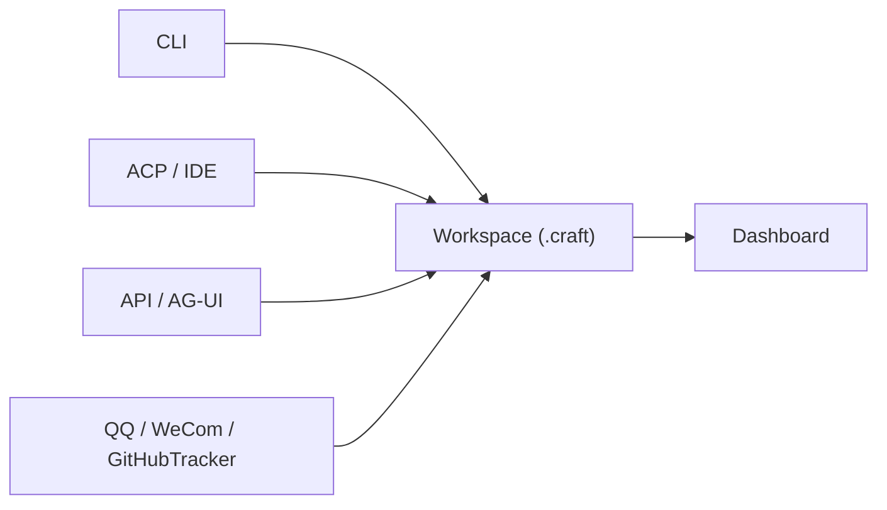

<div align="center">

[](https://deepwiki.com/DotCraftDev/DotCraft)

**[中文](./README_ZH.md) | English**

# DotCraft

**DotCraft** is a one-stop assistant for crafting your intelligent workspace across editors, CLI, and chat bots.


https://github.com/user-attachments/assets/8c5828b4-1682-4410-9df0-ca7d60fa2683

</div>

## ✨ Features

<table>
<tr>
<td width="33%" align="center"><b>🚀 Connect From Anywhere</b><br/>CLI, editors, APIs, and bots share one intelligent workspace</td>
<td width="33%" align="center"><b>🧠 Workspace-Centered Context</b><br/>Sessions, memory, skills, and commands stay with the project</td>
<td width="33%" align="center"><b>🔐 Safe And Observable</b><br/>Approvals, isolation, and Dashboard visibility built in</td>
</tr>
</table>

- 🛠️ **Tool Capabilities**: File, Shell, Web, and SubAgent tools for real workflows
- 🔌 **Open Protocols**: MCP, ACP, AG-UI, and OpenAI-compatible API support
- 🖥️ **Editor Integration**: Native support for [ACP](https://agentclientprotocol.com/)-compatible editors and IDEs
- 👥 **Native Team Collaboration**: `GitHubTracker` connects issues, implementation, review, and handoff
- 🐳 **Sandbox Isolation**: Secure tool execution with [OpenSandbox](https://github.com/alibaba/OpenSandbox)
- 🎯 **Unity Integration**: Unity Editor extension with scene and asset support
- 📊 **Dashboard**: Web UI for sessions, traces, and configuration
- 🧩 **Extensibility**: Skills, Hooks, notifications, and workspace customization

## 🧬 Design

DotCraft is not just about chatting with an agent in one interface. It is about crafting a reusable, collaborative, and observable intelligent workspace around your project.

Instead of binding context to a single chat surface, DotCraft treats the workspace itself as the unit of operation. CLI, editors, APIs, chat bots, and GitHub-driven workflows become different entry points into the same workspace.



### DotCraft Is A Workspace-Centered Agent

DotCraft works around the current project directory. When you start it, that directory becomes the agent's workspace, and its state lives under `<workspace>/.craft/`. Switching to another directory is effectively switching to another project-level agent.

That means each workspace has its own sessions, memory, skills, commands, and configuration, while `~/.craft/` holds reusable global defaults and shared assets. In practice, DotCraft is not tied to a single chat window. It is tied to the project you are working on.

### Multiple Entry Points, One Shared Workspace

The same workspace can be reached from multiple entry points. Sessions stay separate so conversations do not overwrite each other, but they still share the same project context, tool access, long-term memory, skills, and commands inside that workspace.

This makes DotCraft feel more like a continuously available workspace agent than a one-off conversation tool. You can build context in one entry point and continue using it from another without maintaining separate islands of state.

### Collaboration Is Native

Beyond personal use, DotCraft can extend the same workspace model into team workflows. With `GitHubTracker`, issues can drive implementation, review, and handoff, turning the workspace into a shared operational unit for both humans and agents.

### Observability And Governance Are Built In

Once an agent serves multiple entry points, visibility becomes essential. DotCraft includes a built-in Dashboard for viewing sessions, traces, and configuration state in one place, making it easier to investigate issues, trace history, and understand what the agent actually did.

That is also part of what sets DotCraft apart from many assistants focused mainly on interaction flow: it cares not only about completing tasks, but also about making those tasks inspectable when you need to debug or review them.

## 🚀 Quick Start

### Get Running In 3 Minutes

**Prerequisites**:

- [.NET 10 SDK](https://dotnet.microsoft.com/download) (only required for building)
- A supported LLM API key (OpenAI-compatible format)

**Install**:

```bash
# Build the Release package (all modules included by default)
build.bat

# Add DotCraft to PATH (optional)
cd Release/DotCraft
powershell -File install_to_path.ps1
```

**First launch**:

```bash
# Enter your project directory
cd Workspace

# Start DotCraft
dotcraft
```

On the first run in a new directory, DotCraft will first initialize `.craft/` for that workspace interactively. If there is still no usable `ApiKey`, it will automatically launch a local setup-only Dashboard so you can fill in both global and workspace config in the browser instead of hand-writing JSON. After saving, run `dotcraft` again to enter the CLI normally.

### Minimal Configuration

DotCraft uses two levels of configuration:

- **Global config**: `~/.craft/config.json` for shared defaults and secrets
- **Workspace config**: `<workspace>/.craft/config.json` for project-specific overrides

It is recommended to keep secrets in the global config so they do not leak into a workspace Git repository. The setup-only Dashboard will guide you through this layer first:

```json
{
    "ApiKey": "sk-your-api-key",
    "Model": "gpt-4o-mini",
    "EndPoint": "https://api.openai.com/v1"
}
```

### Launch And Verify

After finishing setup-only Dashboard configuration and restarting DotCraft, you can talk to it directly in the CLI. If Dashboard is enabled, you can also open it in the browser to inspect sessions, traces, and configuration.

> When `ApiKey` is missing, the CLI initialization flow now takes you directly into the setup-only Dashboard, so Dashboard becomes one of the primary first-time setup entry points.

## ⚙️ Configuration

### Global Config vs Workspace Config

DotCraft reads `~/.craft/config.json` first, then applies overrides from `<workspace>/.craft/config.json`. This lets you keep API keys and default models globally while storing project-specific runtime settings inside the workspace.

### Recommended Setup Style

- **For new users**: after the first launch, fill in `ApiKey`, `Model`, and `EndPoint` in the setup-only Dashboard first
- **For project differences**: override model, runtime mode, or integrations in the workspace config
- **For visual editing**: use the setup-only Dashboard for first-time config, then use Dashboard Settings for later workspace edits
- **For the full config reference**: see the [Configuration Guide](./docs/en/config_guide.md)

## 🧩 Expand By Use Case

### Local CLI

CLI mode is the default and is the best place to start if you just want to use DotCraft inside a local project directory.


### API / AG-UI

If you want to expose DotCraft as a service, see the [API Mode Guide](./docs/en/api_guide.md) and [AG-UI Mode Guide](./docs/en/agui_guide.md).


### QQ / WeCom

If you want to connect the same workspace to chat bot entry points, see the [QQ Bot Guide](./docs/en/qq_bot_guide.md) and [WeCom Guide](./docs/en/wecom_guide.md).


### GitHubTracker

If you want DotCraft to participate in team workflows, `GitHubTracker` can poll GitHub issues, create isolated workspaces, dispatch coding or review agents, and coordinate handoff across runs. See the [GitHubTracker Guide](./docs/en/github_tracker_guide.md).


### Unity / ACP

If you want to access DotCraft from editors or Unity, it is best to initialize the target workspace once from the CLI first; if config is still missing, that flow will open the setup-only Dashboard for you. Then see the [ACP Mode Guide](./docs/en/acp_guide.md), the [Unity Integration Guide](./docs/en/unity_guide.md), and the [Unity Client README](./src/DotCraft.UnityClient/Packages/com.dotcraft.unityclient/README.md).


## 🛠️ Advanced Capabilities

### Dashboard

DotCraft includes a built-in Dashboard for inspecting sessions, traces, and configuration. When `ApiKey` is missing, it can also run in setup-only mode as the initial configuration entry point. See the [Dashboard Guide](./docs/en/dash_board_guide.md) for details.


<div align="center"> 
Usage and session statistics, aggregated by channel.
</div>


<div align="center"> 
Complete record of tool calls and session history.
</div>

### Sandbox Isolation

If you want Shell and File tools to run in an isolated environment, DotCraft supports [OpenSandbox](https://github.com/alibaba/OpenSandbox). Installation, configuration, and security details are covered in the [Configuration Guide](./docs/en/config_guide.md).

### Workspace Customization

You can customize agent behavior through files such as `.craft/AGENTS.md`, `.craft/USER.md`, `.craft/SOUL.md`, `.craft/TOOLS.md`, and `.craft/IDENTITY.md`, and add custom slash commands under `.craft/commands/`. The README keeps this high level; detailed usage belongs in the dedicated docs and examples.

## 📚 Documentation

**First-time setup and advanced config**

- [Configuration Guide](./docs/en/config_guide.md): configuration, tools, security, approvals, MCP, sandbox, Gateway
- [Dashboard Guide](./docs/en/dash_board_guide.md): Dashboard pages, debugging, and visual configuration
- [GitHubTracker Guide](./docs/en/github_tracker_guide.md): issue-driven collaboration, isolated workspaces, agent dispatch, and handoff flow

**Connect different entry points**

- [API Mode Guide](./docs/en/api_guide.md): OpenAI-compatible API, tool filtering, SDK examples
- [AG-UI Mode Guide](./docs/en/agui_guide.md): AG-UI SSE server and CopilotKit integration
- [QQ Bot Guide](./docs/en/qq_bot_guide.md): NapCat, permissions, and approvals
- [WeCom Guide](./docs/en/wecom_guide.md): WeCom push notifications and bot mode
- [ACP Mode Guide](./docs/en/acp_guide.md): editor/IDE integration (JetBrains, Obsidian, and more)

**Editor integrations and extension points**

- [Unity Integration Guide](./docs/en/unity_guide.md): Unity Editor extension and AI-powered scene and asset tools
- [Hooks Guide](./docs/en/hooks_guide.md): lifecycle hooks, shell extensions, and security guards
- [Documentation Index](./docs/en/index.md): full documentation navigation

## 🤝 Contributing

We welcome contributions! Whether you're fixing bugs, adding features, or improving documentation, your help is appreciated.

**Getting Started**: See [CONTRIBUTING.md](./CONTRIBUTING.md) for development guidelines covering.

You can contribute with or without AI assistance - the guidelines support both approaches.

## 🙏 Credits

Inspired by nanobot and built on the Microsoft Agent Framework.

Thanks to [Devin AI](https://devin.ai/) for providing free ACU credits to facilitate development.

- [HKUDS/nanobot](https://github.com/HKUDS/nanobot)
- [microsoft/agent-framework](https://github.com/microsoft/agent-framework)
- [alibaba/OpenSandbox](https://github.com/alibaba/OpenSandbox)
- [modelcontextprotocol/csharp-sdk](https://github.com/modelcontextprotocol/csharp-sdk)
- [agentclientprotocol/agent-client-protocol](https://github.com/agentclientprotocol/agent-client-protocol)
- [ag-ui-protocol/ag-ui](https://github.com/ag-ui-protocol/ag-ui)
- [openai/symphony](https://github.com/openai/symphony)

## 📄 License

Apache License 2.0
