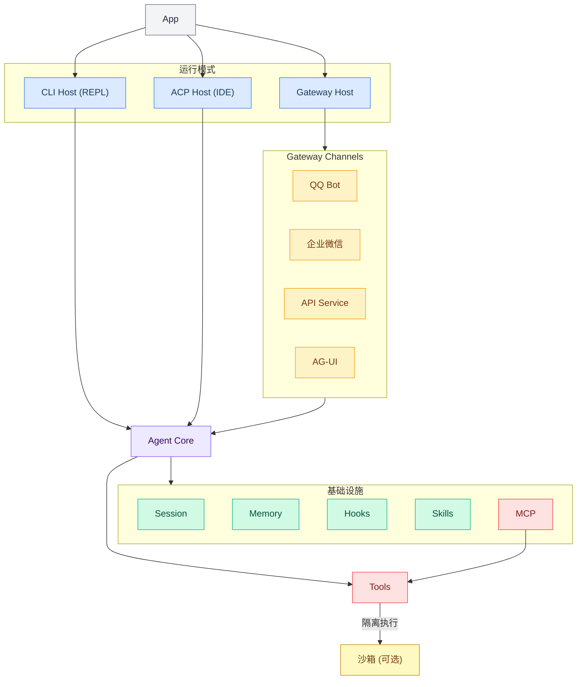

<div align="center">

[](https://deepwiki.com/DotCraftDev/DotCraft)

**中文 | [English](./README.md)**

# DotCraft

**DotCraft** 是一款一站式智能助理，为您打造跨编辑器、CLI 与聊天机器人的智能工作空间。


https://github.com/user-attachments/assets/e583a8fb-cea0-4dc1-9033-593b5e53c2f9

</div>

## ✨ 主要特性

<table>
<tr>
<td width="33%" align="center"><b>🚀 随心所欲启动</b><br/>终端聊天、多通道网关、编辑器集成 — 你想怎么用就怎么用</td>
<td width="33%" align="center"><b>🔗 无缝嵌入编辑器</b><br/>原生支持 ACP 协议，在熟悉的 IDE 里直接召唤 AI 助手</td>
<td width="33%" align="center"><b>🔐 安全可控</b><br/>隔离 + 审批，敏感操作有保障</td>
</tr>
</table>

- 🛠️ **工具能力**: 文件、Shell、Web 与 SubAgent 工具
- 🐳 **沙箱隔离**: 基于 [OpenSandbox](https://github.com/alibaba/OpenSandbox) 的安全工具执行
- 🔌 **MCP 接入**: 通过 [Model Context Protocol](https://modelcontextprotocol.io/) 连接外部工具
- 🖥️ **ACP 编辑器集成**: 原生支持 [ACP](https://agentclientprotocol.com/) 兼容编辑器
- 🎮 **运行形态**: CLI、API、QQ、企业微信、ACP、AG-UI、Gateway
- 🎯 **Unity 集成**: Unity 编辑器扩展与场景资源支持
- 📊 **监控面板**: 会话、调用追踪与配置管理 Web UI
- 🧩 **扩展能力**: Skills、Hooks 与通知集成

## 🏗️ 架构



## 🧬 设计

### Channel 间的会话隔离

每个 Channel 派生独立的会话 ID，对话互不干扰：

- **QQ**：`qq_{groupId}`（群聊）或 `qq_{userId}`（私聊）
- **WeCom**：`wecom_{chatId}_{userId}`
- **API**：从请求头 `X-Session-Key`、Body 中的 `user` 字段或内容指纹中解析
- **ACP**：`acp_{sessionId}`（由编辑器管理）
- **AG-UI**：`ag-ui:{threadId}`（来自 AG-UI `RunAgentInput`）

`SessionGate` 对每个会话提供互斥保护——同一会话的并发请求将被串行化，不同会话则完全并行执行。`MaxSessionQueueSize` 控制每个会话的最大排队请求数，超出时最旧的请求将被丢弃。

### 共享工作区与记忆

在 Gateway 模式下，所有 Channel 共享**同一个工作区**：

- **MemoryStore**：`memory/MEMORY.md`（结构化长期记忆，始终在上下文中）+ `memory/HISTORY.md`（仅追加的可 grep 搜索的事件日志）
- **文件工具、Shell 命令、技能和命令**均在同一工作区目录下运行
- 通过某个 Channel（如 QQ 群）学到的知识，可在其他 Channel（如企业微信）中访问

### 多工作区支持

DotCraft 采用**两级配置**模型：

| 级别 | 路径 | 用途 |
|------|------|------|
| 全局 | `~/.craft/config.json` | API Key、默认模型、共享设置 |
| 工作区 | `<workspace>/.craft/config.json` | 项目级覆盖、Channel 配置、MCP 服务器 |

每个工作区都是完全独立的工作目录，拥有自己的 `.craft/` 文件夹，包含会话、记忆、技能、命令和配置。将多个 DotCraft 实例指向不同的工作区目录，即可实现完全隔离。

## 🚀 快速开始

### 环境要求

- [.NET 10 SDK](https://dotnet.microsoft.com/download)（仅构建时需要）
- 支持的 LLM API Key（OpenAI 兼容格式）

### 构建与安装

```bash
# 构建 Release 包（默认包含所有模块）
build.bat

# 配置路径到环境变量（可选）
cd Release/DotCraft
powershell -File install_to_path.ps1
```

可以排除可选模块（QQ、WeCom、Unity）以生成更轻量的构建产物：

```bash
# 排除指定模块
build.bat --no-qq --no-unity

# 或直接使用 dotnet 命令
dotnet publish src/DotCraft.App/DotCraft.App.csproj -c Release ^
  -p:IncludeModuleQQ=false -p:IncludeModuleUnity=false
```

| 参数 | MSBuild 属性 | 模块 |
|------|-------------|------|
| `--no-qq` | `IncludeModuleQQ=false` | QQ Bot 频道 |
| `--no-wecom` | `IncludeModuleWeCom=false` | 企业微信频道 |
| `--no-unity` | `IncludeModuleUnity=false` | Unity 编辑器扩展 |

### 配置

DotCraft 使用两级配置：**全局配置**（`~/.craft/config.json`）和**工作区配置**（`<workspace>/.craft/config.json`）。

首次使用，创建全局配置文件：

```json
{
    "ApiKey": "sk-your-api-key",
    "Model": "gpt-4o-mini",
    "EndPoint": "https://api.openai.com/v1"
}
```

> 💡 将 API Key 放在全局配置可避免泄露到工作区 Git 仓库。

> 🚀 启动后也可以通过 **Dashboard Settings 页面**（`http://127.0.0.1:8080/dashboard`，选择左侧 Settings）在浏览器中可视化编辑所有配置项，无需手动修改 JSON 文件。修改保存后重启 DotCraft 即可生效。详见 [DashBoard 指南](./docs/dash_board_guide.md)。

### 启动

```bash
# 进入工作区
cd Workspace

# 启动 DotCraft（CLI 模式）
dotcraft
```

### 启用运行模式

| 模式 | 启用条件 | 用途 |
|------|----------|------|
| CLI 模式 | 默认 | 本地 REPL 交互 |
| API 模式 | `Api.Enabled = true` | OpenAI 兼容 HTTP 服务 |
| QQ 机器人 | `QQBot.Enabled = true` | OneBot V11 协议机器人 |
| 企业微信 | `WeComBot.Enabled = true` | 企业微信机器人 |
| ACP 模式 | `Acp.Enabled = true` | 编辑器/IDE 集成（[ACP](https://agentclientprotocol.com/)） |
| AG-UI 模式 | `AgUi.Enabled = true` | SSE 流式服务端（[AG-UI 协议](https://github.com/ag-ui-protocol/ag-ui)） |

### 沙箱隔离（可选）

DotCraft 支持将 Shell 和文件工具放入隔离的 [OpenSandbox](https://github.com/alibaba/OpenSandbox) 容器中执行。启用后，命令在一次性 Linux 容器内运行而非宿主机上，容器边界即安全边界。

**前置要求**：Python 3.10+、Docker

```bash
# 安装 OpenSandbox 服务端
uv pip install opensandbox-server --system

# 生成基础配置
opensandbox-server init-config ~/.sandbox.toml --example docker
```

在工作区配置（`.craft/config.json`）中启用沙箱：

```json
{
  "tools": {
    "Sandbox": {
      "Enabled": true,
      "Domain": "localhost:5880",
      "NetworkPolicy": "allow"
    }
  }
}
```

在启动 DotCraft 之前先启动沙箱服务：

```bash
# 在工作区目录下
.\start-sandbox.ps1
```

启动脚本会自动从 `config.json` 读取端口、预拉 Docker 镜像，并生成本地 `sandbox.toml`。更多高级选项（网络策略、资源限额、空闲超时、工作区同步）请参阅[沙箱配置指南](./docs/config_guide.md)。

### 使用 Bootstrap 文件进行自定义

将以下任意文件放入 `.craft/` 目录，即可将自定义指令注入到智能体的系统提示词中：

| 文件 | 用途 |
|------|------|
| `AGENTS.md` | 项目专属的智能体行为与规范 |
| `SOUL.md` | 个性风格与语气指南 |
| `USER.md` | 用户相关信息 |
| `TOOLS.md` | 工具使用说明与偏好 |
| `IDENTITY.md` | 自定义身份覆盖 |

**示例** — `.craft/AGENTS.md`：

```markdown
# Project Conventions

- This is a C# .NET 10 project using minimal APIs
- Always run `dotnet test` before committing
- Follow the existing code style: file-scoped namespaces, primary constructors
- Use Chinese for user-facing messages, English for code comments
```

### 自定义命令示例

自定义命令是存放在 `.craft/commands/` 目录中的 Markdown 文件，用户通过 `/命令名 [参数]` 的方式调用。

**示例**：

```markdown
---
description: Test subagent functionality by creating, listing, and verifying a file
---

Please test the subagent feature. Spawn a subagent to complete the following tasks:
1. Create a test file `test_subagent_result.txt` in the workspace with content "Hello from Subagent! Time: " followed by the current time
2. List the workspace root directory files to confirm the file was created
3. Read the created file and verify the content is correct

Report the subagent execution result when done.

$ARGUMENTS
```

调用方式：`/test-subagent`

占位符说明：`$ARGUMENTS` 展开为完整参数字符串，`$1`、`$2` 等依次展开为各位置参数。

### Unity 编辑器集成

DotCraft 通过 Agent Client Protocol (ACP) 与 Unity 编辑器无缝集成。集成包含两个组件：

1. **服务端模块** (`DotCraft.Unity`)：提供 4 个只读工具，帮助 AI 理解 Unity 项目状态
2. **Unity 客户端包** (`com.dotcraft.unityclient`)：Unity 编辑器扩展，提供编辑器内聊天界面

#### 安装 Unity 客户端包

**前置要求**：Unity 2022.3 或更高版本，[NuGetForUnity](https://github.com/GlitchEnzo/NuGetForUnity) 并安装 `System.Text.Json 9.0.10`

通过 Unity Package Manager 安装：

**方式 A — Git URL**：

在 **Window → Package Manager** 中，点击 **+ → Add package from git URL** 并输入：

```
https://github.com/DotCraftDev/DotCraft.git?path=src/DotCraft.UnityClient/Packages/com.dotcraft.unityclient
```

**方式 B — 本地路径**：

克隆仓库后从磁盘添加：**+ → Add package from disk**，选择 `src/DotCraft.UnityClient/Packages/com.dotcraft.unityclient/package.json`。

#### 快速开始

1. 在 Unity 中打开 **Tools → DotCraft Assistant**
2. 点击 **Connect** 启动 DotCraft 并建立 ACP 会话
3. 开始与 AI 助手对话

#### 功能特性

- **场景工具**：查询场景层级、获取当前选中对象
- **控制台工具**：获取 Unity Console 日志条目
- **项目工具**：获取 Unity 版本、项目名称和包信息
- **权限审批**：交互式审批面板，处理高风险操作
- **资源附加**：拖拽 Unity 资源到消息中附加它们
- **自动重连**：Domain Reload 后自动重新连接

如需完整的 Unity 操作能力（创建、修改、删除 GameObject 等），请安装 [SkillsForUnity](https://github.com/BestyAIGC/Unity-Skills) 或 [unity-mcp](https://github.com/CoplayDev/unity-mcp)。

详细配置和故障排除请参阅 [Unity 集成指南](./docs/unity_guide.md)。

## 📚 文档导航

| 文档 | 说明 |
|------|------|
| [配置指南](./docs/config_guide.md) | 工具、安全、黑名单、审批、MCP、Gateway |
| [API 模式指南](./docs/api_guide.md) | OpenAI 兼容 API、工具过滤、SDK 示例 |
| [AG-UI 模式指南](./docs/agui_guide.md) | AG-UI 协议 SSE 服务端、CopilotKit 集成 |
| [QQ 机器人指南](./docs/qq_bot_guide.md) | NapCat/权限/审批 |
| [企业微信指南](./docs/wecom_guide.md) | 企业微信推送/机器人模式 |
| [ACP 模式指南](./docs/acp_guide.md) | Agent Client Protocol 编辑器/IDE 集成（JetBrains、Obsidian 等） |
| [Unity 集成指南](./docs/unity_guide.md) | Unity 编辑器扩展与 AI 驱动的场景和资源工具 |
| [Hooks 指南](./docs/hooks_guide.md) | 生命周期事件钩子、Shell 命令扩展、安全防护 |
| [DashBoard 指南](./docs/dash_board_guide.md) | 内置 Web 调试界面、追踪数据查看器 |
| [文档索引](./docs/index.md) | 完整文档导航 |

## 🤝 贡献指南

我们欢迎各种形式的贡献！无论是修复 Bug、添加新功能还是改进文档，我们都非常感谢。

**开始贡献**：请参阅 [CONTRIBUTING.md](./CONTRIBUTING.md) 了解开发规范，包括：
- C# 代码风格与约定
- 架构模式与模块开发
- 双语文档要求

你可以选择使用 AI 辅助或手动开发——规范同时支持两种方式。

## 🙏 致谢

本项目受 nanobot 启发，基于微软 Agent Framework 打造。

感谢 [Devin AI](https://devin.ai/) 提供了免费的 ACU 额度为开发提供便捷。

- [HKUDS/nanobot](https://github.com/HKUDS/nanobot)
- [microsoft/agent-framework](https://github.com/microsoft/agent-framework)
- [alibaba/OpenSandbox](https://github.com/alibaba/OpenSandbox)
- [NapNeko/NapCatQQ](https://github.com/NapNeko/NapCatQQ)
- [spectreconsole/spectre.console](https://github.com/spectreconsole/spectre.console)
- [modelcontextprotocol/csharp-sdk](https://github.com/modelcontextprotocol/csharp-sdk)
- [agentclientprotocol/agent-client-protocol](https://github.com/agentclientprotocol/agent-client-protocol)
- [ag-ui-protocol/ag-ui](https://github.com/ag-ui-protocol/ag-ui)

## 📄 许可证

Apache License 2.0
