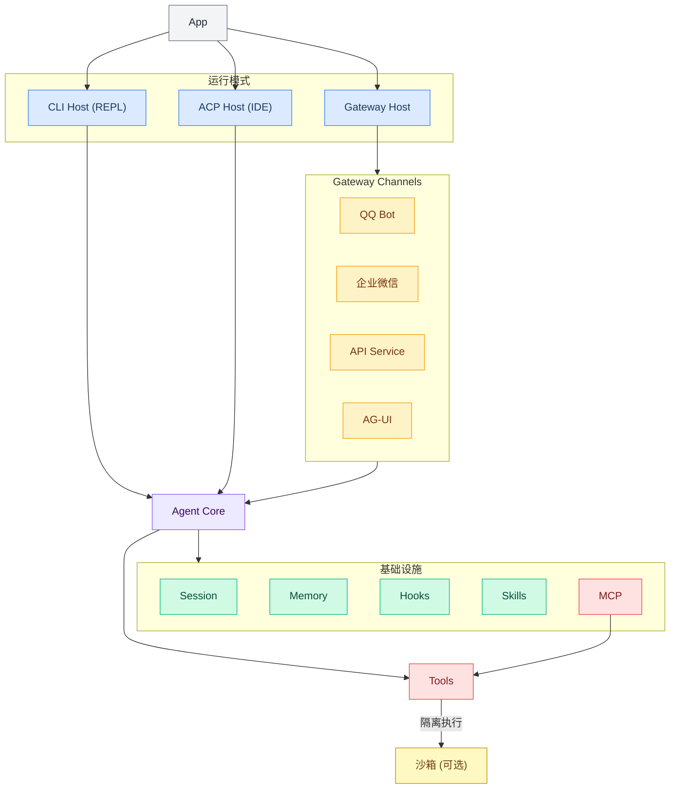
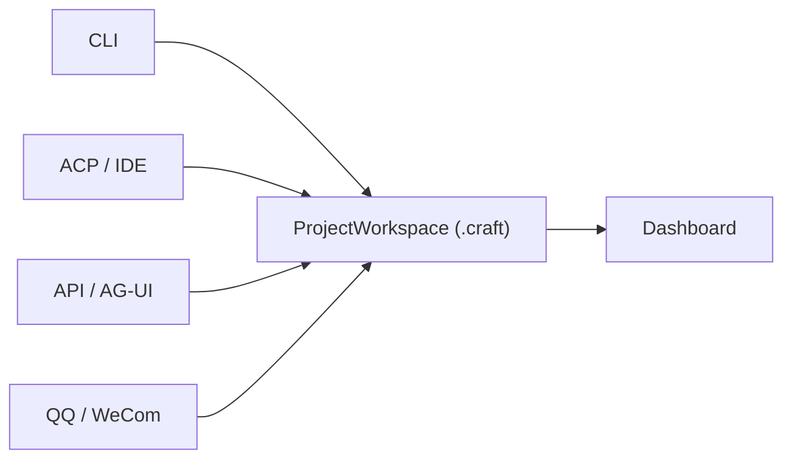

<div align="center">

[](https://deepwiki.com/DotCraftDev/DotCraft)

**中文 | [English](./README.md)**

# DotCraft

**DotCraft** 是一款一站式智能助理，为您打造跨编辑器、CLI 与聊天机器人的智能工作空间。


https://github.com/user-attachments/assets/e583a8fb-cea0-4dc1-9033-593b5e53c2f9

</div>

## ✨ 主要特性

<table>
<tr>
<td width="33%" align="center"><b>🚀 随心所欲启动</b><br/>终端聊天、多通道网关、编辑器集成 — 你想怎么用就怎么用</td>
<td width="33%" align="center"><b>🔗 无缝嵌入编辑器</b><br/>原生支持 ACP 协议，在熟悉的 IDE 里直接召唤 AI 助手</td>
<td width="33%" align="center"><b>🔐 安全可控</b><br/>隔离 + 审批，敏感操作有保障</td>
</tr>
</table>

- 🛠️ **工具能力**: 文件、Shell、Web 与 SubAgent 工具
- 🐳 **沙箱隔离**: 基于 [OpenSandbox](https://github.com/alibaba/OpenSandbox) 的安全工具执行
- 🔌 **MCP 接入**: 通过 [Model Context Protocol](https://modelcontextprotocol.io/) 连接外部工具
- 🖥️ **ACP 编辑器集成**: 原生支持 [ACP](https://agentclientprotocol.com/) 兼容编辑器
- 🎮 **运行形态**: CLI、API、QQ、企业微信、ACP、AG-UI、Gateway
- 🎯 **Unity 集成**: Unity 编辑器扩展与场景资源支持
- 📊 **监控面板**: 会话、调用追踪与配置管理 Web UI
- 🧩 **扩展能力**: Skills、Hooks 与通知集成

## 🏗️ 架构



## 🧬 设计

DotCraft 的核心不是“在某个界面里聊天”，而是“围绕一个项目工作区持续运行的 Agent 系统”。相比常见的单入口 coding assistant，DotCraft 更强调 workspace 本身是运行单元，而 CLI、编辑器、API 和聊天机器人只是接入这个工作区的不同入口。



### DotCraft 是一个 per-workspace 的 Agent

DotCraft 以当前项目目录为中心工作。启动它时，当前目录就是这个 Agent 的工作区，相关状态统一保存在 `<workspace>/.craft/` 中。切换到另一个目录，本质上就是切换到另一个项目级 Agent。

这意味着每个 workspace 都有自己独立的会话、记忆、技能、命令和配置，而 `~/.craft/` 则负责保存可复用的全局默认配置与公共资产。对用户来说，DotCraft 不是“绑定在某个聊天窗口里”，而是“绑定在当前项目上”。

### 多入口接入，同一工作区协同

同一个 workspace 可以同时从多个入口接入，例如 CLI、ACP 编辑器、API、AG-UI、QQ 和企业微信。不同入口下的 Session 会分开，避免对话互相覆盖；但它们共享同一个工作区中的项目上下文、工具能力、长期记忆、技能和命令。

这让 DotCraft 更像一个持续运行的工作区 Agent，而不是一次性的对话工具。你可以在一个入口里积累上下文，在另一个入口里继续使用它，而不必为每个接入方式维护一套彼此孤立的状态。

### 可观测性内建，不是额外插件

当一个 Agent 同时服务多个入口时，能否看清它做了什么就变得非常重要。DotCraft 内置 Dashboard，用来统一查看会话、调用轨迹和配置状态，让用户在排查问题、回溯历史或分析 Agent 行为时有一个直接的入口。

这也是 DotCraft 和很多只强调交互体验的 coding assistant 不同的地方之一：它不仅关注“能不能完成任务”，也关注“任务是如何被完成的，以及出了问题该如何追踪”。

## 🚀 快速开始

### 3 分钟跑起来

**环境要求**：

- [.NET 10 SDK](https://dotnet.microsoft.com/download)（仅构建时需要）
- 支持的 LLM API Key（OpenAI 兼容格式）

**安装**：

```bash
# 构建 Release 包（默认包含所有模块）
build.bat

# 配置路径到环境变量（可选）
cd Release/DotCraft
powershell -File install_to_path.ps1
```

**首次启动**：

```bash
# 进入你的项目目录
cd Workspace

# 启动 DotCraft
dotcraft
```

第一次在新目录运行时，DotCraft 会先交互式初始化当前工作区下的 `.craft/`。如果此时还没有可用的 `ApiKey`，它会自动启动一个本地的 setup-only Dashboard，让你在浏览器里填写全局配置和工作区配置，而不需要手写 JSON。保存后重新运行一次 `dotcraft` 即可正式进入 CLI。

### 最小配置示例

DotCraft 使用两级配置：

- **全局配置**：`~/.craft/config.json`，适合存放 API Key、默认模型等共享设置
- **工作区配置**：`<workspace>/.craft/config.json`，适合存放项目级覆盖配置

推荐把密钥放在全局配置中，避免泄露到工作区 Git 仓库。setup-only Dashboard 也会优先引导你完成这一层配置：

```json
{
    "ApiKey": "sk-your-api-key",
    "Model": "gpt-4o-mini",
    "EndPoint": "https://api.openai.com/v1"
}
```

### 启动并验证

完成 setup-only Dashboard 配置并重新启动后，你就可以直接在 CLI 中与 DotCraft 对话。若启用了 Dashboard，也可以在浏览器中查看会话、调用轨迹和配置状态。

> 首次缺少 `ApiKey` 时，CLI 初始化流程会直接带你进入 setup-only Dashboard；这时 Dashboard 就是首次配置的主入口之一。

## ⚙️ 配置说明

### 全局配置与工作区配置

DotCraft 会先读取 `~/.craft/config.json`，再用 `<workspace>/.craft/config.json` 做覆盖。这样你可以把 API Key、默认模型等通用设置放在全局，把当前项目的运行模式、工具或接入配置放在工作区。

### 推荐配置方式

- **新手推荐**：第一次运行后，先在 setup-only Dashboard 里填写全局 `ApiKey`、`Model`、`EndPoint`
- **项目差异**：再在工作区配置中按需覆盖模型、运行模式或扩展能力
- **可视化编辑**：setup-only Dashboard 可用于首次配置，正常 Dashboard Settings 页面可继续编辑工作区配置
- **完整配置项**：请阅读 [配置指南](./docs/config_guide.md)

## 🧩 按场景扩展

### 本地 CLI

默认就是 CLI 模式，适合在本地项目目录中直接与 DotCraft 交互。

### API / AG-UI

如果你希望把 DotCraft 作为服务接入其他应用，可查看 [API 模式指南](./docs/api_guide.md) 和 [AG-UI 模式指南](./docs/agui_guide.md)。

### QQ / 企业微信

如果你希望把同一个工作区接入聊天机器人入口，可查看 [QQ 机器人指南](./docs/qq_bot_guide.md) 和 [企业微信指南](./docs/wecom_guide.md)。

### Unity / ACP

如果你希望从编辑器或 Unity 中接入 DotCraft，建议先在目标工作区通过 CLI 完成一次初始化；如果缺少配置，会先进入 setup-only Dashboard。之后再查看 [ACP 模式指南](./docs/acp_guide.md)、[Unity 集成指南](./docs/unity_guide.md) 与 [Unity Client README](./src/DotCraft.UnityClient/Packages/com.dotcraft.unityclient/README.md)。

## 🛠️ 进阶能力

### Dashboard

DotCraft 内置 Dashboard，可用于查看会话、追踪调用和编辑配置。首次缺少 `ApiKey` 时，它也会以 setup-only 模式承担初始配置入口。详细说明请参阅 [DashBoard 指南](./docs/dash_board_guide.md)。

### 沙箱隔离

如果你希望把 Shell 和文件工具放到隔离环境中执行，DotCraft 支持 [OpenSandbox](https://github.com/alibaba/OpenSandbox)。安装、配置和安全细节请参阅 [配置指南](./docs/config_guide.md)。

### 工作区定制

你可以通过 `.craft/AGENTS.md`、`.craft/USER.md`、`.craft/SOUL.md`、`.craft/TOOLS.md`、`.craft/IDENTITY.md` 等文件定制 Agent 行为，也可以通过 `.craft/commands/` 添加自定义命令。README 只保留入口说明，具体用法建议参考对应文档和示例。

## 📚 文档导航

**首次配置与进阶选项**

- [配置指南](./docs/config_guide.md)：配置项、工具、安全、审批、MCP、沙箱、Gateway
- [DashBoard 指南](./docs/dash_board_guide.md)：Dashboard 页面、调试能力与可视化配置

**接入不同入口**

- [API 模式指南](./docs/api_guide.md)：OpenAI 兼容 API、工具过滤、SDK 示例
- [AG-UI 模式指南](./docs/agui_guide.md)：AG-UI 协议 SSE 服务端、CopilotKit 集成
- [QQ 机器人指南](./docs/qq_bot_guide.md)：NapCat、权限与审批
- [企业微信指南](./docs/wecom_guide.md)：企业微信推送与机器人模式
- [ACP 模式指南](./docs/acp_guide.md)：编辑器/IDE 集成（JetBrains、Obsidian 等）

**编辑器与扩展**

- [Unity 集成指南](./docs/unity_guide.md)：Unity 编辑器扩展与 AI 驱动的场景和资源工具
- [Hooks 指南](./docs/hooks_guide.md)：生命周期事件钩子、Shell 命令扩展、安全防护
- [文档索引](./docs/index.md)：完整文档导航

## 🤝 贡献指南

我们欢迎各种形式的贡献！无论是修复 Bug、添加新功能还是改进文档，我们都非常感谢。

**开始贡献**：请参阅 [CONTRIBUTING.md](./CONTRIBUTING.md) 了解开发规范。

你可以选择使用 AI 辅助或手动开发——规范同时支持两种方式。

## 🙏 致谢

本项目受 nanobot 启发，基于微软 Agent Framework 打造。

感谢 [Devin AI](https://devin.ai/) 提供了免费的 ACU 额度为开发提供便捷。

- [HKUDS/nanobot](https://github.com/HKUDS/nanobot)
- [microsoft/agent-framework](https://github.com/microsoft/agent-framework)
- [alibaba/OpenSandbox](https://github.com/alibaba/OpenSandbox)
- [modelcontextprotocol/csharp-sdk](https://github.com/modelcontextprotocol/csharp-sdk)
- [agentclientprotocol/agent-client-protocol](https://github.com/agentclientprotocol/agent-client-protocol)
- [ag-ui-protocol/ag-ui](https://github.com/ag-ui-protocol/ag-ui)

## 📄 许可证

Apache License 2.0
