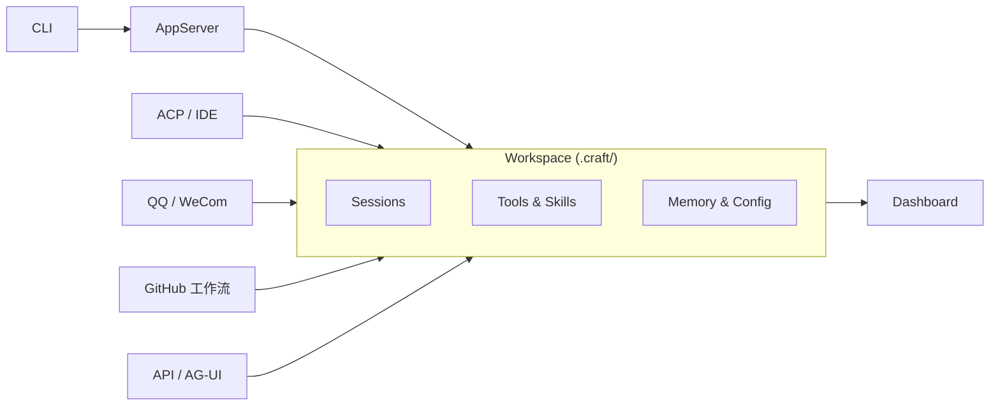

<div align="center">

[](https://deepwiki.com/DotCraftDev/DotCraft)
[](LICENSE)

**中文 | [English](./README.md)**

# DotCraft

**Craft around your project.**

一款 Agent Harness，可将您的目录打造为持久、可观察的智能工作区。

无论您使用命令行界面 (CLI)、编辑器、聊天机器人还是 API，它都能满足您的需求。


https://github.com/user-attachments/assets/8c5828b4-1682-4410-9df0-ca7d60fa2683

</div>

> **注意**：目前项目处于早期开发阶段，可能存在 Breaking Changes。

## ✨ 亮点

<table>
<tr>
<td width="33%" align="center"><b>📁 项目为先</b><br/>会话、记忆、技能与配置保存在 <code>.craft/</code> 下，跟着项目走</td>
<td width="33%" align="center"><b>🔌 多入口接入</b><br/>CLI、编辑器、机器人、API 与 GitHub 工作流接入同一个工作区</td>
<td width="33%" align="center"><b>🛡️ 可观察可治理</b><br/>审批、追踪、Dashboard 与可选沙箱隔离内建</td>
</tr>
</table>

- 🛠️ 文件、Shell、Web 与 SubAgent 工具，面向真实工作流
- 🔗 支持 MCP、ACP、AG-UI 与 OpenAI 兼容 API
- 🖥️ 原生编辑器集成：Unity、JetBrains 系列 IDE、Obsidian
- 👥 基于 GitHubTracker 的 Issue 与 PR 编排
- 🧩 Skills、Hooks、斜杠命令与工作区定制
- ⚗️ MCP 工具延迟加载，大规模工具场景更高效

## 🚀 快速开始

**环境要求**：

- [.NET 10 SDK](https://dotnet.microsoft.com/download)（预览版；仅构建时需要）
- 支持的 LLM API Key（OpenAI 兼容格式）

**构建与安装**：

```bash
# Windows
build.bat

# Linux / macOS
bash build-linux.bat

# 配置路径到环境变量（可选，Windows）
cd Release/DotCraft
powershell -File install_to_path.ps1
```

**首次启动**：

```bash
cd my-project
dotcraft
```

第一次运行时，DotCraft 会初始化当前工作区下的 `.craft/`；如果缺少可用的 `ApiKey`，会自动打开本地 Dashboard 引导首次配置。保存后重新运行 `dotcraft` 即可进入 CLI。

**示例会话**：

```
You > 总结一下这个仓库最近的变更

DotCraft is thinking...

我已经查看了最近的 Git 历史。以下是近一周的变更摘要：...
```

**命令行速查**：

| 命令 | 说明 |
|------|------|
| `dotcraft` | 交互式 CLI（默认模式） |
| `dotcraft app-server` | 启动 AppServer（stdio 模式） |
| `dotcraft app-server --listen ws://host:port` | 启动 AppServer（WebSocket 模式） |
| `dotcraft app-server --listen ws+stdio://host:port` | 启动 AppServer（双模式：stdio + WebSocket） |
| `dotcraft --remote ws://host:port/ws` | CLI 连接远程 AppServer |
| `dotcraft -acp` | ACP 模式（编辑器 / IDE 集成） |

使用 `--token <secret>` 搭配 `--listen` 或 `--remote` 进行 WebSocket 认证。详见 [AppServer 模式指南](./docs/appserver_guide.md)。

如果你希望手动编辑配置或了解更完整的配置项，请阅读 [配置指南](./docs/config_guide.md)。

## ⚙️ 配置说明

首次使用时，推荐通过内置 Dashboard 完成可视化配置。后续如果需要调整工作区设置，也可以继续使用 Dashboard 的 Settings 页面。

如果你需要查看完整配置项、配置层级或手动编辑方式，请阅读 [配置指南](./docs/config_guide.md)。

## 🔌 入口与工作流

同一个工作区可以从多个入口接入。不同入口的会话分开管理，但共享同一个工作区中的项目上下文、工具、记忆与技能。

| 如果你想... | 从这里开始 |
|---|---|
| 在本地终端中使用 | [CLI](#本地-cli) |
| 以无头服务器方式运行 | [AppServer](#appserver) |
| 在编辑器或 IDE 中使用 | [编辑器与 ACP](#编辑器与-acp) |
| 把 DotCraft 作为服务接入 | [API / AG-UI](#api--ag-ui) |
| 接入聊天机器人 | [QQ / 企业微信](#qq--企业微信) |
| 自动化 GitHub Issue 与 PR | [GitHub 工作流](#github-工作流自动化) |

### 本地 CLI

CLI 是最直接的起点，适合在本地项目目录中直接与 DotCraft 协作。


### AppServer

AppServer 将 DotCraft 的 Agent 能力以 wire protocol（JSON-RPC）方式通过 stdio 或 WebSocket 暴露，支持远程 CLI 连接、多客户端接入和任意语言的自定义集成。详见 [AppServer 模式指南](./docs/appserver_guide.md)。

### 编辑器与 ACP

DotCraft 支持 ACP 兼容编辑器，包括 Unity、Obsidian 和 JetBrains 系列 IDE。你可以先查看 [ACP 模式指南](./docs/acp_guide.md)；如果你主要在 Unity 中使用，再查看 [Unity 集成指南](./docs/unity_guide.md) 与 [Unity Client README](./src/DotCraft.UnityClient/Packages/com.dotcraft.unityclient/README.md)。


### API / AG-UI

把 DotCraft 作为服务接入其他应用，或对接前端交互体验。可查看 [API 模式指南](./docs/api_guide.md) 和 [AG-UI 模式指南](./docs/agui_guide.md)。


### QQ / 企业微信

把同一个工作区接入聊天机器人入口。可查看 [QQ 机器人指南](./docs/qq_bot_guide.md) 和 [企业微信指南](./docs/wecom_guide.md)。


### GitHub 工作流自动化

DotCraft 可以自动轮询 GitHub 的 Issue 和 Pull Request、创建隔离工作区、派发开发或 Review Agent，并在多轮运行中完成交接。详见 [GitHubTracker 指南](./docs/github_tracker_guide.md)。


## 🧬 设计

DotCraft 以项目目录为运行单元。启动时，当前目录成为工作区，状态保存在 `.craft/` 下。每个工作区拥有独立的会话、记忆、技能、命令和配置，而 `~/.craft/` 存放可复用的全局默认配置。



多个入口接入同一个工作区。你可以在一个入口积累上下文，然后从另一个入口继续使用，不需要维护彼此孤立的状态。架构上，两种交互模型共存：

| 体验入口 | 模型 |
|---|---|
| CLI、ACP、QQ、企业微信、GitHub 工作流自动化 | 服务端托管的持久会话 |
| API、AG-UI | 客户端托管 |

这种划分是刻意设计的——某些体验更适合持久会话与结构化事件，另一些则更适合轻量的客户端模式。

DotCraft 内置 Dashboard，用来查看会话、追踪与配置状态，让 Agent 行为在需要调试或回溯时保持可观察。

## 🛡️ 运行与治理

### Dashboard

DotCraft 内置 Dashboard，可用于查看会话、追踪调用和编辑配置。首次缺少 `ApiKey` 时，它也会以 setup-only 模式承担初始配置入口。详见 [Dashboard 指南](./docs/dash_board_guide.md)。


<div align="center">
用量、会话统计，按渠道汇总。
</div>


<div align="center">
完整记录工具调用、会话历史。
</div>

### 沙箱隔离

如果你希望把 Shell 和文件工具放到隔离环境中执行，DotCraft 支持 [OpenSandbox](https://github.com/alibaba/OpenSandbox)。安装、配置和安全细节请参阅 [配置指南](./docs/config_guide.md)。

### MCP 工具延迟加载

当接入的 MCP 服务器较多时，将所有工具定义一次性注入上下文会带来显著的 Token 开销，并可能降低模型的工具选择精度。延迟加载让 Agent 通过 `SearchTools` 按需发现并激活 MCP 工具，而非在会话开始时全量注入。工具激活后立即可用，且在会话内单调递增，确保 Prompt Cache 可以稳定复用。

配置详情和推荐的 Skill 引导模式请参阅 [配置指南](./docs/config_guide.md#mcp-工具延迟加载)。

### 工作区定制

你可以通过 `.craft/AGENTS.md`、`.craft/USER.md`、`.craft/SOUL.md`、`.craft/TOOLS.md`、`.craft/IDENTITY.md` 等文件定制 Agent 行为，也可以通过 `.craft/commands/` 添加自定义命令。具体用法建议参考对应文档和示例。

## 📚 文档导航

**配置与运行**

- [配置指南](./docs/config_guide.md)：配置项、工具、安全、审批、MCP、沙箱、Gateway
- [Dashboard 指南](./docs/dash_board_guide.md)：Dashboard 页面、调试能力与可视化配置
- [GitHubTracker 指南](./docs/github_tracker_guide.md)：Issue 与 PR 编排、隔离工作区、Agent 派发与交接机制

**入口能力**

- [AppServer 模式指南](./docs/appserver_guide.md)：Wire Protocol 服务器、WebSocket 传输、远程 CLI 连接
- [API 模式指南](./docs/api_guide.md)：OpenAI 兼容 API、工具过滤、SDK 示例
- [AG-UI 模式指南](./docs/agui_guide.md)：AG-UI 协议 SSE 服务端、CopilotKit 集成
- [QQ 机器人指南](./docs/qq_bot_guide.md)：NapCat、权限与审批
- [企业微信指南](./docs/wecom_guide.md)：企业微信推送与机器人模式
- [ACP 模式指南](./docs/acp_guide.md)：编辑器/IDE 集成（JetBrains、Obsidian 等）

**编辑器与扩展**

- [Unity 集成指南](./docs/unity_guide.md)：Unity 编辑器扩展与 AI 驱动的场景和资源工具
- [Hooks 指南](./docs/hooks_guide.md)：生命周期事件钩子、Shell 命令扩展、安全防护
- [文档索引](./docs/index.md)：完整文档导航

## 🤝 贡献指南

我们欢迎各种形式的贡献！无论是修复 Bug、添加新功能还是改进文档，我们都非常感谢。

**开始贡献**：请参阅 [CONTRIBUTING.md](./CONTRIBUTING.md) 了解开发规范。

你可以选择使用 AI 辅助或手动开发——规范同时支持两种方式。

## 🙏 致谢

本项目受 nanobot 和 Codex 启发，基于微软 Agent Framework 打造。

感谢 [Devin AI](https://devin.ai/) 提供了免费的 ACU 额度为开发提供便捷。

- [HKUDS/nanobot](https://github.com/HKUDS/nanobot)
- [openai/codex](https://github.com/openai/codex)
- [microsoft/agent-framework](https://github.com/microsoft/agent-framework)
- [alibaba/OpenSandbox](https://github.com/alibaba/OpenSandbox)
- [modelcontextprotocol/csharp-sdk](https://github.com/modelcontextprotocol/csharp-sdk)
- [agentclientprotocol/agent-client-protocol](https://github.com/agentclientprotocol/agent-client-protocol)
- [ag-ui-protocol/ag-ui](https://github.com/ag-ui-protocol/ag-ui)
- [openai/symphony](https://github.com/openai/symphony)

## 📄 许可证

Apache License 2.0
