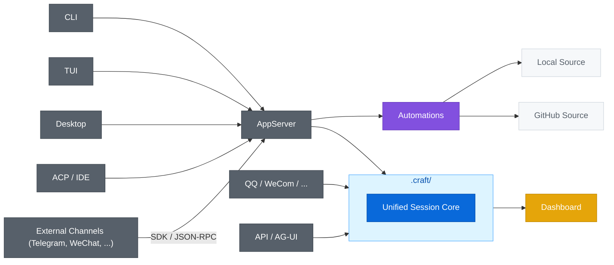

<div align="center">

[](https://deepwiki.com/DotHarness/DotCraft)
[](LICENSE)

**中文 | [English](./README.md)**

# DotCraft

面向项目的 Agent Harness，打造持久的 AI 工作空间。

*围绕你的项目，打造一个持久的 AI 工作空间。*

由 .NET 10 与 Unified Session Core 驱动，DotCraft 在 CLI、Desktop、IDE、API 与外部渠道之间提供可观测的 AI 编排体验。


</div>

## ✨ 亮点

<table>
<tr>
<td width="33%" align="center"><b>📁 项目级工作空间</b><br/>会话、记忆、技能与配置存放在 <code>.craft/</code> 中，并随仓库一起演进</td>
<td width="33%" align="center"><b>⚡ Unified Session Core</b><br/>同一套 harness 贯穿 CLI、Desktop、IDE、机器人与自动化</td>
<td width="33%" align="center"><b>🛡️ 可观测编排</b><br/>内置审批、Trace、Dashboard 与可选沙箱隔离</td>
</tr>
</table>

| 能力主题 | 这意味着什么 |
|------|------|
| 📁 项目级工作空间 | `.craft/` 随仓库保存会话、记忆、技能与配置，而不是散落在不同客户端里 |
| ⚡ Unified Session Core | CLI、Desktop、IDE、机器人与自动化复用同一套运行时与会话模型 |
| 🛡️ 可观测与审批 | 内置 approvals、trace、dashboard 与可选 sandbox，便于长期运行与治理 |
| 🔗 扩展与集成 | AppServer、API、外部适配器、SDK、MCP 与 Automations 都围绕同一 harness 展开 |

## 🚀 快速开始

**环境要求**：

- 支持的 LLM API Key（OpenAI 兼容格式）

**方式一 — 直接下载预构建包**（无需安装 .NET SDK）：

前往 [GitHub Releases](https://github.com/DotHarness/DotCraft/releases) 下载对应平台的压缩包：

| 平台 | 文件 |
|------|------|
| Windows | `DotCraft-win-x64.zip` |
| Linux   | `DotCraft-linux-x64.tar.gz` |
| macOS   | `DotCraft-macos-x64.tar.gz` |

解压后即可运行，可选将目录添加到 PATH：

```bash
# Windows — 解压 DotCraft-win-x64.zip，可选加入 PATH
powershell -File install_to_path.ps1

# Linux / macOS — 解压后可选移动至 $PATH 目录
tar -xzf DotCraft-linux-x64.tar.gz   # 或 DotCraft-macos-x64.tar.gz
```

**方式二 — 从源码构建**：

需要提前安装 [.NET 10 SDK](https://dotnet.microsoft.com/download)。

```bash
# Windows
build.bat

# Linux / macOS
bash build_linux.bat

# 配置路径到环境变量（可选，Windows）
cd Release/DotCraft
powershell -File install_to_path.ps1
```

**首次启动**：

```bash
cd my-project
dotcraft
```

第一次运行时，DotCraft 会初始化当前工作区下的 `.craft/`；如果缺少可用的 `ApiKey`，会自动打开本地 Dashboard 引导首次配置。保存后重新运行 `dotcraft` 即可进入 CLI。

**常见启动方式**：

- `dotcraft`：启动默认 CLI
- `dotcraft app-server [--listen ...]`：启动 AppServer
- `dotcraft gateway`：启动 Gateway 宿主

**配置与下一步**：

- 首次使用时，推荐通过内置 Dashboard 完成可视化配置。
- 如果你需要查看完整配置项、配置层级或手动编辑方式，请阅读 [配置指南](./docs/config_guide.md)。
- 如果你想继续了解 Dashboard 的使用方式，请阅读 [Dashboard 指南](./docs/dash_board_guide.md)。

## 🔌 入口与工作流

DotCraft 围绕 **统一会话核心（Unified Session Core）** 组织不同入口：CLI、Desktop、IDE、机器人与自动化并不是各自维护一套 agent 流程，而是复用同一个执行引擎与会话模型。

先看它与传统 Gateway 风格架构（如 nanobot / OpenClaw）的核心差异：

| 维度 | Gateway 风格（nanobot / OpenClaw） | DotCraft |
|------|-----------------------------------|----------|
| 会话模型 | 扁平化 `MessageBus`（`InboundMessage` / `OutboundMessage`） | 统一会话核心 |
| 渠道接入方式 | Gateway 将事件路由至通用消息总线 | 每个适配器都是完整的双向 Wire Protocol Client |
| 平台原生交互 | 压平为消息总线后丢失平台特性 | 保留——每个适配器独立负责自身平台的渲染逻辑 |
| 审批 / HITL | 无法表达平台原生的审批交互 | 双向：服务端下发审批请求，适配器以平台原生 UI 呈现（Telegram Inline Keyboard、QQ 消息回复等） |
| 跨渠道恢复 | 不支持 | 服务端管理的 Thread 可跨渠道恢复 |
| 工作区持久化 | 框架层不定义 | `.craft/` 统一管理会话、记忆、技能与配置，随项目走 |


<div align="center">不同入口作为接入面连接同一个项目级工作空间，由统一会话核心负责承接执行、状态与编排。</div>



基于这套结构，你可以再按自己的使用场景选择最合适的入口：

| 如果你想... | 从这里开始 |
|---|---|
| 在本地终端中使用 | [CLI](#cli) |
| 使用终端富文本界面 | [TUI](#tui) |
| 以无头服务器方式运行 | [AppServer](#appserver) |
| 使用图形化桌面客户端 | [Desktop 桌面应用](#desktop-桌面应用) |
| 在编辑器或 IDE 中使用 | [编辑器与 ACP](#编辑器与-acp) |
| 把 DotCraft 作为服务接入 | [API / AG-UI](#api--ag-ui) |
| 接入聊天机器人 | [QQ / 企业微信](#qq--企业微信) |
| 自定义渠道适配器 | [External Channels](#external-channels外部渠道适配器) |
| 运行自动化任务（Local / GitHub） | [Automations](#automations) |

| **CLI** | **TUI** |
|:---:|:---:|
|  |  |
| **Desktop** | **ACP** |
|  |  |

### CLI

CLI 是最直接的入口，适合在本地项目目录中与 DotCraft 协作。它也是理解整套工作流的默认起点：先在仓库里启动，再根据需要延伸到 AppServer、Desktop 或自动化场景。

### TUI

TUI 适合希望在终端里获得更丰富交互体验的用户。它基于 Ratatui 构建，通过 Wire Protocol 连接 AppServer，并复用同一套会话能力。

### AppServer

AppServer 是 DotCraft 对外暴露能力的统一后端边界，通过 stdio 或 WebSocket 提供基于 JSON-RPC 的 Wire Protocol。它适合远程 CLI、多客户端接入，以及任意语言的自定义集成。详见 [AppServer 模式指南](./docs/appserver_guide.md)。

### Desktop 桌面应用

Desktop 适合希望以图形化方式管理会话、Diff、计划与自动化审核的用户。它作为 AppServer 的图形化客户端工作，通过 Wire Protocol 消费同一套会话、审批与自动化能力。详见 [Desktop Client README](./desktop/README_ZH.md)。

### 编辑器与 ACP

编辑器与 ACP 适合希望把 DotCraft 直接嵌入开发环境的用户，包括 Unity、Obsidian 与 JetBrains IDE。这里的关键不是另起一套编辑器 Agent，而是通过 ACP 桥接层把编辑器接入同一个 AppServer 会话运行时。先看 [ACP 模式指南](./docs/acp_guide.md)；如果主要在 Unity 中使用，再看 [Unity 集成指南](./docs/unity_guide.md) 与 [Unity Client README](./src/DotCraft.UnityClient/Packages/com.dotcraft.unityclient/README.md)。

### API / AG-UI

API / AG-UI 适合把 DotCraft 作为服务接入其他应用，或对接前端交互体验。它们提供的是复用 DotCraft 运行时的服务端入口，而不是单独维护的一套能力分支。可查看 [API 模式指南](./docs/api_guide.md) 和 [AG-UI 模式指南](./docs/agui_guide.md)。


### QQ / 企业微信

QQ / 企业微信适合把同一个工作区接入聊天机器人入口，在 IM 场景中继续复用会话、审批与任务流。可查看 [QQ 机器人指南](./docs/qq_bot_guide.md) 和 [企业微信指南](./docs/wecom_guide.md)。

 

### External Channels（外部渠道适配器）

External Channels 适合需要把 Telegram、飞书、微信、Discord、Slack 或企业内部 IM 接入同一个工作区的场景。这里的重点是：外部渠道通过 AppServer Wire Protocol 作为完整适配器接入，而不是被压平为主进程里的消息插件。

Python 与 TypeScript SDK（`DotCraftClient`、`ChannelAdapter`）便于构建这类适配器，仓库里也提供了参考实现：

- **Telegram**（Python SDK）：长连接、内联按键审批以及与 DotCraft 会话模型的完整闭环。详见 [Python SDK](./sdk/python/README.md)。

- **飞书**（TypeScript SDK）：WebSocket 事件订阅、交互式审批卡片，以及与 DotCraft 外部渠道协议的完整接入。详见 [Feishu 示例](./sdk/typescript/examples/feishu/README_ZH.md) 与 [TypeScript SDK](./sdk/typescript/README_ZH.md)。

- **微信**（TypeScript SDK）：WebSocket 长连接、扫码登录、文本审批，详见 [TypeScript SDK](./sdk/typescript/README.md)。

| Telegram（Python SDK） | 微信（TypeScript SDK） |
|:---:|:---:|
|  |  |

### Automations

Automations 适合运行本地任务与 GitHub 驱动的工作流。这里的关键优化在于：自动化任务由统一的 `AutomationOrchestrator` 编排，并复用同一套会话运行时，而不是作为旁路脚本系统单独存在。详见 [Automations 指南](./docs/automations_guide.md)。

| Desktop 自动化面板 | GitHub 追踪 |
|:---:|:---:|
|  |  |
| 桌面应用查看自动化任务。 | PR 自动 Review。 |

## 🛡️ 运行与治理

### Dashboard

Dashboard 是 DotCraft 的可视化观察与配置入口，用于查看会话、追踪调用和编辑工作区设置。首次缺少 `ApiKey` 时，它也会承担 setup-only 的初始配置入口。详见 [Dashboard 指南](./docs/dash_board_guide.md)。

| 用量与会话概览 | 会话追踪 |
|:---:|:---:|
|  |  |
| 用量、会话统计，按渠道汇总。 | 完整记录工具调用、会话历史。 |

### 沙箱隔离

沙箱隔离用于把 Shell 与文件工具放到受控环境中执行，适合对安全边界和宿主隔离有更高要求的场景。安装、配置和安全细节请参阅 [配置指南](./docs/config_guide.md)。

## 📚 文档导航

**我想直接在仓库里使用 DotCraft**

- [配置指南](./docs/config_guide.md)：配置项、工具、安全、审批、MCP、沙箱、启动方式、Gateway
- [Dashboard 指南](./docs/dash_board_guide.md)：Dashboard 页面、调试能力与可视化配置
- [Automations 指南](./docs/automations_guide.md)：本地任务与 GitHub Issue/PR 编排、Agent 派发与人工审核流程
- [Rust TUI 指南](./tui/README_ZH.md)：构建方式、启动模式、快捷键、斜杠命令和主题配置

**我想把 DotCraft 接入编辑器或客户端**

- [Desktop Client 指南](./desktop/README_ZH.md)：Electron 桌面应用，构建、启动与功能概览
- [ACP 模式指南](./docs/acp_guide.md)：编辑器/IDE 集成（JetBrains、Obsidian 等）
- [Unity 集成指南](./docs/unity_guide.md)：Unity 编辑器扩展与 AI 驱动的场景和资源工具

**我想把 DotCraft 作为服务端或后端**

- [AppServer 模式指南](./docs/appserver_guide.md)：Wire Protocol 服务器、WebSocket 传输、远程 CLI 连接
- [API 模式指南](./docs/api_guide.md)：OpenAI 兼容 API、工具过滤、SDK 示例
- [AG-UI 模式指南](./docs/agui_guide.md)：AG-UI 协议 SSE 服务端、CopilotKit 集成

**我想构建机器人、适配器或扩展**

- [QQ 机器人指南](./docs/qq_bot_guide.md)：NapCat、权限与审批
- [企业微信指南](./docs/wecom_guide.md)：企业微信推送与机器人模式
- [外部渠道适配器规范](./specs/external-channel-adapter.md)：面向进程外渠道适配器的 Wire Protocol 契约
- [Python SDK](./sdk/python/README.md)：使用 `dotcraft-wire` 与 Telegram 参考示例构建外部适配器
- [TypeScript SDK](./sdk/typescript/README_ZH.md)：使用 `dotcraft-wire`（TypeScript）构建微信、飞书等外部适配器
- [Hooks 指南](./docs/hooks_guide.md)：生命周期事件钩子、Shell 命令扩展、安全防护

**我想继续深入查阅完整文档**

- [文档索引](./docs/index.md)：完整文档导航

## 🤝 贡献指南

欢迎提交代码、文档与集成相关贡献。开始前请阅读 [CONTRIBUTING.md](./CONTRIBUTING.md)。

## 🙏 致谢

本项目受 [nanobot](https://github.com/HKUDS/nanobot) 与 [codex](https://github.com/openai/codex) 启发，并构建在 [Agent Framework](https://github.com/microsoft/agent-framework) 之上。

- [HKUDS/nanobot](https://github.com/HKUDS/nanobot)
- [openai/codex](https://github.com/openai/codex)
- [microsoft/agent-framework](https://github.com/microsoft/agent-framework)
- [alibaba/OpenSandbox](https://github.com/alibaba/OpenSandbox)
- [modelcontextprotocol/csharp-sdk](https://github.com/modelcontextprotocol/csharp-sdk)
- [agentclientprotocol/agent-client-protocol](https://github.com/agentclientprotocol/agent-client-protocol)
- [ag-ui-protocol/ag-ui](https://github.com/ag-ui-protocol/ag-ui)
- [openai/symphony](https://github.com/openai/symphony)

## 📄 许可证

Apache License 2.0
