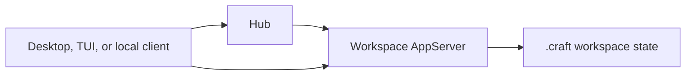

# Hub Local Management Guide

## Overview

Hub is DotCraft's local runtime coordinator. It runs per user on your machine and discovers, starts, reuses, and stops the AppServer process for each workspace. Each workspace still owns its own DotCraft runtime; Hub only helps Desktop, TUI, and other local clients find the right runtime and avoid starting duplicate servers for the same workspace.

On Windows and macOS, DotCraft Desktop provides the visual management layer for this local runtime model: open workspaces, see running state, enter recent or active workspaces from the tray, receive system notifications, and restart or stop local runtimes when needed.

## When To Use Hub

- You use Desktop to open multiple workspaces and want DotCraft to manage local runtimes automatically.
- You use Desktop, TUI, or a custom local client at the same time and want them to share one AppServer per workspace.
- You do not want to manually choose AppServer, Dashboard, API, or AG-UI ports.
- You want the system tray to show and manage local DotCraft workspaces.

If you need remote connections, CI, bots, or explicit AppServer debugging, you can still use [AppServer mode](./appserver_guide.md) directly.

## Quick Start

### Use Desktop

1. Install and launch DotCraft Desktop.
2. Open a project directory as a workspace.
3. Desktop discovers or starts the local Hub.
4. Hub ensures that the workspace has a usable AppServer.
5. Desktop connects directly to that workspace AppServer for chat, changes, and tasks.

You usually do not need to start `dotcraft hub` manually. Desktop and other local clients start it when they need it.

### Start Hub Manually

For local coordination debugging, start Hub explicitly:

```bash
dotcraft hub
```

Hub starts a loopback management API and writes discovery metadata to `~/.craft/hub/hub.lock`.

## How It Works



Important properties:

- There is usually one Hub per OS user.
- Each workspace still has one AppServer.
- Hub does not handle normal conversation traffic or proxy the AppServer protocol.
- A client only asks Hub during bootstrap: "make sure this workspace AppServer is available."
- After bootstrap, the client connects directly to the returned AppServer WebSocket URL.

## Desktop And Tray

Desktop owns the visual experience. Hub itself is a headless background coordinator.

Desktop can provide:

- Open or switch workspaces.
- See recent and running workspaces.
- Open Desktop or Dashboard.
- Restart or stop Hub-managed workspace runtimes.
- Receive system notifications forwarded through Hub, such as task completion, approval requests, or runtime state changes.

When the tray exits, Desktop can ask Hub to stop the workspace AppServers that Hub manages.

## Local State

Hub state lives under:

```text
~/.craft/hub/
```

Common files include:

- `hub.lock`: current Hub discovery metadata, including API URL, process ID, start time, and local token.
- `appservers.json`: best-effort AppServer state used for display and recovery.

Each workspace also has:

```text
<workspace>/.craft/appserver.lock
```

That file records which AppServer process owns the workspace and prevents multiple local AppServers from running against the same workspace at the same time.

## Local Mode And Remote Mode

Local mode is best for daily Desktop and TUI use. Hub manages ports, processes, and state so users do not need to think about AppServer startup details.

Remote mode bypasses Hub. Use it when:

- AppServer runs on another machine.
- You need to connect through a fixed WebSocket URL.
- You are running `dotcraft app-server` explicitly in CI, servers, or bot environments.
- You are debugging the AppServer protocol itself.

For remote mode, see the [AppServer Mode Guide](./appserver_guide.md).

## Troubleshooting

### Desktop Cannot Open A Workspace

Make sure `dotcraft` or `dotcraft.exe` is on `PATH`, or configure the AppServer executable path in Desktop settings.

### The Workspace Is Locked

The workspace `.craft/appserver.lock` points to another live AppServer. Close the Desktop/TUI/CLI instance using that workspace, or stop the workspace runtime from the tray, then try again.

### Local Port Conflicts

Hub allocates local ports automatically. If startup fails, the cause is usually a busy port, local permission issue, or security software blocking loopback connections. Restarting Hub or Desktop normally allocates fresh ports.

## Developer References

- [Hub Protocol](./reference/hub-protocol.md): discover Hub, call `ensure`, and subscribe to lifecycle events from a local client.
- [AppServer Protocol](./reference/appserver-protocol.md): implement the JSON-RPC client after connecting to a workspace AppServer.
- [Hub architecture spec](https://github.com/DotHarness/dotcraft/blob/master/specs/hub-architecture.md): complete Hub design constraints.
