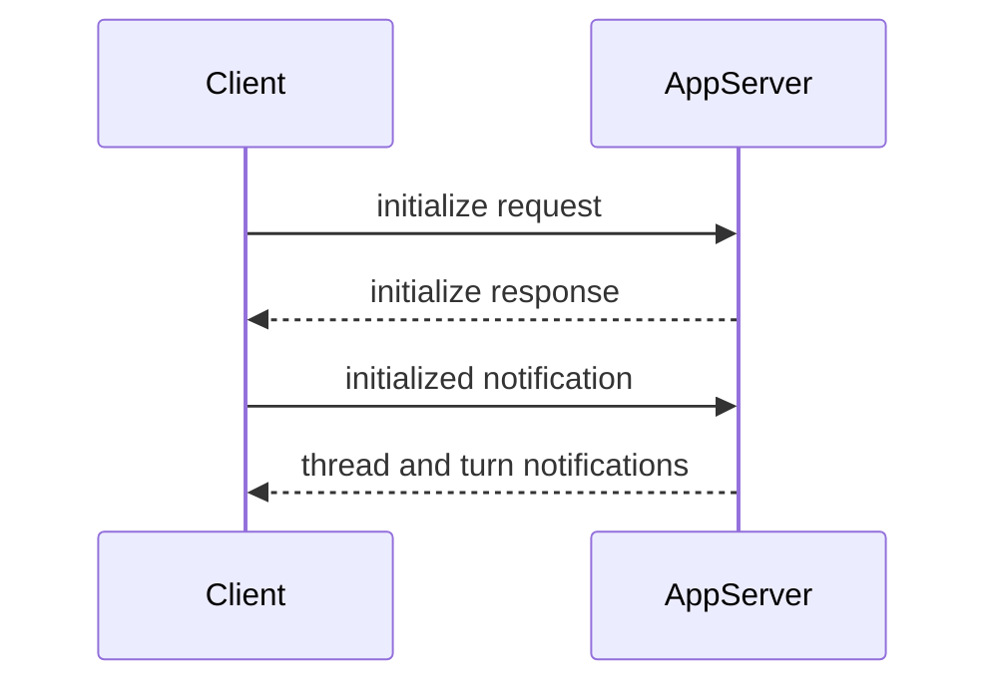

# AppServer Protocol

AppServer Protocol is DotCraft's JSON-RPC wire protocol for external clients. Desktop, TUI, ACP bridges, external channel adapters, and custom IDE clients can use it to create or resume threads, submit user input, consume streaming events, and participate in command or file-change approvals.

If you only need to find or start a local workspace AppServer, use [Hub Protocol](./hub-protocol.md) first. After Hub returns an AppServer WebSocket endpoint, session traffic uses this protocol.

See the [AppServer Protocol Spec](https://github.com/DotHarness/dotcraft/blob/master/specs/appserver-protocol.md) for the complete contract. This page provides the stable integration path and common API overview needed to build a client.

## When To Use It

Use AppServer Protocol when you want to:

- Build Desktop, TUI, IDE, editor, or browser frontends.
- Build non-C# clients in Node.js, Python, Rust, Swift, or another language.
- Embed DotCraft into an existing product while reusing sessions, tools, approvals, and streaming events.
- Implement an external channel adapter that connects social platforms or bots to the same workspace runtime.

For one-shot automation scripts, prefer the CLI or SDK. AppServer Protocol is designed for long-lived connections and rich UIs.

## Protocol

AppServer Protocol uses JSON-RPC 2.0. Every message includes `"jsonrpc": "2.0"`.

| Message kind | `id` | `method` | Direction |
|--------------|------|----------|-----------|
| Request | yes | yes | client to server or server to client |
| Response | yes | no | replies to a request |
| Notification | no | yes | client to server or server to client |

Request:

```json
{
  "jsonrpc": "2.0",
  "id": 1,
  "method": "thread/list",
  "params": {}
}
```

Response:

```json
{
  "jsonrpc": "2.0",
  "id": 1,
  "result": {
    "data": []
  }
}
```

Notification:

```json
{
  "jsonrpc": "2.0",
  "method": "turn/started",
  "params": {
    "turn": {
      "id": "turn_001"
    }
  }
}
```

## Transports

| Transport | Wire format | Use case |
|-----------|-------------|----------|
| `stdio` | UTF-8 JSONL; one full JSON-RPC message per line | Subprocess clients, one-to-one connections, default mode |
| `websocket` | One full JSON-RPC message per WebSocket text frame | Multi-client workspace sharing, Hub-managed local mode, remote connections |

In stdio mode, stdout is reserved for protocol messages. Logs and diagnostics should go to stderr.

In WebSocket mode, each connection has independent initialization state and thread subscriptions. With Hub-managed local mode, clients usually connect to the URL returned in `endpoints.appServerWebSocket`.

## Initialization

The first request on every connection must be `initialize`. After it succeeds, the client must send an `initialized` notification.



Initialize request:

```json
{
  "jsonrpc": "2.0",
  "id": 0,
  "method": "initialize",
  "params": {
    "clientInfo": {
      "name": "my-client",
      "title": "My Client",
      "version": "0.1.0"
    },
    "capabilities": {
      "approvalSupport": true,
      "streamingSupport": true,
      "commandExecutionStreaming": true,
      "toolExecutionLifecycle": true,
      "configChange": true
    }
  }
}
```

The response returns server info and capabilities:

```json
{
  "jsonrpc": "2.0",
  "id": 0,
  "result": {
    "serverInfo": {
      "name": "dotcraft",
      "version": "0.2.0",
      "protocolVersion": "1",
      "extensions": ["acp"]
    },
    "capabilities": {
      "threadManagement": true,
      "threadSubscriptions": true,
      "approvalFlow": true,
      "skillsManagement": true,
      "pluginManagement": true,
      "skillVariants": true,
      "modelCatalogManagement": true,
      "mcpManagement": true
    }
  }
}
```

Then send:

```json
{
  "jsonrpc": "2.0",
  "method": "initialized",
  "params": {}
}
```

Requests sent before initialization are rejected. Repeated `initialize` calls on the same connection are also rejected.

## Core Primitives

| Primitive | Description |
|-----------|-------------|
| Thread | A resumable conversation with workspace, origin channel, configuration, and turns. |
| Turn | One user input and the agent work it triggers. |
| Item | A unit inside a turn, such as user message, agent message, command execution, file change, tool call, plan, or reasoning. |

Common flow:

1. Call `thread/start` to create a thread, or `thread/resume` to continue one.
2. Call `turn/start` to submit user input.
3. Keep reading `turn/*` and `item/*` notifications.
4. If the server sends an approval request, render UI and return a decision.
5. Update UI state when `turn/completed`, `turn/failed`, or `turn/cancelled` arrives.

## Threads

Creating a thread requires an `identity` that identifies the client/channel, user, and workspace owner:

```json
{
  "jsonrpc": "2.0",
  "id": 1,
  "method": "thread/start",
  "params": {
    "identity": {
      "channelName": "desktop",
      "userId": "local-user",
      "channelContext": "workspace:/Users/me/project",
      "workspacePath": "/Users/me/project"
    },
    "historyMode": "server",
    "displayName": "Fix tests"
  }
}
```

Response:

```json
{
  "jsonrpc": "2.0",
  "id": 1,
  "result": {
    "thread": {
      "id": "thread_20260316_x7k2m4",
      "workspacePath": "/Users/me/project",
      "userId": "local-user",
      "originChannel": "desktop",
      "status": "active",
      "turns": []
    }
  }
}
```

The server also broadcasts `thread/started`. In multi-client deployments, the initiating client may receive both the response and the broadcast; dedupe by thread id.

Common thread methods:

| Method | Description |
|--------|-------------|
| `thread/start` | Create a new thread. |
| `thread/resume` | Resume an existing thread. |
| `thread/list` | List threads by identity. |
| `thread/read` | Read thread data and history without necessarily resuming execution context. |
| `thread/subscribe` | Subscribe to thread events. |
| `thread/unsubscribe` | Unsubscribe from thread events. |
| `thread/rename` | Update the display name. |
| `thread/delete` | Delete a thread. |
| `thread/config/update` | Update thread configuration. |
| `thread/mode/set` | Switch agent mode, such as `plan` or `agent`. |

## Turns

`turn/start` submits user input and starts agent execution. The response returns the initial turn immediately; later output streams through notifications.

```json
{
  "jsonrpc": "2.0",
  "id": 2,
  "method": "turn/start",
  "params": {
    "threadId": "thread_20260316_x7k2m4",
    "input": [
      {
        "type": "text",
        "text": "Run the tests and fix any failures."
      }
    ]
  }
}
```

Response:

```json
{
  "jsonrpc": "2.0",
  "id": 2,
  "result": {
    "turn": {
      "id": "turn_001",
      "threadId": "thread_20260316_x7k2m4",
      "status": "running",
      "items": []
    }
  }
}
```

`input` is a tagged union. Common types include:

- `text`: plain user text.
- `commandRef`: structured slash-command reference.
- `skillRef`: structured skill reference.
- `fileRef`: structured file reference.
- `image`: remote image URL.
- `localImage`: local image path with optional MIME metadata.

If a turn is already running, Desktop-style clients usually use `turn/enqueue` to queue the next input, or `turn/interrupt` to cancel the current turn.

## Events

AppServer pushes thread, turn, and item state through notifications. Clients should keep reading the transport stream and treat `item/completed` as the final state for that item.

Common notifications:

| Notification | Description |
|--------------|-------------|
| `thread/started` | Thread created. |
| `thread/resumed` | Thread resumed. |
| `thread/deleted` | Thread deleted. |
| `thread/renamed` | Display name changed. |
| `thread/runtimeChanged` | Runtime state changed. |
| `turn/started` | Turn started. |
| `turn/completed` | Turn completed successfully. |
| `turn/failed` | Turn failed. |
| `turn/cancelled` | Turn was cancelled. |
| `turn/diff/updated` | File-change diff updated. |
| `turn/plan/updated` | Plan updated. |
| `item/started` | Item started. |
| `item/completed` | Item completed with final state. |
| `item/agentMessage/delta` | Agent message text delta. |
| `item/reasoning/delta` | Reasoning delta. |
| `item/commandExecution/outputDelta` | Command output delta. |
| `item/toolCall/argumentsDelta` | Tool-call argument delta. |

When a client declares `capabilities.toolExecutionLifecycle: true`, the server may also send `toolExecution` item lifecycle events: `item/started` marks one tool invocation as executing, and `item/completed` marks that `callId` as finished. This is a UI/runtime enhancement for updating individual parallel tool cards early; the matching `toolResult` remains the complete authoritative result.

Clients can suppress specific notifications for the current connection by passing exact method names in `initialize.params.capabilities.optOutNotificationMethods`.

## Approvals

When command execution, file changes, or other sensitive operations require human confirmation, the server sends a server-initiated JSON-RPC request. The client must render approval UI and return a decision.

Command approval example:

```json
{
  "jsonrpc": "2.0",
  "id": 50,
  "method": "item/approval/request",
  "params": {
    "threadId": "thread_20260316_x7k2m4",
    "turnId": "turn_001",
    "itemId": "item_005",
    "requestId": "approval_001",
    "approvalType": "shell",
    "operation": "dotnet test",
    "target": "/Users/me/project",
    "scopeKey": "shell:*",
    "reason": "Agent wants to execute a shell command."
  }
}
```

Response:

```json
{
  "jsonrpc": "2.0",
  "id": 50,
  "result": {
    "decision": "accept"
  }
}
```

Common decisions include `accept`, `acceptForSession`, `acceptAlways`, `decline`, and `cancel`. Use the available decisions in the actual request payload as the source of truth.

If a client declares `approvalSupport: false` during `initialize`, the server handles non-interactive approval situations according to server policy. Rich UI clients should keep `approvalSupport: true`.

## API Overview

The table below covers common method families. The complete method list is in the protocol spec.

| Family | Examples | Description |
|--------|----------|-------------|
| Initialization | `initialize`, `initialized` | Negotiate client and server capabilities. |
| Thread | `thread/start`, `thread/list`, `thread/read`, `thread/subscribe` | Conversation lifecycle and subscriptions. |
| Turn | `turn/start`, `turn/enqueue`, `turn/interrupt` | User input, queues, and cancellation. |
| Cron | `cron/list`, `cron/remove`, `cron/enable` | Scheduled task management. |
| Heartbeat | `heartbeat/trigger` | Manual heartbeat trigger. |
| Skills | `skills/list`, `skills/read`, `skills/view`, `skills/restoreOriginal`, `skills/setEnabled`, `skills/uninstall` | Skill discovery, effective view, restore original, enablement, and removable skill deletion. |
| Plugins | `plugin/list`, `plugin/view`, `plugin/install`, `plugin/remove`, `plugin/setEnabled` | Plugin discovery, detail, installation, removal, and enablement management. |
| Commands | `command/list`, `command/execute` | Custom command discovery and execution. |
| Models | `model/list` | Model catalog. |
| MCP | `mcp/list`, `mcp/get`, `mcp/upsert`, `mcp/status/list`, `mcp/test` | MCP configuration and status. |
| External channels | `externalChannel/list`, `externalChannel/upsert` | External channel configuration. |
| SubAgents | `subagent/profiles/list`, `subagent/profiles/upsert` | SubAgent profile management. |
| Workspace config | `workspace/config/update` | Workspace configuration updates. |

Clients should use `capabilities` from the `initialize` response before showing feature-specific UI.

Skill entries returned by `skills/list` may include `hasVariant: true`, which means the current runtime resolves that skill through a workspace adaptation. `skills/read` still reads the source `SKILL.md`; use `skills/view` when a client needs the effective content.

### Plugin and Skill Management

Clients should check `capabilities.skillsManagement` before calling `skills/*`, and `capabilities.pluginManagement` before calling `plugin/*`.

`skills/uninstall` deletes removable workspace or personal skills only. System skills cannot be uninstalled; plugin-contained skills are managed by the plugin lifecycle and are not uninstalled separately. If the removed source skill has associated variants, the server also removes those workspace-local variants and broadcasts `workspace/configChanged` with `regions: ["skills"]`.

Plugin lifecycle separates installation from enablement:

- `plugin/install`: deploys a DotCraft-managed built-in plugin into the current workspace at `.craft/plugins/<id>/` and enables it by default.
- `plugin/setEnabled`: only controls whether an installed plugin enters the Agent context. It does not install or delete plugin files.
- `plugin/remove`: removes only DotCraft-managed built-in plugin directories that carry a `.builtin` marker. It does not delete user-owned local plugin directories.

Plugin install, remove, and enablement changes broadcast `workspace/configChanged` with `regions: ["plugins", "skills"]`. Tools contributed by plugins are projected in conversations as `pluginFunctionCall` items; they do not create companion `toolCall` / `toolResult` items. See the [AppServer Protocol Spec](https://github.com/DotHarness/dotcraft/blob/master/specs/appserver-protocol.md) for full fields and error behavior, and the [Plugin Architecture Spec](https://github.com/DotHarness/dotcraft/blob/master/specs/plugin-architecture.md) for the plugin model.

## Minimal Node Client

This example starts AppServer over stdio, initializes the connection, creates a thread, and starts a turn:

```ts
import { spawn } from "node:child_process";
import readline from "node:readline";

const workspacePath = process.cwd();
const proc = spawn("dotcraft", ["app-server"], {
  cwd: workspacePath,
  stdio: ["pipe", "pipe", "inherit"],
});

const rl = readline.createInterface({ input: proc.stdout });
let nextId = 0;
let threadId: string | undefined;

function send(method: string, params?: unknown, id = ++nextId) {
  proc.stdin.write(
    JSON.stringify({ jsonrpc: "2.0", id, method, params: params ?? {} }) + "\n",
  );
  return id;
}

function notify(method: string, params?: unknown) {
  proc.stdin.write(
    JSON.stringify({ jsonrpc: "2.0", method, params: params ?? {} }) + "\n",
  );
}

rl.on("line", (line) => {
  const message = JSON.parse(line);
  console.log("server:", message);

  if (message.id === 0 && message.result) {
    notify("initialized");
    send("thread/start", {
      identity: {
        channelName: "custom",
        userId: "local-user",
        channelContext: `workspace:${workspacePath}`,
        workspacePath,
      },
      historyMode: "server",
    });
    return;
  }

  if (message.result?.thread?.id && !threadId) {
    threadId = message.result.thread.id;
    send("turn/start", {
      threadId,
      input: [{ type: "text", text: "Summarize this repository." }],
    });
  }
});

send(
  "initialize",
  {
    clientInfo: {
      name: "custom-client",
      title: "Custom Client",
      version: "0.1.0",
    },
    capabilities: {
      approvalSupport: true,
      streamingSupport: true,
      commandExecutionStreaming: true,
      toolExecutionLifecycle: true,
      configChange: true,
    },
  },
  0,
);
```

Production clients should also handle process exit, JSON parse errors, request timeouts, approval requests, turn cancellation, and reconnect.

## Errors And Backpressure

JSON-RPC errors use the standard `error` field:

```json
{
  "jsonrpc": "2.0",
  "id": 2,
  "error": {
    "code": -32602,
    "message": "Invalid params"
  }
}
```

Recommended handling:

- `Not initialized`: make sure the first request is `initialize`.
- `Already initialized`: do not initialize twice on the same connection.
- `Invalid params`: check the method parameter shape and required fields.
- `Server overloaded; retry later.`: use exponential backoff and jitter for WebSocket requests.
- Turn failure: listen for error events and the final `turn/failed`; do not rely only on request responses.

## Client Checklist

- Initialize exactly once per connection and send `initialized` after the response.
- Assign a unique `id` to every request and preserve the id type.
- Keep reading notifications; do not only wait for request responses.
- Dedupe by thread id and turn id, especially with multi-client broadcasts.
- Treat `item/completed` as the final state for an item.
- Support server-initiated approval requests, or explicitly declare that you do not.
- Use `capabilities` for feature discovery instead of assuming all management APIs exist.
- Stay compatible with unknown notifications, item types, and capabilities.
