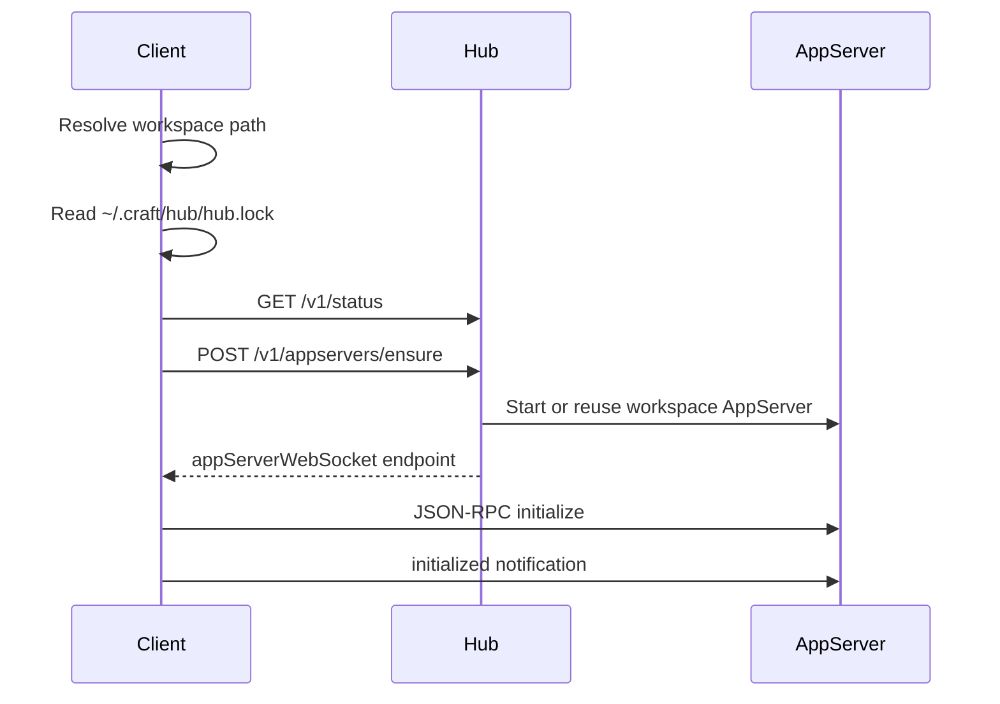

# Hub Protocol

Hub Protocol is the local protocol DotCraft clients use to discover and manage workspace AppServers. It is intended for Desktop, TUI, editor extensions, and other local clients. If you want to talk to the agent, normal session traffic still uses [AppServer Protocol](./appserver-protocol.md).

Hub coordinates local runtimes. It is not a session proxy:

- Hub manages workspace AppServers through an HTTP JSON API.
- Hub broadcasts lifecycle events through Server-Sent Events.
- Hub does not expose AppServer JSON-RPC methods such as `thread/*`, `turn/*`, `approval/*`, or `mcp/*`.
- After calling `appservers/ensure`, clients connect directly to the returned AppServer WebSocket endpoint.

See the [Hub architecture spec](https://github.com/DotHarness/dotcraft/blob/master/specs/hub-architecture.md) for the full design constraints.

## When To Use It

Implement a Hub client when:

- You are building DotCraft Desktop, TUI, an IDE extension, or a local GUI.
- You want multiple local clients to share one runtime per workspace.
- You need to show local workspace status, tray menus, or system notifications.
- You want to start AppServer on demand while avoiding duplicate AppServers for the same workspace.

If your client connects to a remote AppServer, or if you manage the AppServer process yourself, you can skip Hub.

## Protocol

Hub Local API uses HTTP JSON over loopback. All JSON fields use camelCase.

| Capability | Description |
|------------|-------------|
| Discovery | Read `~/.craft/hub/hub.lock` |
| API transport | HTTP JSON |
| Event transport | Server-Sent Events (`GET /v1/events`) |
| Address | Loopback by default |
| Auth | Protected endpoints use `Authorization: Bearer <token>` |
| Status check | `GET /v1/status` is public |

Typical `hub.lock` content:

```json
{
  "pid": 12345,
  "apiBaseUrl": "http://127.0.0.1:49231",
  "token": "local-random-token",
  "startedAt": "2026-04-30T06:30:00Z",
  "version": "0.1.0"
}
```

After reading the lock file, clients should verify:

1. The recorded `pid` still points to a live process.
2. `GET {apiBaseUrl}/v1/status` succeeds.
3. The returned URL, version, and capabilities match what the client expects.

If verification fails, stop trusting that lock file and start `dotcraft hub` if local auto-start is enabled.

## Bootstrap Flow



Once the client connects to AppServer, normal session traffic no longer goes through Hub.

## Authentication

Every management endpoint except `GET /v1/status` requires a bearer token:

```http
Authorization: Bearer <token-from-hub-lock>
```

Unauthorized response:

```json
{
  "error": {
    "code": "unauthorized",
    "message": "Missing or invalid Hub token.",
    "details": null
  }
}
```

Hub is a same-OS-user local coordinator, not a cross-user security boundary. Do not expose the Hub API on a non-loopback network.

## API Overview

| Endpoint | Auth | Description |
|----------|------|-------------|
| `GET /v1/status` | no | Return Hub metadata and capabilities. |
| `POST /v1/shutdown` | yes | Stop Hub and trigger managed AppServer cleanup. |
| `POST /v1/appservers/ensure` | yes | Ensure a workspace AppServer is available, starting it if needed. |
| `GET /v1/appservers` | yes | List live and known workspace AppServers. |
| `GET /v1/appservers/by-workspace?path=...` | yes | Inspect one workspace without starting a process. |
| `POST /v1/appservers/stop` | yes | Stop one Hub-managed workspace AppServer. |
| `POST /v1/appservers/restart` | yes | Restart a workspace AppServer. |
| `GET /v1/events` | yes | Subscribe to Hub lifecycle events. |
| `POST /v1/notifications/request` | yes | Request a local notification for Desktop or tray UI. |

### `GET /v1/status`

Example response:

```json
{
  "hubVersion": "0.1.0",
  "pid": 12345,
  "startedAt": "2026-04-30T06:30:00Z",
  "statePath": "/Users/me/.craft/hub",
  "apiBaseUrl": "http://127.0.0.1:49231",
  "capabilities": {
    "appServerManagement": true,
    "portManagement": true,
    "events": true,
    "notifications": true,
    "tray": false
  }
}
```

`tray: false` means Hub is headless. Desktop owns tray and notification UI.

### `POST /v1/appservers/ensure`

Example request:

```json
{
  "workspacePath": "/Users/me/project",
  "client": {
    "name": "my-client",
    "version": "0.1.0"
  },
  "startIfMissing": true
}
```

Example response:

```json
{
  "workspacePath": "/Users/me/project",
  "canonicalWorkspacePath": "/Users/me/project",
  "state": "running",
  "pid": 23456,
  "endpoints": {
    "appServerWebSocket": "ws://127.0.0.1:49300/ws?token=..."
  },
  "serviceStatus": {
    "appServerWebSocket": {
      "state": "allocated",
      "url": "ws://127.0.0.1:49300/ws?token=...",
      "reason": null
    },
    "dashboard": {
      "state": "disabled",
      "url": null,
      "reason": "Dashboard or tracing is disabled."
    }
  },
  "serverVersion": "0.1.0",
  "startedByHub": true,
  "exitCode": null,
  "lastError": null,
  "recentStderr": null
}
```

Important fields:

- `state`: one of `stopped`, `starting`, `running`, `unhealthy`, `stopping`, `exited`.
- `endpoints.appServerWebSocket`: the URL your client should use for AppServer Protocol.
- `serviceStatus`: optional service state for `dashboard`, `api`, `agui`, or `apiProxy`.
- `startedByHub`: whether the current process is managed by this Hub.

If `startIfMissing` is `false`, clients can inspect state without creating a new process.

### APIProxy Sidecar

Desktop may ask Hub to start an APIProxy sidecar before the managed AppServer:

```json
{
  "workspacePath": "/Users/me/project",
  "apiProxy": {
    "enabled": true,
    "binaryPath": "/absolute/path/to/proxy",
    "configPath": "/absolute/path/to/config.json",
    "endpoint": "http://127.0.0.1:49900",
    "apiKey": "local-secret"
  }
}
```

If APIProxy is requested and cannot start or pass readiness checks, `ensure` fails instead of returning an AppServer configured with a dead proxy. Treat secrets such as `apiKey` as local-only and do not display them in UI logs.

### Stop And Restart

Stop request:

```json
{
  "workspacePath": "/Users/me/project"
}
```

Restart uses the same body and may also include `apiProxy`.

### Notifications

Notification request:

```json
{
  "workspacePath": "/Users/me/project",
  "kind": "turn.completed",
  "title": "Task completed",
  "body": "The agent finished the requested change.",
  "severity": "success",
  "source": "appserver",
  "actionUrl": "dotcraft://workspace/open?path=/Users/me/project"
}
```

Response:

```json
{
  "accepted": true
}
```

`severity` is normalized to `info`, `success`, `warning`, or `error`.

## Events

Subscribe with:

```http
GET /v1/events
Authorization: Bearer <token>
Accept: text/event-stream
```

Hub sends standard SSE records:

```text
event: appserver.running
data: {"kind":"appserver.running","at":"2026-04-30T06:31:00Z","workspacePath":"/Users/me/project","data":{"pid":23456,"endpoints":{"appServerWebSocket":"ws://127.0.0.1:49300/ws?token=..."}}}
```

Known event kinds include:

| Event | Description |
|-------|-------------|
| `hub.started` | Hub has started. |
| `hub.stopping` | Hub is stopping. |
| `port.allocated` | Hub allocated a local port for a service. |
| `appserver.starting` | A workspace AppServer is starting. |
| `appserver.running` | A workspace AppServer is ready. |
| `appserver.exited` | A workspace AppServer exited. |
| `appserver.unhealthy` | A health check failed. |
| `apiProxy.running` | APIProxy sidecar is ready. |
| `apiProxy.exited` | APIProxy sidecar exited. |
| `notification.requested` | A local notification is waiting for UI display. |

Event payloads are extensible. Clients should render known fields by `kind` and ignore unknown fields.

## Connect To AppServer

After receiving `endpoints.appServerWebSocket`, open that WebSocket and initialize AppServer Protocol:

```json
{
  "jsonrpc": "2.0",
  "id": 0,
  "method": "initialize",
  "params": {
    "clientInfo": {
      "name": "my-client",
      "title": "My Client",
      "version": "0.1.0"
    },
    "capabilities": {
      "approvalSupport": true,
      "streamingSupport": true
    }
  }
}
```

Then send:

```json
{
  "jsonrpc": "2.0",
  "method": "initialized",
  "params": {}
}
```

See [AppServer Protocol](./appserver-protocol.md) for session methods.

## Errors

Errors use one shape:

```json
{
  "error": {
    "code": "workspaceLocked",
    "message": "A live process appears to own the workspace AppServer lock.",
    "details": {
      "workspacePath": "/Users/me/project",
      "pid": 23456
    }
  }
}
```

Common error codes:

| Code | HTTP | Description |
|------|------|-------------|
| `unauthorized` | 401 | Missing or invalid token. |
| `workspaceNotFound` | 400/404 | Workspace path is missing, does not exist, or is not a DotCraft workspace. |
| `workspaceLocked` | 409 | Another live AppServer owns the workspace lock. |
| `appServerStartFailed` | 500 | Managed AppServer failed during startup. |
| `appServerUnhealthy` | 500 | Managed AppServer failed readiness or health checks. |
| `portUnavailable` | 500 | Hub could not allocate a required local port. |
| `invalidProxySidecar` | 400 | APIProxy sidecar request is invalid. |
| `invalidNotification` | 400 | Notification request is invalid. |

## Client Recommendations

- Use Hub by default for local workspaces, while keeping explicit remote AppServer mode as an advanced path.
- After starting Hub, reread `hub.lock` and verify `/v1/status`; do not assume the process is ready immediately.
- Render `appserver.unhealthy` and `appserver.exited` as actionable UI states, such as "restart workspace runtime."
- Do not log Hub tokens, AppServer tokens, or APIProxy API keys.
- Keep unknown endpoints, service statuses, and event kinds forward-compatible.
