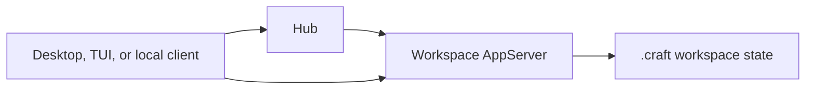

# Hub 本地管理指南

## 概述

Hub 是 DotCraft 的本地运行时协调器。它在你的电脑上按用户运行，负责发现、启动、复用和停止每个工作区对应的 AppServer。你仍然是在一个工作区里使用一个独立的 DotCraft 运行时；Hub 只是帮 Desktop、TUI 或其他本地客户端找到正确的运行时，避免同一个工作区被重复启动。

在 Windows 和 macOS 上，DotCraft Desktop 提供可视化的本地托管与管理体验：打开工作区、查看运行状态、从托盘进入最近或正在运行的工作区、接收系统通知，并在需要时重启或停止本地运行时。

## 适用场景

- 你使用 Desktop 打开多个工作区，希望 DotCraft 自动管理本地运行时。
- 你同时使用 Desktop、TUI 或自定义本地客户端，希望它们共享同一个工作区 AppServer。
- 你不想手动配置 AppServer、Dashboard、API 或 AG-UI 的本地端口。
- 你希望通过系统托盘查看和管理本地 DotCraft 工作区。

如果你需要远程连接、CI、机器人或显式调试 AppServer，仍然可以直接使用 [AppServer 模式](./appserver_guide.md)。

## 快速开始

### 使用 Desktop

1. 安装并启动 DotCraft Desktop。
2. 打开一个项目目录作为工作区。
3. Desktop 会自动发现或启动本机 Hub。
4. Hub 会确保该工作区有一个可用的 AppServer。
5. Desktop 直接连接到该工作区 AppServer，开始聊天、查看变更和运行任务。

通常不需要手动启动 `dotcraft hub`。当 Desktop 或其他本地客户端需要它时，会按需启动。

### 手动启动 Hub

如果你在调试本地协调行为，可以手动启动：

```bash
dotcraft hub
```

Hub 启动后会在本机回环地址上提供本地管理 API，并把发现信息写入 `~/.craft/hub/hub.lock`。

## 工作原理



关键点：

- 每个用户通常只有一个 Hub。
- 每个工作区仍然只有一个 AppServer。
- Hub 不处理普通对话消息，也不代理 AppServer 协议流量。
- 客户端只在启动阶段询问 Hub：“请确保这个工作区的 AppServer 可用。”
- 启动完成后，客户端直接连接返回的 AppServer WebSocket 地址。

## Desktop 与托盘

Desktop 负责所有可视化体验，Hub 本身是无界面的后台协调器。

Desktop 可以提供：

- 打开或切换工作区。
- 查看最近和正在运行的工作区。
- 打开 Desktop 或 Dashboard。
- 重启或停止 Hub 托管的工作区运行时。
- 接收 Hub 转发的系统通知，例如任务完成、需要审批或运行时状态变化。

托盘退出时，Desktop 可以请求 Hub 停止它托管的工作区 AppServer。

## 本地状态

Hub 的状态保存在：

```text
~/.craft/hub/
```

常见文件包括：

- `hub.lock`：当前 Hub 的发现信息，包括 API 地址、进程 ID、启动时间和本地 token。
- `appservers.json`：Hub 记录的工作区 AppServer 状态，用于展示和恢复。

每个工作区还会有自己的：

```text
<workspace>/.craft/appserver.lock
```

这个文件表示该工作区当前由哪个 AppServer 进程拥有。它可以防止同一个工作区被多个本地 AppServer 同时占用。

## 本地模式与远程模式

本地模式适合日常 Desktop/TUI 使用。Hub 管理端口、进程和状态，用户不需要关心 AppServer 的启动细节。

远程模式会绕过 Hub。适合这些情况：

- AppServer 运行在另一台机器上。
- 你需要通过固定 WebSocket 地址连接。
- 你在 CI、服务器或机器人环境中显式运行 `dotcraft app-server`。
- 你正在调试 AppServer 协议本身。

远程模式请参考 [AppServer 模式指南](./appserver_guide.md)。

## 故障排查

### Desktop 无法打开工作区

确认 `dotcraft` 或 `dotcraft.exe` 在 `PATH` 中，或在 Desktop 设置里配置 AppServer 可执行文件路径。

### 提示工作区已被占用

说明该工作区的 `.craft/appserver.lock` 指向另一个仍然存活的 AppServer。关闭占用该工作区的 Desktop/TUI/CLI，或在托盘里停止对应工作区运行时后重试。

### 本地端口冲突

Hub 会自动分配本地端口。若启动失败，通常是端口被占用、权限受限，或安全软件阻止本地回环连接。重启 Hub 或 Desktop 后通常会重新分配端口。

## 开发者资料

- [Hub Protocol](./reference/hub-protocol.md)：实现本地客户端时如何发现 Hub、调用 `ensure`、订阅事件。
- [AppServer Protocol](./reference/appserver-protocol.md)：连接工作区 AppServer 后如何实现 JSON-RPC 客户端。
- [Hub 架构规格](https://github.com/DotHarness/dotcraft/blob/master/specs/hub-architecture.md)：Hub 的完整设计约束。
