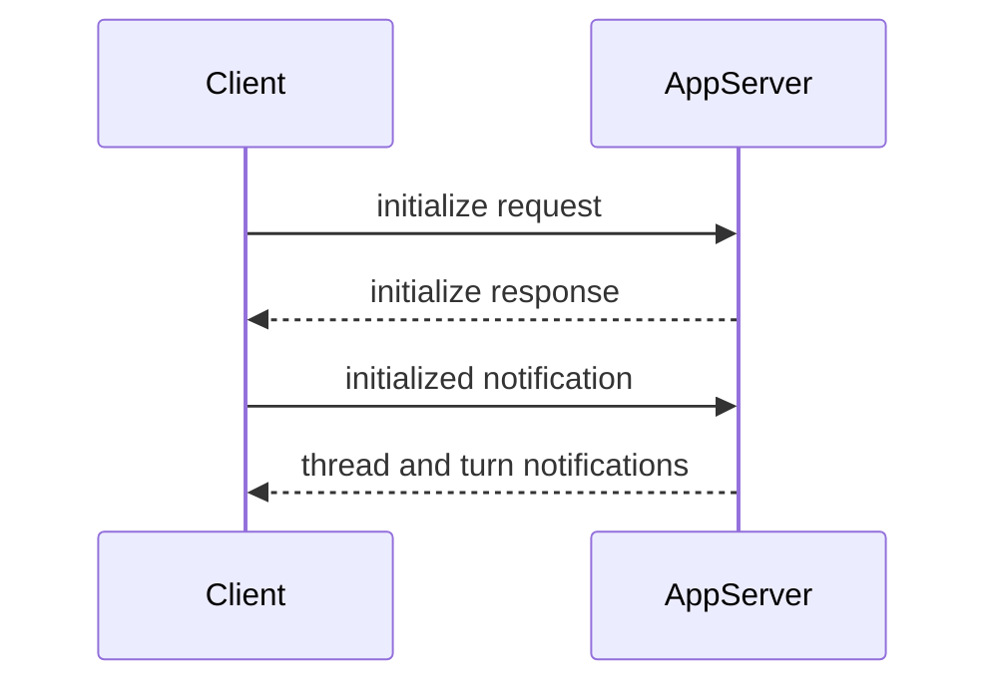

# AppServer Protocol

AppServer Protocol 是 DotCraft 暴露给外部客户端的 JSON-RPC wire protocol。Desktop、TUI、ACP bridge、外部 channel adapter 和自定义 IDE client 都可以通过它创建或恢复线程、提交用户输入、消费流式事件，并参与命令执行或文件变更审批。

如果你只是在本机寻找或启动工作区 AppServer，请先使用 [Hub Protocol](./hub-protocol.md)。Hub 返回 AppServer WebSocket endpoint 后，后续会话流量才进入本协议。

完整规范见 [AppServer Protocol Spec](https://github.com/DotHarness/dotcraft/blob/master/specs/appserver-protocol.md)。本文提供开发 client 所需的稳定接入路径和常用 API 概览。

## 适用场景

使用 AppServer Protocol 适合：

- 构建 Desktop、TUI、IDE、编辑器或浏览器前端。
- 构建非 C# client，例如 Node.js、Python、Rust 或 Swift 应用。
- 将 DotCraft 嵌入已有产品，复用会话、工具、审批和流式事件。
- 实现外部 channel adapter，让社交平台或机器人接入同一个工作区运行时。

如果你只是要在自动化脚本中运行一次性任务，优先考虑 CLI 或 SDK；AppServer Protocol 更适合长期连接和丰富 UI。

## 协议

AppServer Protocol 使用 JSON-RPC 2.0。每条消息都包含 `"jsonrpc": "2.0"`。

| 消息类型 | `id` | `method` | 方向 |
|----------|------|----------|------|
| Request | 有 | 有 | client → server 或 server → client |
| Response | 有 | 无 | 响应 request |
| Notification | 无 | 有 | client → server 或 server → client |

Request:

```json
{
  "jsonrpc": "2.0",
  "id": 1,
  "method": "thread/list",
  "params": {}
}
```

Response:

```json
{
  "jsonrpc": "2.0",
  "id": 1,
  "result": {
    "data": []
  }
}
```

Notification:

```json
{
  "jsonrpc": "2.0",
  "method": "turn/started",
  "params": {
    "turn": {
      "id": "turn_001"
    }
  }
}
```

## 传输方式

| Transport | Wire format | 适用场景 |
|-----------|-------------|----------|
| `stdio` | UTF-8 JSONL；每行一条完整 JSON-RPC 消息 | 子进程 client，一对一连接，默认模式 |
| `websocket` | 每个 WebSocket text frame 一条完整 JSON-RPC 消息 | 多客户端共享工作区、本地 Hub 托管、远程连接 |

stdio 模式下，stdout 保留给协议消息，日志和诊断输出应写入 stderr。

WebSocket 模式下，每个连接都有独立的初始化状态和线程订阅。通过 Hub 托管时，client 通常连接 `endpoints.appServerWebSocket` 返回的 URL。

## 初始化

每个连接的第一条 request 必须是 `initialize`。成功后，client 必须发送 `initialized` notification。



初始化 request:

```json
{
  "jsonrpc": "2.0",
  "id": 0,
  "method": "initialize",
  "params": {
    "clientInfo": {
      "name": "my-client",
      "title": "My Client",
      "version": "0.1.0"
    },
    "capabilities": {
      "approvalSupport": true,
      "streamingSupport": true,
      "commandExecutionStreaming": true,
      "configChange": true
    }
  }
}
```

初始化响应会返回服务端信息和能力：

```json
{
  "jsonrpc": "2.0",
  "id": 0,
  "result": {
    "serverInfo": {
      "name": "dotcraft",
      "version": "0.2.0",
      "protocolVersion": "1",
      "extensions": ["acp"]
    },
    "capabilities": {
      "threadManagement": true,
      "threadSubscriptions": true,
      "approvalFlow": true,
      "skillsManagement": true,
      "skillVariants": true,
      "modelCatalogManagement": true,
      "mcpManagement": true
    }
  }
}
```

然后发送：

```json
{
  "jsonrpc": "2.0",
  "method": "initialized",
  "params": {}
}
```

在初始化完成前发送其他方法会被拒绝。重复 `initialize` 也会被拒绝。

## 核心对象

| Primitive | 说明 |
|-----------|------|
| Thread | 一个可恢复的会话，包含工作区、来源 channel、配置和 turns。 |
| Turn | 一次用户输入及其触发的 agent 执行。 |
| Item | turn 内的输入或输出单元，例如用户消息、agent 消息、命令执行、文件变更、工具调用、计划和 reasoning。 |

常见流程：

1. `thread/start` 创建新线程，或 `thread/resume` 恢复已有线程。
2. `turn/start` 提交用户输入。
3. 持续读取 `turn/*` 和 `item/*` notifications。
4. 如果收到 server-initiated approval request，展示 UI 并返回 decision。
5. 收到 `turn/completed`、`turn/failed` 或 `turn/cancelled` 后更新 UI 状态。

## 线程

创建线程需要提供 `identity`，用于表示 client/channel、用户和工作区归属：

```json
{
  "jsonrpc": "2.0",
  "id": 1,
  "method": "thread/start",
  "params": {
    "identity": {
      "channelName": "desktop",
      "userId": "local-user",
      "channelContext": "workspace:/Users/me/project",
      "workspacePath": "/Users/me/project"
    },
    "historyMode": "server",
    "displayName": "Fix tests"
  }
}
```

响应：

```json
{
  "jsonrpc": "2.0",
  "id": 1,
  "result": {
    "thread": {
      "id": "thread_20260316_x7k2m4",
      "workspacePath": "/Users/me/project",
      "userId": "local-user",
      "originChannel": "desktop",
      "status": "active",
      "turns": []
    }
  }
}
```

Server 还会广播 `thread/started`。多 client 场景下，发起请求的 client 可能同时收到 response 和 broadcast，应按 thread id 去重。

常用 thread 方法：

| Method | 说明 |
|--------|------|
| `thread/start` | 创建新线程。 |
| `thread/resume` | 恢复已有线程。 |
| `thread/list` | 按 identity 列出线程。 |
| `thread/read` | 读取线程和历史，不一定恢复执行上下文。 |
| `thread/subscribe` | 订阅线程事件。 |
| `thread/unsubscribe` | 取消订阅线程事件。 |
| `thread/rename` | 更新显示名称。 |
| `thread/delete` | 删除线程。 |
| `thread/config/update` | 更新线程配置。 |
| `thread/mode/set` | 切换 agent mode，例如 `plan` 或 `agent`。 |

## 回合

`turn/start` 提交用户输入并启动 agent 执行。响应会立即返回初始 turn，后续输出通过 notification 流式发送。

```json
{
  "jsonrpc": "2.0",
  "id": 2,
  "method": "turn/start",
  "params": {
    "threadId": "thread_20260316_x7k2m4",
    "input": [
      {
        "type": "text",
        "text": "Run the tests and fix any failures."
      }
    ]
  }
}
```

响应：

```json
{
  "jsonrpc": "2.0",
  "id": 2,
  "result": {
    "turn": {
      "id": "turn_001",
      "threadId": "thread_20260316_x7k2m4",
      "status": "running",
      "items": []
    }
  }
}
```

`input` 是 tagged union，常见类型包括：

- `text`：普通用户文本。
- `commandRef`：结构化 slash command 引用。
- `skillRef`：结构化 skill 引用。
- `fileRef`：结构化文件引用。
- `image`：远程图片 URL。
- `localImage`：本地图片路径和可选 MIME 信息。

如果一个 turn 正在运行，Desktop 类客户端通常使用 `turn/enqueue` 将下一条输入加入队列，或使用 `turn/interrupt` 取消当前 turn。

## 事件

AppServer 通过 notification 推送线程、turn 和 item 状态。Client 应持续读取传输流，并把 `item/completed` 视为该 item 的最终状态。

常见 notification：

| Notification | 说明 |
|--------------|------|
| `thread/started` | 线程创建。 |
| `thread/resumed` | 线程恢复。 |
| `thread/deleted` | 线程删除。 |
| `thread/renamed` | 显示名称变化。 |
| `thread/runtimeChanged` | 运行状态变化。 |
| `turn/started` | turn 开始。 |
| `turn/completed` | turn 成功完成。 |
| `turn/failed` | turn 失败。 |
| `turn/cancelled` | turn 被取消。 |
| `turn/diff/updated` | 文件变更 diff 更新。 |
| `turn/plan/updated` | plan 更新。 |
| `item/started` | item 开始。 |
| `item/completed` | item 完成，包含最终状态。 |
| `item/agentMessage/delta` | agent 回复文本增量。 |
| `item/reasoning/delta` | reasoning 增量。 |
| `item/commandExecution/outputDelta` | 命令输出增量。 |
| `item/toolCall/argumentsDelta` | 工具参数增量。 |

Client 可以在 `initialize.params.capabilities.optOutNotificationMethods` 中传入精确 method 名称，关闭当前连接不需要的 notification。

## 审批

当命令执行、文件变更或其他敏感操作需要人工确认时，server 会发送 server-initiated JSON-RPC request。Client 必须展示审批 UI，并返回 decision。

命令审批示例：

```json
{
  "jsonrpc": "2.0",
  "id": 50,
  "method": "item/approval/request",
  "params": {
    "threadId": "thread_20260316_x7k2m4",
    "turnId": "turn_001",
    "itemId": "item_005",
    "requestId": "approval_001",
    "approvalType": "shell",
    "operation": "dotnet test",
    "target": "/Users/me/project",
    "scopeKey": "shell:*",
    "reason": "Agent wants to execute a shell command."
  }
}
```

响应：

```json
{
  "jsonrpc": "2.0",
  "id": 50,
  "result": {
    "decision": "accept"
  }
}
```

常见 decision 包括 `accept`、`acceptForSession`、`acceptAlways`、`decline` 和 `cancel`。可用 decision 以实际 request payload 为准。

如果 client 在 `initialize` 中声明 `approvalSupport: false`，server 会按自身策略处理无法交互的审批场景；富 UI client 应保持 `approvalSupport: true`。

## API 概览

下面是常用方法族。完整列表以协议规范为准。

| 方法族 | 示例 | 说明 |
|--------|------|------|
| 初始化 | `initialize`, `initialized` | 建立连接能力和 server 能力。 |
| Thread | `thread/start`, `thread/list`, `thread/read`, `thread/subscribe` | 会话生命周期和订阅。 |
| Turn | `turn/start`, `turn/enqueue`, `turn/interrupt` | 用户输入、队列和取消。 |
| Cron | `cron/list`, `cron/remove`, `cron/enable` | 定时任务管理。 |
| Heartbeat | `heartbeat/trigger` | 手动触发 heartbeat。 |
| Skills | `skills/list`, `skills/read`, `skills/view`, `skills/restoreOriginal`, `skills/setEnabled` | Skill 发现、有效内容查看、恢复原始技能和开关。 |
| Commands | `command/list`, `command/execute` | 自定义命令发现和执行。 |
| Models | `model/list` | 模型目录。 |
| MCP | `mcp/list`, `mcp/get`, `mcp/upsert`, `mcp/status/list`, `mcp/test` | MCP 配置和状态。 |
| External channels | `externalChannel/list`, `externalChannel/upsert` | 外部 channel 配置。 |
| SubAgents | `subagent/profiles/list`, `subagent/profiles/upsert` | 子代理 profile 管理。 |
| Workspace config | `workspace/config/update` | 工作区配置更新。 |

Client 应根据 `initialize` 响应中的 `capabilities` 决定是否展示对应 UI。

`skills/list` 返回的 Skill 条目可能包含 `hasVariant: true`，表示当前运行环境下该技能会通过工作区适配内容执行。`skills/read` 仍读取源 `SKILL.md`；需要展示或执行有效内容时使用 `skills/view`。

## 最小 Node Client 示例

下面示例使用 stdio 启动 AppServer、初始化连接、创建 thread 并启动 turn：

```ts
import { spawn } from "node:child_process";
import readline from "node:readline";

const workspacePath = process.cwd();
const proc = spawn("dotcraft", ["app-server"], {
  cwd: workspacePath,
  stdio: ["pipe", "pipe", "inherit"],
});

const rl = readline.createInterface({ input: proc.stdout });
let nextId = 0;
let threadId: string | undefined;

function send(method: string, params?: unknown, id = ++nextId) {
  proc.stdin.write(
    JSON.stringify({ jsonrpc: "2.0", id, method, params: params ?? {} }) + "\n",
  );
  return id;
}

function notify(method: string, params?: unknown) {
  proc.stdin.write(
    JSON.stringify({ jsonrpc: "2.0", method, params: params ?? {} }) + "\n",
  );
}

rl.on("line", (line) => {
  const message = JSON.parse(line);
  console.log("server:", message);

  if (message.id === 0 && message.result) {
    notify("initialized");
    send("thread/start", {
      identity: {
        channelName: "custom",
        userId: "local-user",
        channelContext: `workspace:${workspacePath}`,
        workspacePath,
      },
      historyMode: "server",
    });
    return;
  }

  if (message.result?.thread?.id && !threadId) {
    threadId = message.result.thread.id;
    send("turn/start", {
      threadId,
      input: [{ type: "text", text: "Summarize this repository." }],
    });
  }
});

send(
  "initialize",
  {
    clientInfo: {
      name: "custom-client",
      title: "Custom Client",
      version: "0.1.0",
    },
    capabilities: {
      approvalSupport: true,
      streamingSupport: true,
      commandExecutionStreaming: true,
      configChange: true,
    },
  },
  0,
);
```

生产 client 还应处理 process exit、JSON parse 错误、request timeout、approval requests、turn cancellation 和 reconnect。

## 错误与背压

JSON-RPC 错误响应使用标准 `error` 字段：

```json
{
  "jsonrpc": "2.0",
  "id": 2,
  "error": {
    "code": -32602,
    "message": "Invalid params"
  }
}
```

常见错误处理建议：

- `Not initialized`：确保第一条 request 是 `initialize`。
- `Already initialized`：不要在同一连接重复初始化。
- `Invalid params`：检查 method 参数 shape 和 required 字段。
- `Server overloaded; retry later.`：对 WebSocket 请求做指数退避和 jitter。
- Turn 失败：监听错误事件和最终的 `turn/failed`，不要只依赖 request response。

## Client 实现检查清单

- 每个连接只初始化一次，并在 response 后发送 `initialized`。
- 为所有 request 分配唯一 `id`，并保留 id 类型。
- 持续读取 notification；不要只等待 request response。
- 按 thread id 和 turn id 做去重，尤其是多 client broadcast 场景。
- 把 `item/completed` 作为 item 的最终状态。
- 支持 server-initiated approval request，或明确声明不支持。
- 使用 `capabilities` 做功能发现，不要假设所有管理 API 都存在。
- 对未知 notification、item 类型和 capability 保持兼容。
