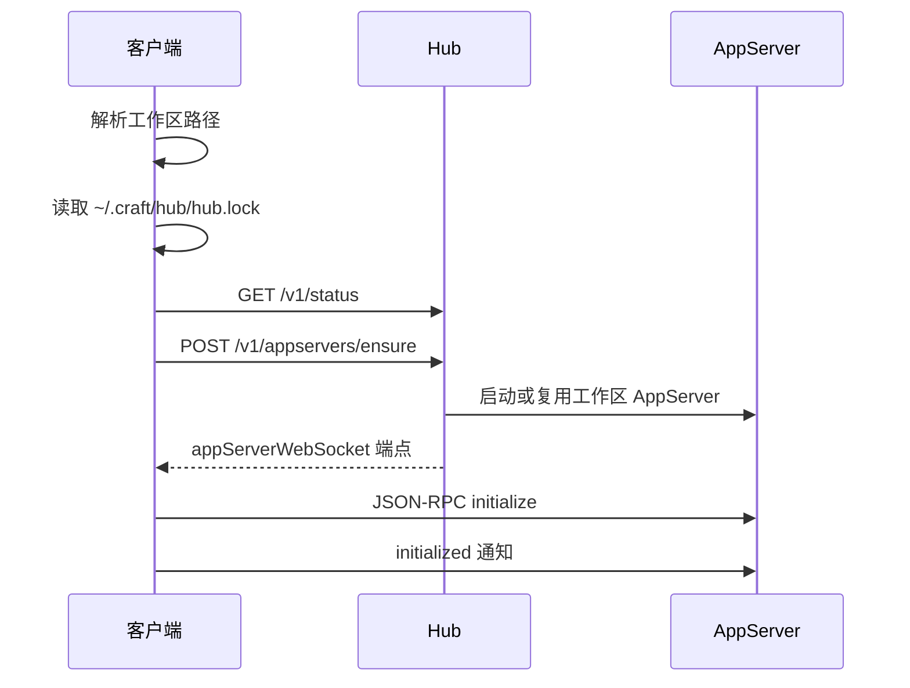

# Hub Protocol

Hub Protocol 是 DotCraft 本地客户端用来发现和管理工作区 AppServer 的本机协议。它面向 Desktop、TUI、编辑器扩展和其他本地客户端；如果你只想和 Agent 对话，真正的会话流量仍然走 [AppServer Protocol](./appserver-protocol.md)。

Hub 的职责是本地协调，不是会话代理：

- Hub 通过 HTTP JSON API 管理本机工作区 AppServer。
- Hub 通过 SSE 广播生命周期事件。
- Hub 不暴露 `thread/*`、`turn/*`、`approval/*`、`mcp/*` 等 AppServer JSON-RPC 方法。
- 调用 `appservers/ensure` 后，客户端应直接连接返回的 AppServer WebSocket 端点。

完整设计约束见 [Hub 架构规格](https://github.com/DotHarness/dotcraft/blob/master/specs/hub-architecture.md)。

## 适用场景

实现 Hub 客户端适合这些场景：

- 你正在开发 DotCraft Desktop、TUI、IDE 扩展或本地 GUI。
- 你希望多个本地客户端共享同一个工作区运行时。
- 你需要显示本机工作区运行状态、托盘菜单或系统通知。
- 你希望按需启动 AppServer，同时避免同一个工作区被重复启动。

如果你的客户端连接的是远程 AppServer，或者你自己显式管理 AppServer 进程，可以跳过 Hub。

## 协议

Hub Local API 在回环地址上使用 HTTP JSON。所有 JSON 字段使用 camelCase。

| 能力 | 说明 |
|------|------|
| 发现 | 读取 `~/.craft/hub/hub.lock` |
| API 传输 | HTTP JSON |
| 事件传输 | Server-Sent Events (`GET /v1/events`) |
| 地址 | 默认绑定回环地址 |
| 认证 | 受保护端点使用 `Authorization: Bearer <token>` |
| 状态检查 | `GET /v1/status` 不需要认证 |

`hub.lock` 的典型内容：

```json
{
  "pid": 12345,
  "apiBaseUrl": "http://127.0.0.1:49231",
  "token": "local-random-token",
  "startedAt": "2026-04-30T06:30:00Z",
  "version": "0.1.0"
}
```

客户端读取锁文件后应同时验证：

1. `pid` 指向的进程仍然存活。
2. `GET {apiBaseUrl}/v1/status` 可访问。
3. 返回的 `apiBaseUrl`、版本和能力符合客户端预期。

如果验证失败，客户端可以删除对该锁文件的信任，并按需启动 `dotcraft hub`。

## 启动流程



客户端在连接到 AppServer 后，普通会话流量不再经过 Hub。

## 认证

除 `GET /v1/status` 外，所有管理端点都需要 Bearer 令牌：

```http
Authorization: Bearer <token-from-hub-lock>
```

未授权响应：

```json
{
  "error": {
    "code": "unauthorized",
    "message": "缺少 Hub 令牌或令牌无效。",
    "details": null
  }
}
```

Hub 是同一操作系统用户下的本地协调器，不是跨用户安全边界。不要把 Hub API 暴露到非回环网络。

## API 概览

| 端点 | 认证 | 说明 |
|----------|------|------|
| `GET /v1/status` | 否 | 返回 Hub 元数据和能力。 |
| `POST /v1/shutdown` | 是 | 停止 Hub，并触发托管 AppServer 清理。 |
| `POST /v1/appservers/ensure` | 是 | 确保工作区 AppServer 可用，必要时启动。 |
| `GET /v1/appservers` | 是 | 列出运行中和已知的工作区 AppServer。 |
| `GET /v1/appservers/by-workspace?path=...` | 是 | 查询某个工作区，不启动新进程。 |
| `POST /v1/appservers/stop` | 是 | 停止一个 Hub 托管的工作区 AppServer。 |
| `POST /v1/appservers/restart` | 是 | 重启一个工作区 AppServer。 |
| `GET /v1/events` | 是 | 订阅 Hub 生命周期事件。 |
| `POST /v1/notifications/request` | 是 | 请求本地通知，由 Desktop 或托盘展示。 |

### `GET /v1/status`

响应示例：

```json
{
  "hubVersion": "0.1.0",
  "pid": 12345,
  "startedAt": "2026-04-30T06:30:00Z",
  "statePath": "/Users/me/.craft/hub",
  "apiBaseUrl": "http://127.0.0.1:49231",
  "capabilities": {
    "appServerManagement": true,
    "portManagement": true,
    "events": true,
    "notifications": true,
    "tray": false
  }
}
```

`tray: false` 表示 Hub 本身无界面；托盘和系统通知 UI 由 Desktop 负责。

### `POST /v1/appservers/ensure`

请求示例：

```json
{
  "workspacePath": "/Users/me/project",
  "client": {
    "name": "my-client",
    "version": "0.1.0"
  },
  "startIfMissing": true
}
```

响应示例：

```json
{
  "workspacePath": "/Users/me/project",
  "canonicalWorkspacePath": "/Users/me/project",
  "state": "running",
  "pid": 23456,
  "endpoints": {
    "appServerWebSocket": "ws://127.0.0.1:49300/ws?token=..."
  },
  "serviceStatus": {
    "appServerWebSocket": {
      "state": "allocated",
      "url": "ws://127.0.0.1:49300/ws?token=...",
      "reason": null
    },
    "dashboard": {
      "state": "disabled",
      "url": null,
      "reason": "Dashboard 或追踪已禁用。"
    }
  },
  "serverVersion": "0.1.0",
  "startedByHub": true,
  "exitCode": null,
  "lastError": null,
  "recentStderr": null
}
```

重要字段：

- `state`: 取值为 `stopped`、`starting`、`running`、`unhealthy`、`stopping` 或 `exited`。
- `endpoints.appServerWebSocket`: 客户端连接 AppServer Protocol 时应使用的 URL。
- `serviceStatus`: `dashboard`、`api`、`agui` 或 `apiProxy` 等可选服务的状态。
- `startedByHub`: 当前进程是否由此 Hub 管理。

如果 `startIfMissing` 为 `false`，客户端可以查看状态，而不会创建新进程。

### APIProxy 辅助进程

Desktop 可以要求 Hub 在托管 AppServer 之前启动 APIProxy 辅助进程：

```json
{
  "workspacePath": "/Users/me/project",
  "apiProxy": {
    "enabled": true,
    "binaryPath": "/absolute/path/to/proxy",
    "configPath": "/absolute/path/to/config.json",
    "endpoint": "http://127.0.0.1:49900",
    "apiKey": "local-secret"
  }
}
```

如果请求了 APIProxy，但它无法启动或无法通过就绪检查，`ensure` 会失败，而不是返回一个配置了不可用代理的 AppServer。`apiKey` 等密钥必须视为仅限本地使用，不应显示在 UI 日志中。

### 停止与重启

停止请求：

```json
{
  "workspacePath": "/Users/me/project"
}
```

重启使用相同的请求体，也可以包含 `apiProxy`。

### 通知请求

通知请求：

```json
{
  "workspacePath": "/Users/me/project",
  "kind": "turn.completed",
  "title": "任务完成",
  "body": "Agent 已完成请求的更改。",
  "severity": "success",
  "source": "appserver",
  "actionUrl": "dotcraft://workspace/open?path=/Users/me/project"
}
```

响应：

```json
{
  "accepted": true
}
```

`severity` 会被规范化为 `info`、`success`、`warning` 或 `error`。

## 事件

订阅方式：

```http
GET /v1/events
Authorization: Bearer <token>
Accept: text/event-stream
```

Hub 发送标准 SSE 记录：

```text
event: appserver.running
data: {"kind":"appserver.running","at":"2026-04-30T06:31:00Z","workspacePath":"/Users/me/project","data":{"pid":23456,"endpoints":{"appServerWebSocket":"ws://127.0.0.1:49300/ws?token=..."}}}
```

已知事件类型包括：

| 事件 | 说明 |
|-------|------|
| `hub.started` | Hub 启动完成。 |
| `hub.stopping` | Hub 正在停止。 |
| `port.allocated` | Hub 为某个服务分配了本地端口。 |
| `appserver.starting` | 工作区 AppServer 正在启动。 |
| `appserver.running` | 工作区 AppServer 已可用。 |
| `appserver.exited` | 工作区 AppServer 已退出。 |
| `appserver.unhealthy` | 健康检查失败。 |
| `apiProxy.running` | APIProxy 辅助进程已可用。 |
| `apiProxy.exited` | APIProxy 辅助进程已退出。 |
| `notification.requested` | 有本地通知请求等待 UI 展示。 |

事件负载是扩展点。客户端应根据 `kind` 和已知字段渲染 UI，并忽略未知字段。

## 连接 AppServer

拿到 `endpoints.appServerWebSocket` 后，客户端应打开 WebSocket，并按 AppServer Protocol 进行初始化：

```json
{
  "jsonrpc": "2.0",
  "id": 0,
  "method": "initialize",
  "params": {
    "clientInfo": {
      "name": "my-client",
      "title": "我的客户端",
      "version": "0.1.0"
    },
    "capabilities": {
      "approvalSupport": true,
      "streamingSupport": true
    }
  }
}
```

然后发送：

```json
{
  "jsonrpc": "2.0",
  "method": "initialized",
  "params": {}
}
```

更多会话方法见 [AppServer Protocol](./appserver-protocol.md)。

## 错误

错误响应统一为：

```json
{
  "error": {
    "code": "workspaceLocked",
    "message": "似乎已有运行中的进程持有工作区 AppServer 锁。",
    "details": {
      "workspacePath": "/Users/me/project",
      "pid": 23456
    }
  }
}
```

常见错误码：

| 错误码 | HTTP | 说明 |
|------|------|------|
| `unauthorized` | 401 | 令牌缺失或不匹配。 |
| `workspaceNotFound` | 400/404 | 工作区路径缺失、不存在，或不是 DotCraft 工作区。 |
| `workspaceLocked` | 409 | 另一个运行中的 AppServer 拥有该工作区锁。 |
| `appServerStartFailed` | 500 | 托管 AppServer 启动失败。 |
| `appServerUnhealthy` | 500 | 托管 AppServer 未通过就绪检查或健康检查。 |
| `portUnavailable` | 500 | Hub 无法分配需要的本地端口。 |
| `invalidProxySidecar` | 400 | APIProxy 辅助进程请求无效。 |
| `invalidNotification` | 400 | 通知请求无效。 |

## 客户端实现建议

- 默认使用 Hub 管理本地工作区；保留显式远程 AppServer 模式作为高级路径。
- 启动 Hub 后应重读 `hub.lock` 并验证 `/v1/status`，不要假设进程已立即可用。
- 对 `appserver.unhealthy` 和 `appserver.exited` 事件显示可操作状态，例如“重启工作区运行时”。
- 不要把 Hub 令牌、AppServer 令牌或 APIProxy API 密钥写入日志。
- 对未知端点、服务状态和事件类型保持兼容。
