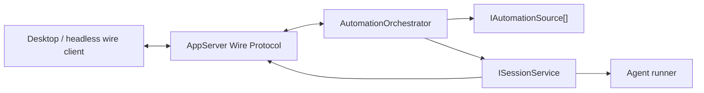
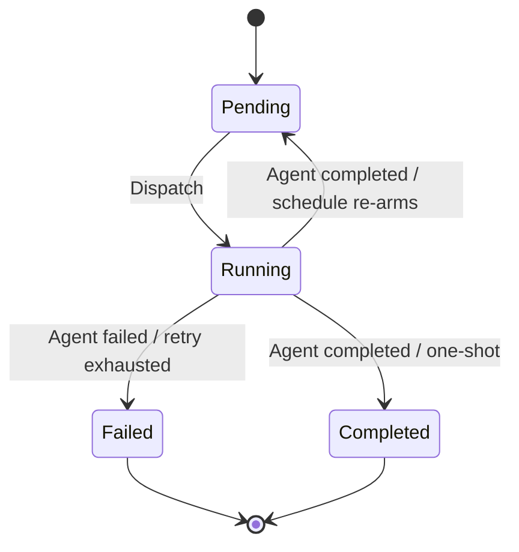

# DotCraft Automations Lifecycle Specification

| Field | Value |
|-------|-------|
| **Version** | 0.3.0 |
| **Status** | Draft |
| **Date** | 2026-05-04 |
| **Parent Spec** | [Symphony SPEC](https://github.com/openai/symphony/blob/main/SPEC.md), especially [§7 Orchestration State Machine](https://github.com/openai/symphony/blob/main/SPEC.md#7-orchestration-state-machine) and [§8 Polling, Scheduling, and Reconciliation](https://github.com/openai/symphony/blob/main/SPEC.md#8-polling-scheduling-and-reconciliation); [AppServer Protocol](appserver-protocol.md); [Session Core](session-core.md); [PR Review Lifecycle](pr-review-lifecycle.md) |

This spec defines DotCraft's built-in Automations module as an increment over Symphony. Symphony owns the common poll, dispatch, retry, reconciliation, workspace, and agent-run semantics. DotCraft adds in-process AppServer integration, a source abstraction, local task storage, Desktop visibility, and automation wire methods.

Built-in Automations does not define a task-level human review workflow. When an agent finishes a local automation task, the task reaches a terminal status directly or is re-armed by its schedule. Multi-round human feedback, comments, and explicit approval flows belong to the separate [DotCraft Symphony](dotcraft-symphony.md) application.

---

## 0. Relationship to Symphony

DotCraft inherits Symphony's orchestration model unless this document explicitly overrides it.

| Area | Symphony baseline | DotCraft increment |
|------|-------------------|--------------------|
| Poll and dispatch | Symphony §7-8 define candidate polling, dispatch, active-run reconciliation, retry/backoff, stall handling, and startup cleanup. | The orchestrator runs inside `dotcraft app-server` and dispatches through `ISessionService` rather than an external agent runner process. |
| Tracker abstraction | Symphony models tracker issues and tracker reader/writer roles. | DotCraft generalizes the tracker into `IAutomationSource`, so local files, GitHub issues, GitHub PRs, and future sources share one orchestrator. |
| Agent sessions | Symphony defines agent attempt lifecycle and event expectations. | DotCraft creates normal Session Core threads with reserved automation identity and AppServer-visible events. |
| Local tasks | Symphony assumes an external tracker. | DotCraft adds file-backed local tasks under `.craft/automations/tasks`. |
| Review | Symphony may be extended by products that add review loops. | Built-in Automations has no review gate. The separate DotCraft Symphony app owns multi-round feedback. |
| Desktop | Symphony's dashboard is optional. | DotCraft Desktop observes tasks through the AppServer wire protocol and presents read-only activity/summary surfaces. |

The local copy under `specs/symphony/` is for repository-local reference only. Normative parent links point to the public Symphony repository.

---

## 1. Scope

### 1.1 This Spec Defines

- `IAutomationSource`, `AutomationTask`, and the source-neutral task model.
- Local task file storage, scheduling, and terminal-status semantics.
- DotCraft's built-in local task lifecycle without a review gate.
- Session Core extensions used by automation threads.
- Wire Protocol methods and notifications for task management and observability.
- Desktop Automations behavior after the removal of built-in review actions.
- Migration notes for slimming the GitHubTracker path and later replacing it with DotCraft Symphony.

### 1.2 This Spec Does Not Define

- Symphony's common orchestrator loop, retry queue, reconciliation rules, or stall detection. See Symphony §7-8.
- The GitHub pull-request SHA review loop. See [PR Review Lifecycle](pr-review-lifecycle.md).
- Multi-user comments, review rounds, approve/reject actions, or re-triggering from human feedback. See [DotCraft Symphony](dotcraft-symphony.md).
- Session Core internals beyond the thread configuration surface needed by automation dispatch.
- Desktop visual design tokens. See [Desktop Client](desktop-client.md).

---

## 2. Goals and Non-Goals

### 2.1 Goals

1. Keep built-in Automations small and source-neutral.
2. Make local and GitHub automation activity visible through normal AppServer and Session Core event streams.
3. Preserve file-backed local tasks and scheduled task execution.
4. Preserve PR review as a GitHub-specific source behavior while avoiding duplicated Symphony text.
5. Remove task-level review actions from built-in Automations so terminal behavior is clear and implementable.
6. Leave a clean replacement path for the future DotCraft Symphony app.

### 2.2 Non-Goals

- Built-in Automations does not store comment threads or feedback rounds.
- Built-in Automations does not provide approve, request-changes, or reject decisions.
- Built-in Automations does not replace a full web-based orchestration console.
- Cross-repository orchestration remains outside this built-in module.

---

## 3. Architecture Overview

### 3.1 Process Model

The Automations orchestrator runs as a hosted service inside the AppServer process. It shares `ISessionService`, `AgentFactory`, `ThreadEventBroker`, and the AppServer event dispatcher with interactive clients.



### 3.2 Responsibility Split

| Layer | DotCraft responsibility |
|-------|-------------------------|
| `AutomationOrchestrator` | Hosts the Symphony-style loop, merges candidates from all sources, applies source-neutral dispatch guards, prepares workspaces, creates automation threads, and records task outcomes. |
| `AutomationSessionClient` | In-process adapter over `ISessionService`; creates threads, submits turns, subscribes to events, and detects agent completion. |
| `IAutomationSource` | Fetches pending tasks, persists status transitions, provisions optional source workspaces, registers tools, and decides source-specific completion behavior. |
| `LocalAutomationSource` | Manages file-backed task definitions, schedules, local workspace policy, and terminal local task status. |
| `GitHubAutomationSource` | Adapts GitHub issues and PRs into `AutomationTask`; PR-specific review semantics are governed by [PR Review Lifecycle](pr-review-lifecycle.md). |
| Session Core | Executes agents and tools with per-thread workspace, tool profile, and tool-call approval policy. |

### 3.3 Thread Identity

Automation threads use a reserved channel identity:

| Identity field | Value |
|----------------|-------|
| `channelName` | `"automations"` |
| `userId` | `"task-{taskId}"` |
| `workspacePath` | Main workspace path for discoverability |
| `channelContext` | `"automation:{sourceName}"` |

The actual execution workspace is passed through `ThreadConfiguration.WorkspaceOverride`.

---

## 4. Automation Source Abstraction

### 4.1 Interface Contract

```csharp
public interface IAutomationSource
{
    string Name { get; }
    string ToolProfileName { get; }

    void RegisterToolProfile(IToolProfileRegistry registry);
    Task<IReadOnlyList<AutomationTask>> GetPendingTasksAsync(CancellationToken ct);
    Task<IReadOnlyList<AutomationTask>> GetAllTasksAsync(CancellationToken ct);
    Task<AutomationWorkflowDefinition> GetWorkflowAsync(AutomationTask task, CancellationToken ct);
    Task OnStatusChangedAsync(AutomationTask task, AutomationTaskStatus newStatus, CancellationToken ct);
    Task OnAgentCompletedAsync(AutomationTask task, string agentSummary, CancellationToken ct);
    Task<bool> ShouldStopWorkflowAfterTurnAsync(AutomationTask task, CancellationToken ct);

    Task<string?> ProvisionWorkspaceAsync(AutomationTask task, CancellationToken ct) =>
        Task.FromResult<string?>(null);
    Task ReconcileExpiredResourcesAsync(CancellationToken ct) => Task.CompletedTask;
    Task DeleteTaskAsync(string taskId, CancellationToken ct);
}
```

### 4.2 Source Requirements

| Member | Requirement |
|--------|-------------|
| `GetPendingTasksAsync` | Return tasks eligible for dispatch. Source-specific filtering happens here. |
| `GetAllTasksAsync` | Return all tasks regardless of status for list/read views. |
| `GetWorkflowAsync` | Return the workflow definition for the task. |
| `OnStatusChangedAsync` | Persist orchestrator-driven status changes. Local tasks never enter a review status. |
| `OnAgentCompletedAsync` | Persist the latest agent summary. |
| `ShouldStopWorkflowAfterTurnAsync` | Reload source data after each turn and return true when the workflow should stop. |
| `RegisterToolProfile` | Register only source-specific tools. Standard tools are provided by Session Core. |
| `ProvisionWorkspaceAsync` | Optionally provide source-owned workspace setup. Returning `null` uses the generic workspace manager. |

### 4.3 Composite Source

`AutomationOrchestrator` merges candidates from all registered sources and routes status and completion calls by `task.SourceName`.

---

## 5. AutomationTask Model

### 5.1 Core Fields

```csharp
public abstract class AutomationTask
{
    public required string Id { get; init; }
    public required string Title { get; init; }
    public required AutomationTaskStatus Status { get; set; }
    public required string SourceName { get; init; }
    public string? ThreadId { get; set; }
    public string? ToolProfileOverride { get; init; }
    public string? Description { get; set; }
    public string? AgentSummary { get; set; }
    public DateTimeOffset? CreatedAt { get; set; }
    public DateTimeOffset? UpdatedAt { get; set; }
    public CronSchedule? Schedule { get; set; }
    public AutomationThreadBinding? ThreadBinding { get; set; }
    public DateTimeOffset? NextRunAt { get; set; }
}
```

### 5.2 Kinds

```csharp
public enum AutomationTaskKind
{
    Local,
    GitHubIssue,
    GitHubPullRequest
}
```

### 5.3 Status Names

Local task persisted statuses are:

| Status | Meaning |
|-------|---------|
| `pending` | Eligible for dispatch. |
| `running` | Agent is currently running or the task has been claimed. |
| `completed` | Agent finished successfully and no schedule re-armed the task. |
| `failed` | Agent run failed and retry policy is exhausted or not applicable. |

Unknown or legacy review-gate statuses are not valid built-in Automations statuses.

---

## 6. Local Task Source

### 6.1 Task Store Layout

```text
.craft/
  automations/
    tasks/
      {task-id}/
        task.md
        workflow.md
        summary.md
        workspace/
```

### 6.2 Task File Front Matter

```yaml
id: task-001
title: Refactor auth module
status: pending
workflow: project
approval_policy: workspaceScope
schedule:
  kind: cron
  expression: "0 9 * * 1"
thread_binding:
  thread_id: null
```

The task body stores the user-facing description. `summary.md` stores the latest agent summary after a successful run. Feedback history is not stored by built-in Automations.

### 6.3 Local Source Behavior

| Operation | Behavior |
|-----------|----------|
| Candidate fetch | Return tasks in `pending` whose schedule is due or absent. |
| Dispatch | Set `status: running`, update `updated_at`, and bind the `threadId` when available. |
| Agent success | Store `agentSummary`, write `summary.md`, then evaluate schedule. |
| Schedule present | Re-arm to `pending` for the next due time. |
| No schedule | Set `status: completed`. |
| Agent failure | Set `status: failed` unless Symphony retry/backoff schedules another attempt. |

---

## 7. Local Task Lifecycle Status Machine

### 7.1 Status Diagram



### 7.2 Transition Rules

| Transition | Rule |
|------------|------|
| `Pending -> Running` | The orchestrator has capacity and the source says the task should dispatch. |
| `Running -> Pending` | The agent completes a scheduled task and the orchestrator refreshes `nextRunAt`. |
| `Running -> Completed` | The agent completes a one-shot task. |
| `Running -> Failed` | The run fails and no retry remains. |

### 7.3 Round Tracking

Attempt tracking is for summaries and logs only. It does not imply human feedback, comments, approval, or request-changes loops.

### 7.4 No Built-In Review Gate

Built-in Automations intentionally has no task-level review status or decision API. Human feedback and multi-round review are provided by [DotCraft Symphony](dotcraft-symphony.md), which keeps its own comment and round store and drives DotCraft through AppServer.

---

## 8. Session Core Extensions

### 8.1 Workspace Override

Automation dispatch sets `ThreadConfiguration.WorkspaceOverride` to the task execution workspace. `thread/list` still finds the thread through the main workspace path in the automation identity.

### 8.2 Tool Profiles

Sources register source-specific tools through `IToolProfileRegistry`. Dispatch sets `ThreadConfiguration.ToolProfile` to the source profile name, and Session Core merges standard tools with the profile tools.

### 8.3 Per-Thread Approval Policy

Built-in Automations uses tool-call approval policy only. It does not model task-level approval.

| Task `approval_policy` | Tool behavior |
|------------------------|---------------|
| `workspaceScope` (default) | Operations outside the task workspace are rejected without prompting. |
| `fullAuto` | Outside-workspace operations may proceed with auto-approval when the configured tool provider permits it. |

Implementations map these values to `ThreadConfiguration.ApprovalPolicy` and tool-provider workspace scope flags. This policy controls file/shell/tool access, not acceptance of task results.

### 8.4 `thread/list` Filter

`thread/list` accepts `channelName: "automations"` so clients can find automation threads without scanning all user conversations.

---

## 9. Orchestrator Behavior

DotCraft follows Symphony §7-8 for poll ticks, dispatch ordering, retry/backoff, active-run reconciliation, stall detection, and terminal cleanup.

DotCraft-specific dispatch flow:

```text
OnTick
  Reconcile active runs
  Fetch candidates from all IAutomationSource instances
  Merge and sort candidates
  For each candidate while capacity remains:
    skip if running or claimed
    skip unless source.ShouldReDispatch(...) is true
    provision workspace
    create or resume automation thread
    submit workflow prompt
    persist source dispatch state
```

DotCraft-specific worker exit flow:

```text
Agent success:
  source.OnAgentCompletedAsync(task, summary)
  Local source: schedule ? pending : completed

Agent failure:
  apply Symphony retry/backoff
  if no retry remains, source.OnStatusChangedAsync(task, failed)
```

---

## 10. Workflow Format

### 10.1 Front Matter

```yaml
automation:
  active_states: ["pending"]
  terminal_states: ["completed", "failed"]
  max_turns: 20
  workspace: project
  approval_policy: workspaceScope
```

Review-related workflow keys are not part of built-in Automations.

### 10.2 Template Variables

| Variable | Description |
|----------|-------------|
| `task.id` | DotCraft task ID. |
| `task.identifier` | Human-readable source identifier. |
| `task.title` | Task title. |
| `task.description` | Task body or tracker description. |
| `task.source` | Source name. |
| `task.round` | Current dispatch round. |
| `workspace.path` | Agent execution workspace. |

Legacy `work_item.*` variables MAY be aliased to `task.*` during migration.

---

## 11. Workspace Management

Local tasks support two workspace modes:

| Mode | Behavior |
|------|----------|
| `project` | The agent works in the main project workspace. |
| `isolated` | The agent works in `.craft/automations/tasks/{task-id}/workspace`. |

Non-local sources MAY provide their own workspace through `IAutomationSource.ProvisionWorkspaceAsync`. If they return `null`, the generic workspace manager is used.

Hook variables:

| Variable | Value |
|----------|-------|
| `DOTCRAFT_AUTOMATION_TASK_ID` | Task ID. |
| `DOTCRAFT_AUTOMATION_SOURCE` | Source name. |
| `DOTCRAFT_AUTOMATION_WORKSPACE` | Execution workspace path. |
| `DOTCRAFT_AUTOMATION_THREAD_ID` | Bound thread ID when known. |

Hooks tied to approve/reject decisions are not part of built-in Automations.

---

## 12. Agent Execution

### 12.1 AutomationSessionClient

`AutomationSessionClient` is an in-process wrapper over `ISessionService`:

1. Create or resume an automation thread with reserved identity.
2. Submit the rendered workflow prompt.
3. Observe Session Core events through `ThreadEventBroker`.
4. Detect successful completion, timeout, or failure.
5. Return `AgentRunOutcome` to the orchestrator.

### 12.2 Completion Detection

Completion can be detected by:

- Source-specific completion tools, such as local task completion or GitHub issue completion.
- Agent run termination after the configured max turns.
- Timeout or exception.

Local task success maps directly to `completed` for one-shot tasks, or to `pending` with a refreshed `nextRunAt` for scheduled tasks. Failures map to `failed`.

---

## 13. Wire Protocol Extensions

### 13.1 Methods

| Method | Direction | Params | Result |
|--------|-----------|--------|--------|
| `automation/task/list` | Client -> Server | `{ sourceName? }` | `{ tasks: AutomationTaskWire[] }` |
| `automation/task/read` | Client -> Server | `{ taskId, sourceName }` | `{ task: AutomationTaskWire }` |
| `automation/task/create` | Client -> Server | `{ title, description?, workflowTemplate?, approvalPolicy?, workspaceMode?: "project" \| "isolated", schedule?: AutomationScheduleWire, threadBinding?: AutomationThreadBindingWire, templateId?: string }` | `{ task: AutomationTaskWire }` |
| `automation/task/updateBinding` | Client -> Server | `{ taskId, sourceName, threadBinding?: AutomationThreadBindingWire \| null }` | `{ task: AutomationTaskWire }` |
| `automation/task/delete` | Client -> Server | `{ taskId, sourceName }` | `{ ok: true }` |
| `automation/template/list` | Client -> Server | `{ locale? }` | `{ templates: AutomationTemplateWire[] }` |
| `automation/template/save` | Client -> Server | `{ id?, title, description?, icon?, category?, workflowMarkdown, defaultSchedule?, defaultWorkspaceMode?, defaultApprovalPolicy?, needsThreadBinding?, defaultTitle?, defaultDescription? }` | `{ template: AutomationTemplateWire }` |
| `automation/template/delete` | Client -> Server | `{ id }` | `{ ok: true }` |

Task-level review endpoints are not part of built-in Automations.

### 13.2 Notifications

| Notification | Direction | Payload |
|--------------|-----------|---------|
| `automation/task/updated` | Server -> Client | `{ task: AutomationTaskWire }` |

Review-requested notifications are not part of built-in Automations.

### 13.3 `AutomationTaskWire`

```json
{
  "id": "task-001",
  "sourceName": "local",
  "title": "Refactor auth module",
  "description": "Task body...",
  "status": "completed",
  "threadId": "thr_123",
  "agentSummary": "Completed summary...",
  "approvalPolicy": "workspaceScope",
  "schedule": null,
  "threadBinding": null,
  "nextRunAt": null,
  "createdAt": "2026-05-04T00:00:00Z",
  "updatedAt": "2026-05-04T00:10:00Z"
}
```

`AutomationTaskWire.status` for built-in local tasks is one of:

```text
pending | running | completed | failed
```

The wire DTO does not include legacy task-level approval flags, approval decisions, review decisions, or review notification data.

### 13.4 Schedule and Thread Binding DTOs

`AutomationScheduleWire` and `AutomationThreadBindingWire` are retained. Absence of `schedule` means the task is one-shot and reaches `completed` after successful agent completion.

---

## 14. Desktop Integration

### 14.1 Automations View

Desktop shows built-in automation tasks as an operational activity board.

```text
Automations
[All] [Pending] [Running] [Completed] [Failed]

task-001  Refactor auth module       Completed
task-042  Fix login redirect         Running
task-099  Weekly dependency scan     Pending
```

### 14.2 Task List Entry

Each task row displays:

| Element | Description |
|---------|-------------|
| Status indicator | Pending, running, completed, or failed. |
| Identifier and title | `{identifier}: {title}`. |
| State badge | Right-aligned state label. |
| Metadata line | Source, workflow, round count, turn count, schedule, and relative time. |
| Tool policy badge | Shows `workspaceScope` or `fullAuto` when relevant. |

Review badges are not shown in built-in Automations.

### 14.3 Read-Only Task Panel

Selecting a task opens a read-only activity and summary panel:

| Tab | Content |
|-----|---------|
| **Activity** | Live or historical automation thread events. Running tasks subscribe via `thread/subscribe(threadId)`. |
| **Summary** | Latest `agentSummary` and `summary.md` content. |
| **Details** | Source, schedule, workspace, tool policy, timestamps, and thread binding. |

The panel has no approve, request-changes, or reject actions. Full multi-round review workflows are provided by [DotCraft Symphony](dotcraft-symphony.md).

### 14.4 State Store

| Field | Type | Updated by |
|-------|------|------------|
| `tasks` | `AutomationTaskWire[]` | `automation/task/list`, `automation/task/updated` |
| `activeFilter` | `"all" \| "pending" \| "running" \| "completed" \| "failed"` | User tab selection |
| `selectedTaskId` | `string \| null` | User task selection |

---

## 15. Configuration

```toml
[Automations]
Enabled = true

[Automations.Local]
WorkflowPath = "WORKFLOW.md"
TasksDirectory = ".craft/automations/tasks"
WorkflowsDirectory = ".craft/automations/workflows"

[Automations.Orchestrator]
PollIntervalMs = 30000
MaxConcurrentAgents = 3
MaxTurns = 20
TurnTimeoutMs = 3600000
StallTimeoutMs = 300000
MaxRetryBackoffMs = 300000

[Automations.Workspace]
Root = ""

[Automations.Hooks]
AfterCreate = ""
BeforeRun = ""
AfterRun = ""
BeforeRemove = ""
TimeoutMs = 60000
```

No approve/reject hooks are defined for built-in Automations.

---

## 16. Observability, Logging, and Diagnostics

Automations should emit enough `ILogger` output for headless operators to inspect `.craft/logs/` and confirm poll, dispatch, thread association, and terminal status transitions.

| Phase | Minimum event |
|-------|---------------|
| Poll | Poll cycle completed with source counts. |
| Dispatch | Task dispatch started with `taskId` and `sourceName`. |
| Thread | Thread created or resumed with `taskId`, `threadId`, and `sourceName`. |
| Status | Task enters `running`, `completed`, or `failed`. |
| Workflow | Turn or round milestones. |
| Errors | Source fetch, dispatch, persistence, or worker failures. |

Logs are supplementary to Session thread history and tracing; they must not duplicate full prompts or tool payloads.

---

## 17. Module Structure

### 17.1 DotCraft.Automations

```text
src/DotCraft.Automations/
  AutomationsModule.cs
  AutomationsConfig.cs
  Core/
    IAutomationSource.cs
    AutomationTask.cs
    AgentRunOutcome.cs
  Orchestrator/
    AutomationOrchestrator.cs
    OrchestratorState.cs
    DispatchSorter.cs
    RetryQueue.cs
  Protocol/
    AutomationSessionClient.cs
    AutomationsRequestHandler.cs
  Sources/
    Local/
      LocalAutomationSource.cs
      LocalTaskStore.cs
      LocalTaskCompletionToolProvider.cs
  Workspace/
    AutomationWorkspaceManager.cs
```

### 17.2 DotCraft.GitHubTracker

```text
src/DotCraft.GitHubTracker/
  GitHubTrackerConfig.cs
  GitHubTrackerModule.cs
  GitHubAutomationSource.cs
  Tools/
    IssueCompletionToolProvider.cs
    PullRequestReviewToolProvider.cs
```

`GitHubTrackerModule` registers `GitHubAutomationSource` as an `IAutomationSource`. DotCraft Automations has no dependency on GitHub-specific types.

### 17.3 DotCraft.Core Extensions

```text
src/DotCraft.Core/
  Protocol/
    ThreadConfiguration.cs
  Agents/
    IToolProfileRegistry.cs
```

---

## 18. Migration Path

### 18.1 Phase 1: Session Core Prerequisites

- Add `ThreadConfiguration.WorkspaceOverride`.
- Add `ThreadConfiguration.ToolProfile` and `IToolProfileRegistry`.
- Add the tool-call approval policy mapping needed for `workspaceScope` and `fullAuto`.
- Extend `thread/list` with `channelName`.

### 18.2 Phase 2: Automations Core

- Create `DotCraft.Automations` with the source abstraction and orchestrator.
- Implement `LocalAutomationSource` without review statuses or review decisions.
- Add `AutomationsRequestHandler` for the non-review `automation/*` methods.
- Register the orchestrator as an AppServer hosted service.

### 18.3 Phase 3: Desktop Integration

- Implement the Automations task list and read-only task panel.
- Subscribe to automation threads for live running task activity.
- Add task creation, delete, and template list flows.
- Remove built-in approve/request-changes/reject UI.

### 18.4 Phase 4: GitHubTracker Slimming

- Refactor GitHubTracker into `GitHubAutomationSource`.
- Keep PR-specific behavior in [PR Review Lifecycle](pr-review-lifecycle.md).
- Remove duplicated orchestration code after Automations owns dispatch.

### 18.5 Phase 5: DotCraft Symphony Replacement

After [DotCraft Symphony](dotcraft-symphony.md) ships, remove the built-in GitHub source and Desktop GitHub integration as a single replacement step. DotCraft Symphony becomes the owner of long-running GitHub issue/PR automation, comment storage, review rounds, and web review UX.

### 18.6 Backward Compatibility

- Existing `WORKFLOW.md` and `PR_WORKFLOW.md` files continue to load during migration.
- Legacy `work_item.*` variables may be aliased to `task.*`.
- Existing `GitHubTrackerConfig` settings continue to function until the DotCraft Symphony replacement phase.
