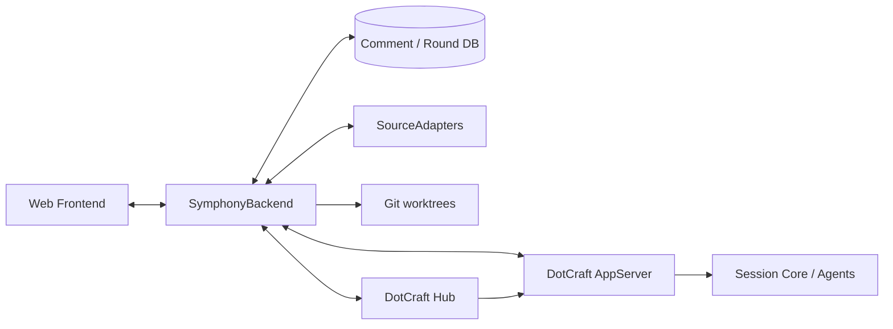
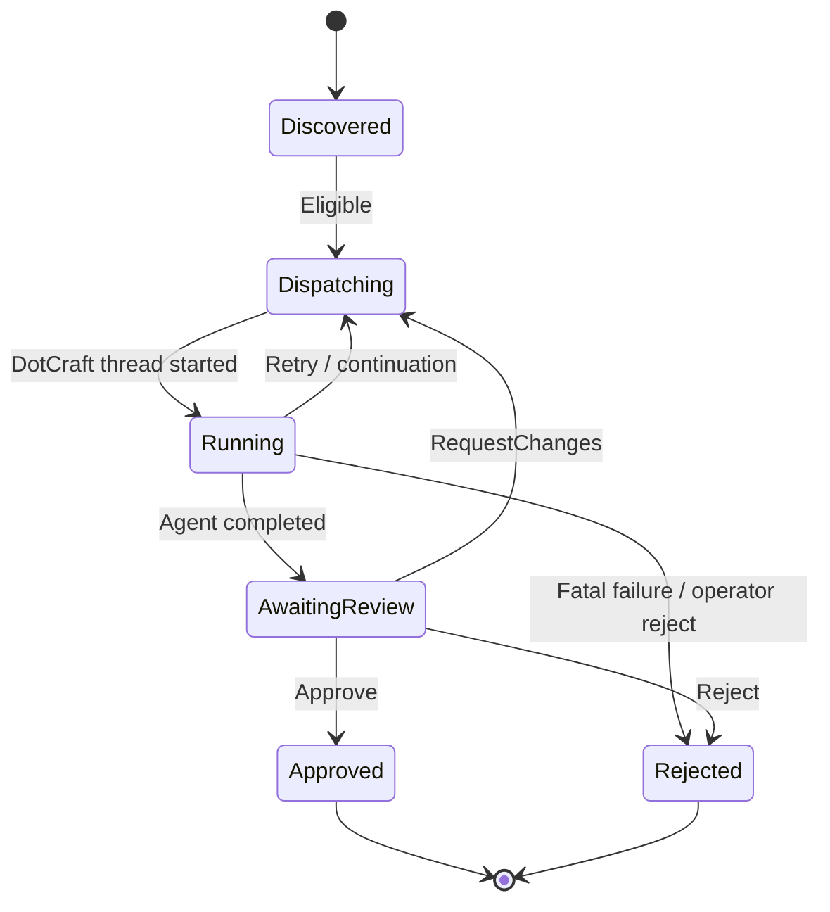

# DotCraft Symphony Specification

| Field | Value |
|-------|-------|
| **Version** | 0.1.0 |
| **Status** | Draft |
| **Date** | 2026-05-04 |
| **Parent Spec** | [Symphony SPEC](https://github.com/openai/symphony/blob/main/SPEC.md), especially [§7 Orchestration State Machine](https://github.com/openai/symphony/blob/main/SPEC.md#7-orchestration-state-machine), [§8 Polling, Scheduling, and Reconciliation](https://github.com/openai/symphony/blob/main/SPEC.md#8-polling-scheduling-and-reconciliation), and [§11 Issue Tracker Integration Contract](https://github.com/openai/symphony/blob/main/SPEC.md#11-issue-tracker-integration-contract-linear-compatible) |

DotCraft Symphony is the planned self-hosted Symphony application for DotCraft. It runs as a standalone backend plus web frontend, keeps durable issue/PR comments and review rounds, and drives DotCraft through AppServer or Hub. It is the long-running, multi-round review product that replaces built-in Desktop GitHub integration over time.

This document is a design spec. It does not require immediate C#, Desktop, or web implementation changes.

---

## 1. Problem and Goals

### 1.1 Problem

Built-in DotCraft Automations intentionally stays small:

- It has no durable store for multi-round user feedback, comments, or review decisions.
- Desktop is not the right host for long-running parallel orchestration that may need to continue while no UI is open.
- The existing built-in GitHub path mixes automation execution with local Desktop UX and should eventually move to a product surface designed for issue and PR review.

### 1.2 Goals

1. Provide a self-hosted backend that can run continuously on a server.
2. Provide a web frontend that replaces Linear-like comment and review panels for DotCraft tasks.
3. Reuse DotCraft AppServer, Hub, Session Core, agents, skills, and tools instead of embedding a second agent runtime.
4. Store comments, review rounds, agent summaries, and task state durably.
5. Support multi-round flows: approve, request changes, reject, and re-trigger agent work with feedback.
6. Keep tracker writes, such as GitHub comments or status changes, inside explicit tool or adapter boundaries.

### 1.3 Non-Goals

- DotCraft Symphony does not reuse built-in `automation/task/review`.
- DotCraft Symphony does not require Desktop to stay open.
- DotCraft Symphony does not replace low-level Session Core or AppServer protocols.
- DotCraft Symphony does not define every UI pixel; this spec defines product contract and lifecycle.

---

## 2. Architecture



DotCraft Symphony is split into:

| Component | Responsibility |
|-----------|----------------|
| Web Frontend | Task list, detail page, comment timeline, review controls, run status, and operator settings. |
| SymphonyBackend | Polls sources, reconciles runs, persists rounds/comments, calls DotCraft AppServer/Hub, and exposes web APIs. |
| SourceAdapters | Read issues and PRs from GitHub and future trackers such as Gitee. |
| Comment / Round DB | Durable storage for user feedback, agent summaries, review decisions, and run metadata. |
| DotCraft AppServer | Creates threads and submits turns through JSON-RPC over stdio or WebSocket. |
| DotCraft Hub | Optional routing layer for remote or multi-workspace DotCraft instances. |
| Git worktrees | Source-controlled execution workspaces used by backend-managed runs. |

---

## 3. Component Contract

### 3.1 Backend Orchestrator

The backend orchestrator reuses Symphony §7-8 semantics:

- Poll sources for candidate issues and PRs.
- Dispatch eligible work while respecting concurrency limits.
- Reconcile active runs and detect stalls.
- Retry transient failures with bounded backoff.
- Move work into awaiting review when agent output is ready for human judgment.

Unlike built-in Automations, the backend is an external process. It drives DotCraft by creating threads and submitting turns through [AppServer Protocol](appserver-protocol.md).

Required AppServer operations:

| AppServer capability | Use |
|----------------------|-----|
| Create or resume thread | Create one automation thread per source item and round as needed. |
| Submit turn | Send the rendered task prompt and feedback context to the agent. |
| Subscribe/read thread | Stream run progress and collect final summaries. |
| Tool and workspace configuration | Bind agent execution to backend-managed workspace and tool policy. |

### 3.2 Issue and PR Adapters

Adapters keep Symphony's tracker-reader role:

| Operation | Contract |
|-----------|----------|
| Fetch candidates | Return source items eligible for automation. |
| Fetch by IDs | Return current source state for reconciliation. |
| Normalize identity | Provide stable `(source, externalId)` keys. |
| Fetch comments | Import source-side comments when configured. |
| Write status/comment | Either expose explicit adapter writes or delegate to agent tools, depending on source policy. |

GitHub is the first adapter. Future adapters can include Gitee or internal issue trackers.

Tracker write boundaries must remain explicit. Agent-driven writes, such as posting GitHub comments, should continue to happen through audited tools when possible.

### 3.3 Comment and Round Store

The backend stores review data in an independent database. SQLite is recommended for single-node deployments; Postgres is recommended for shared or server deployments.

Primary logical key:

```text
(source, externalId, round)
```

Stored data:

| Data | Purpose |
|------|---------|
| Source item snapshot | Reconstruct the issue/PR state used for each dispatch. |
| User comments | Feed human feedback into the next prompt. |
| Review decision | Approve, request changes, reject, or reopen. |
| Agent summary | Show result and seed later rounds. |
| Thread IDs | Link backend rounds to DotCraft Session Core history. |
| Workspace metadata | Track worktree path, branch, commit, or cleanup state. |

Historical feedback becomes prompt context for subsequent runs through explicit template variables.

### 3.4 Web Frontend

The web frontend provides:

- Task list with filters for source, state, assignee, repository, and updated time.
- Detail page with source metadata, timeline, comments, agent run status, and summaries.
- Comment box for human feedback.
- Approve, request changes, reject, and re-trigger controls.
- Link-outs to DotCraft thread history when available.

Difference from built-in Desktop Automations:

| Built-in Desktop Automations | DotCraft Symphony Web |
|------------------------------|-----------------------|
| Read-only activity and summary panel. | Durable comment and review console. |
| Local app process. | Server-capable backend. |
| No built-in review gate. | Multi-round review lifecycle. |
| Local task and source overview. | Source-centric issue/PR operations. |

---

## 4. Lifecycle

These states belong to DotCraft Symphony, not built-in DotCraft Automations.



### 4.1 State Definitions

| State | Description |
|-------|-------------|
| `Discovered` | Source item exists and has not been dispatched for the current round. |
| `Dispatching` | Backend is preparing workspace, prompt, and DotCraft thread. |
| `Running` | DotCraft agent is executing through AppServer or Hub. |
| `AwaitingReview` | Agent output is ready for human review in the web frontend. |
| `Approved` | Human accepted the result. The backend may run completion hooks or source updates. |
| `RequestChanges` | A transition decision that records feedback and re-enters `Dispatching`. |
| `Rejected` | Human rejected the result or the backend stopped the work permanently. |

### 4.2 Round Semantics

Each request-changes decision creates a new round. The next prompt must include:

- Current source item snapshot.
- Latest user feedback.
- Prior agent summaries for the same `(source, externalId)`.
- Relevant unresolved comments.
- Workspace and branch metadata.

---

## 5. Wire and API Contract

DotCraft Symphony exposes its own API. It does not reuse built-in `automation/task/review`, and it does not depend on built-in Automations review persistence.

### 5.1 Backend REST Shape (Draft)

| Method | Path | Purpose |
|--------|------|---------|
| `GET` | `/api/v1/items` | List source items and Symphony state. |
| `GET` | `/api/v1/items/{source}/{externalId}` | Read detail, timeline, comments, rounds, and current run. |
| `POST` | `/api/v1/items/{source}/{externalId}/comments` | Add human feedback. |
| `POST` | `/api/v1/items/{source}/{externalId}/dispatch` | Manually dispatch or re-dispatch work. |
| `POST` | `/api/v1/items/{source}/{externalId}/approve` | Approve current round. |
| `POST` | `/api/v1/items/{source}/{externalId}/request-changes` | Record feedback and dispatch another round. |
| `POST` | `/api/v1/items/{source}/{externalId}/reject` | Reject current round. |
| `GET` | `/api/v1/runs/{runId}` | Read run status and linked DotCraft thread IDs. |

### 5.2 Example Item Detail

```json
{
  "source": "github",
  "externalId": "pr:42",
  "title": "Add JWT middleware",
  "state": "awaiting_review",
  "round": 2,
  "threadIds": ["thr_abc", "thr_def"],
  "agentSummary": "Implemented middleware and tests.",
  "comments": [
    {
      "id": "cmt_1",
      "author": "user",
      "body": "Please cover expired token behavior.",
      "round": 1,
      "createdAt": "2026-05-04T08:00:00Z"
    }
  ]
}
```

### 5.3 AppServer JSON-RPC Boundary

The backend talks to DotCraft AppServer through JSON-RPC:

| Backend action | AppServer interaction |
|----------------|-----------------------|
| Start round | Create or resume a DotCraft thread. |
| Run agent | Submit a turn with rendered prompt and feedback context. |
| Stream progress | Subscribe to thread events. |
| Collect history | Read thread contents for timeline and summaries. |
| Configure execution | Pass workspace, tool profile, and approval policy through thread config. |

---

## 6. Deployment and Runtime

### 6.1 Deployment Modes

| Mode | Description |
|------|-------------|
| Single-node | Backend, database, and DotCraft AppServer run on the same machine. |
| Containerized | Backend and database run in containers; DotCraft AppServer can run beside them or remotely. |
| Remote DotCraft | Backend connects to AppServer or Hub over WebSocket. |

### 6.2 AppServer Connection

| Connection | Use |
|------------|-----|
| stdio | Same-host backend launches or supervises `dotcraft app-server`. |
| WebSocket | Backend connects to an already-running local or remote AppServer. |
| Hub | Backend routes across multiple workspaces or machines. |

### 6.3 Runtime Requirements

- Durable DB migrations.
- Source credentials for GitHub or other adapters.
- Workspace root for git worktrees.
- DotCraft AppServer credentials or process supervision.
- Operator logs for poll, dispatch, run, review, and source-write events.

---

## 7. Migration and Replacement

DotCraft Symphony is the long-term replacement for built-in GitHub automation UX.

When DotCraft Symphony is ready:

1. Remove Desktop GitHub integration that duplicates issue/PR review console behavior.
2. Remove the built-in GitHub `IAutomationSource` from DotCraft Automations.
3. Remove [PR Review Lifecycle](pr-review-lifecycle.md) with the built-in GitHub source.
4. Keep built-in Automations focused on local/scheduled tasks and read-only activity.
5. Route long-running issue and PR orchestration through DotCraft Symphony.

This matches the Phase 5 migration path in [Automations Lifecycle](automations-lifecycle.md).

---

## 8. Relationship to Existing Specs

| Spec | Relationship |
|------|--------------|
| [Automations Lifecycle](automations-lifecycle.md) | Defines built-in local/source automation without review gate. DotCraft Symphony owns the omitted review workflow. |
| [PR Review Lifecycle](pr-review-lifecycle.md) | Temporary built-in GitHub PR behavior. Removed after DotCraft Symphony replaces GitHub integration. |
| [AppServer Protocol](appserver-protocol.md) | Backend uses this protocol to create threads, submit turns, and read events. |
| [Hub Architecture](hub-architecture.md) | Optional routing layer for remote or multi-workspace AppServer access. |
| Symphony SPEC | Parent orchestration, polling, tracker, workspace, and agent-run semantics. |

---

## 9. Open Questions

| Question | Notes |
|----------|-------|
| Sandbox and auth | Define how backend users authenticate and how tool permissions map to web users. |
| Single instance vs multi-instance | Decide whether one backend can orchestrate many DotCraft workspaces concurrently. |
| Cron job relationship | Clarify which scheduled work stays in built-in Automations and which belongs to DotCraft Symphony; see existing cron-job specs when available. |
| Source write policy | Decide which writes are backend adapter operations and which must go through agent tools. |
| Comment sync | Decide whether external tracker comments are mirrored continuously or imported only at dispatch time. |
