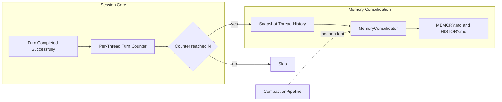

# DotCraft Memory Consolidation Design Specification

| Field | Value |
|-------|-------|
| **Version** | 0.1.0 |
| **Status** | Draft |
| **Date** | 2026-04-29 |
| **Parent Specs** | [Session Core](session-core.md), [AppServer Protocol](appserver-protocol.md) |

Purpose: Define DotCraft's long-term memory consolidation flow. Memory consolidation is an independent persistence workflow for durable user and workspace knowledge. It is not a context compaction mechanism and does not depend on `CompactionPipeline`.

## 1. Scope

Memory consolidation turns completed conversation history into durable workspace memory.

In scope:

- Updating `MEMORY.md` with structured long-term facts.
- Appending `HISTORY.md` with timestamped, grep-searchable event summaries.
- Defining when consolidation runs and what conversation history it may inspect.
- Defining failure, configuration, and user-facing control semantics.

Out of scope:

- Short-term context compaction and token-pressure recovery.
- Provider prompt-cache behavior.
- Vector retrieval, semantic indexes, or cross-workspace memory sharing.
- Exact prompts, model-specific output formatting, and code-level implementation details.

## 2. Core Concepts

| Concept | Definition |
|---------|------------|
| **Short-term Compaction** | A context-window management workflow that reduces model-visible history so future model calls fit within token limits. |
| **Long-term Memory Consolidation** | A persistence workflow that extracts durable facts and events from completed conversation history. |
| **`MEMORY.md`** | The structured long-term memory file. It should contain stable facts about the user, workspace, preferences, and recurring project context. |
| **`HISTORY.md`** | The append-only event log. It should contain compact timestamped paragraphs useful for search and audit. |
| **Consolidation Window** | The conversation history snapshot given to the consolidation model for one consolidation attempt. |

Short-term compaction and long-term memory consolidation may observe similar conversation content, but they optimize for different outcomes. Compaction protects the next model call. Consolidation improves future sessions by preserving durable knowledge.

## 3. Triggering Model

Consolidation runs after successful turns, using a simple per-thread counter:

- Each successfully completed turn increments the thread's consolidation counter.
- When the counter reaches the configured interval, DotCraft snapshots model-visible history. If the snapshot is non-empty, it resets the counter and schedules a background consolidation task. Empty snapshots do not consume the scheduled attempt.
- Failed or cancelled turns do not increment the counter and do not reset it.
- Clearing or deleting a thread clears that thread's consolidation counter.

`CompactionPipeline` does not trigger consolidation. A compaction attempt, success, failure, or circuit-breaker state must not affect whether memory consolidation is eligible to run.

Manual consolidation commands may be added later, but the baseline behavior is automatic turn-count-based consolidation.

## 4. Input Scope

The consolidation input is the current thread's model-visible conversation history at the end of a successful turn.

DotCraft intentionally uses the whole thread snapshot rather than only the messages since the last consolidation. This keeps triggering simple and lets the consolidation model compare current conversation history with existing `MEMORY.md` before deciding what changed.

If the visible thread history already contains compacted summary messages, those messages may remain in the consolidation input. They represent part of the conversation state available to the agent and can help the model understand earlier context boundaries.

## 5. Persistence Contract

Consolidation writes two memory layers:

- `MEMORY.md` is updated as a full replacement. The consolidation model reads the current memory and returns the complete updated long-term memory.
- `HISTORY.md` is append-only. Each consolidation attempt may append one timestamped paragraph describing key events, decisions, and topics.

The operation is best-effort. The system should avoid corrupting existing memory files; if a consolidation attempt cannot produce a valid update, it should leave existing memory unchanged.

Concurrent consolidation attempts should be treated as independent background maintenance work. Implementations should serialize writes per memory store, replace `MEMORY.md` atomically via a temporary file, append `HISTORY.md` under the same store lock, and avoid blocking the active turn.

## 6. Failure And Backpressure

Consolidation is fire-and-forget:

- The active turn does not wait for consolidation to complete.
- A consolidation failure does not fail the turn.
- A consolidation failure does not trip the compaction circuit breaker.
- A skipped or failed consolidation attempt is acceptable; the worst expected user-visible outcome is that long-term memory was not updated.

Unlike context compaction, consolidation does not need a circuit breaker in the baseline design. The trigger should remain predictable and simple. If future implementations observe repeated provider failures or excessive load, a separate memory-specific backoff can be added without coupling it to compaction.

## 7. Event Emission

Memory consolidation emits transient `system/event` notifications so clients can display and dismiss maintenance status without blocking the active Turn:

- `consolidating` is emitted through the active turn-scoped event channel after the successful Turn is marked complete and before the background consolidation task is scheduled. It carries the completed Turn's `turnId`.
- `consolidated` is emitted through the thread event broker after the background task successfully writes `MEMORY.md` or `HISTORY.md`. Because the turn-scoped event channel may already be closed, this event is thread-scoped and carries `turnId = null`.
- `consolidationSkipped` is emitted through the thread event broker when the background task completes without writing durable memory, such as when the model does not call `save_memory` or returns no valid changes. Clients should dismiss any active consolidation status without showing a success marker.
- `consolidationFailed` is emitted through the thread event broker if the background task fails. Clients should dismiss any active consolidation status and may surface the event `message`.

On `consolidated`, Session Core also persists a `SystemNotice` item with `kind = "memoryConsolidated"` into the completed Turn and broadcasts `item/started` + `item/completed` through the thread event broker. This gives Desktop and other timeline clients a durable divider that survives thread reloads. Skipped and failed attempts do not create persistent conversation items.

## 8. Configuration

Memory consolidation is controlled by memory-specific configuration:

| Setting | Default | Meaning |
|---------|---------|---------|
| `Memory.AutoConsolidateEnabled` | `true` | Enables automatic turn-count-based consolidation. |
| `Memory.ConsolidateEveryNTurns` | `5` | Number of successful turns between automatic consolidation attempts per thread. |
| `ConsolidationModel` | empty | Optional model override for consolidation. Empty means use the main model. |

These settings are independent from `Compaction.*` settings. Disabling context compaction must not disable long-term memory consolidation, and disabling long-term memory consolidation must not change context compaction behavior.

## 9. UX Surface

Desktop exposes memory consolidation as a personalization setting:

- Label: "Enable long-term memory"
- Meaning: allow DotCraft to progressively accumulate facts about the user and workspace so future sessions can reference them.

Other clients do not need dedicated UI to benefit from the same workspace setting. They may read or update the same workspace configuration through AppServer.

The setting should take effect for future successful turns without requiring an AppServer restart.

## 10. Future Work

Potential extensions:

- Incremental consolidation windows that include only messages since the last successful consolidation.
- Token-based or idle-time triggers.
- Manual consolidation commands.
- Vector or semantic retrieval over consolidated history.
- User-reviewable memory diffs before writing `MEMORY.md`.

## 11. Data Flow

