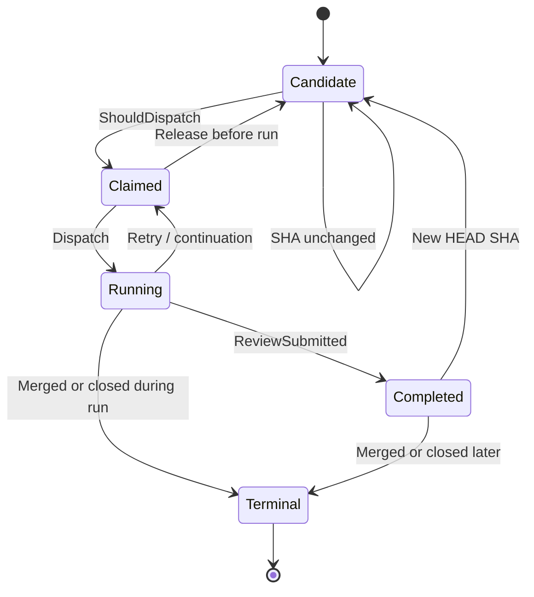

# DotCraft PR Review Lifecycle Specification

| Field | Value |
|-------|-------|
| **Version** | 0.3.0 |
| **Status** | Living |
| **Date** | 2026-05-04 |
| **Parent Spec** | [Symphony SPEC](https://github.com/openai/symphony/blob/main/SPEC.md), especially [§7 Orchestration State Machine](https://github.com/openai/symphony/blob/main/SPEC.md#7-orchestration-state-machine) and [§8 Polling, Scheduling, and Reconciliation](https://github.com/openai/symphony/blob/main/SPEC.md#8-polling-scheduling-and-reconciliation) |

This spec defines the DotCraft-specific delta for automated GitHub pull-request review. Symphony owns the shared orchestrator lifecycle, polling, reconciliation, retry/backoff, and stall detection rules. DotCraft keeps only the behavior needed to review PRs safely with in-memory HEAD SHA tracking and COMMENT-only GitHub reviews.

---

## 0. Scope vs Symphony

| Category | Behavior |
|----------|----------|
| Inherited from Symphony | Poll loop, candidate dispatch structure, active-run reconciliation, retry/backoff, stall detection, terminal workspace cleanup, and worker attempt lifecycle. See Symphony §7-8. |
| DotCraft simplification | PR HEAD SHA tracking is in memory through `ReviewedSha`; PR reviews always submit GitHub `COMMENT`; there is no PR label gate; PR completion does not write back tracker state beyond the GitHub review comment. |
| DotCraft extension | `ReviewedSha` cleanup has two paths: active running-entry cleanup and completed-PR scanning during reconcile. |

This spec is scoped to the built-in GitHub PR source used by DotCraft Automations. It will be deprecated after [DotCraft Symphony](dotcraft-symphony.md) replaces the Desktop GitHub integration and built-in GitHub source.

---

## 1. Scope

### 1.1 This Spec Defines

- PR candidate selection rules that differ from a generic Symphony issue tracker.
- The `HeadSha` field and in-memory `ReviewedSha` map.
- The DotCraft internal PR state names used by the orchestrator.
- The `SubmitReview` behavioral contract.
- Cleanup rules that prevent stale SHA entries after PR merge or close.

### 1.2 This Spec Does Not Define

- General orchestrator poll, dispatch, retry, or reconciliation behavior. See Symphony §7-8.
- Local automation task lifecycle. See [Automations Lifecycle](automations-lifecycle.md).
- Long-lived comment storage, review rounds, or web review UX. See [DotCraft Symphony](dotcraft-symphony.md).
- GitHub diff fetching, workspace provisioning, or agent execution mechanics except where they affect the SHA lifecycle.

---

## 2. PR Discovery

### 2.1 Candidate Selection

On each poll tick, the GitHub source fetches open pull requests and applies these DotCraft-specific filters:

| Step | Filter | Action |
|------|--------|--------|
| 1 | `draft == true` | Exclude. Draft PRs are never review candidates. |
| 2 | `PullRequestActiveStates` | Keep only PRs whose derived state matches a configured active state. |

All open, non-draft PRs in an active review state are eligible. There is no label gate.

### 2.2 HEAD SHA Mapping

Every `TrackedWorkItem` or `AutomationTask` of kind `GitHubPullRequest` must carry the current PR `head.sha` as `HeadSha`. The value is `null` for issues and non-GitHub local tasks.

---

## 3. HEAD SHA Tracking

### 3.1 Data Model

The orchestrator keeps:

```csharp
Dictionary<string, string> ReviewedSha
```

The key is the PR work-item ID. The value is the HEAD commit SHA that was last reviewed successfully.

### 3.2 Lifecycle

| Event | `ReviewedSha` action |
|-------|----------------------|
| Review submitted successfully | Record `ReviewedSha[prId] = headSha` when `headSha` is non-null. |
| Running PR reaches terminal state | Remove `ReviewedSha[prId]` during active-run reconciliation. |
| Completed PR later reaches terminal state | Remove `ReviewedSha[prId]` during completed-PR cleanup. |
| New commits pushed | Keep old value until the next poll detects that current `HeadSha` differs. |
| Orchestrator restart | Start with an empty map. Open PRs are reviewed once on the first eligible poll. |

The map is intentionally in memory. Occasional redundant reviews after restart are acceptable and avoid persistent state complexity.

### 3.3 Cleanup Safety

Completed-PR cleanup runs during every reconcile tick. It excludes IDs currently in `Running` or `Claimed` to avoid races with active agent sessions. Missing GitHub snapshots are treated conservatively: the entry is kept.

---

## 4. PR Review Lifecycle State Machine

The states below are DotCraft internal names layered on top of Symphony's orchestrator lifecycle.



### 4.1 State Definitions

| State | Description |
|-------|-------------|
| `Candidate` | Open, non-draft PR in an active review state and not blocked by `ReviewedSha`. |
| `Claimed` | Orchestrator selected the PR for dispatch and prevents duplicate dispatch. |
| `Running` | Agent session is actively reviewing the PR. |
| `Completed` | A COMMENT review was submitted and the reviewed HEAD SHA is recorded. |
| `Terminal` | PR was merged, closed, or otherwise reached a configured terminal state. Workspace and SHA entries are cleaned. |

### 4.2 Re-Review Trigger

A completed PR becomes a candidate again when:

1. A new commit is pushed to the PR branch.
2. The next poll fetches a different `HeadSha`.
3. `ShouldDispatch` compares current `HeadSha` with `ReviewedSha[prId]`.
4. The mismatch makes the PR eligible for dispatch.

---

## 5. DotCraft Dispatch Delta

The PR-specific `ShouldDispatch` check runs after Symphony's source-neutral running/claimed/capacity checks:

```text
if ReviewedSha[prId] == currentHeadSha:
  return false

if ReviewedSha contains prId and currentHeadSha differs:
  remove prId from Completed
  return true

return true
```

New PRs have no `ReviewedSha` entry and pass through. Issue-specific blocker checks are unaffected.

---

## 6. Agent Review Contract

### 6.1 COMMENT-Only Policy

The `SubmitReview` tool always submits GitHub reviews with event type `COMMENT`. It accepts structured payloads:

| Field | Meaning |
|-------|---------|
| `summaryJson` | Review summary payload. |
| `commentsJson` | Inline or file-level comments payload. |

Automated reviews must not approve or reject PRs on GitHub. `COMMENT` provides feedback without affecting human code review state or auto-merge rules.

### 6.2 Completion Flag

The tool provider exposes `ReviewSubmitted` or equivalent runner state. The orchestrator records `ReviewedSha` only when the agent run exits after a successful `SubmitReview` call.

---

## 7. Post-Review Completion Flow

### 7.1 Successful Review

When the agent exits normally after calling `SubmitReview`:

1. Record `ReviewedSha[prId] = workItem.HeadSha` when `HeadSha` is non-null.
2. Release `Claimed`.
3. Treat the PR as `Completed` until `HeadSha` changes or the PR reaches a terminal state.

### 7.2 Review Not Submitted

When the agent exits normally but did not call `SubmitReview`, no SHA is recorded. The orchestrator schedules a continuation retry according to Symphony §8.4.

### 7.3 Failed or Cancelled Runs

Failed runs use Symphony retry/backoff. Cancelled runs release the claimed slot. Neither path records `ReviewedSha`.

### 7.4 Terminal Cleanup

Two cleanup paths remove stale SHA entries:

| Path | Trigger | Action |
|------|---------|--------|
| Running-entry cleanup | Active reconciliation sees a running PR reach terminal state. | Stop the agent if needed, clean workspace, remove `ReviewedSha[prId]`. |
| Completed-PR cleanup | Reconcile scans `ReviewedSha` entries outside `Running` and `Claimed`. | Remove entries whose current GitHub state is terminal. |

---

## 8. Configuration

| Field | Description |
|-------|-------------|
| `PullRequestWorkflowPath` | Enables PR review dispatch when set. Clearing it disables PR tracking. |
| `PullRequestActiveStates` | States considered active for candidate selection. Default: `["Pending Review", "Review Requested", "Changes Requested"]`. |
| `PullRequestTerminalStates` | States that trigger terminal cleanup. Default: `["Merged", "Closed", "Approved"]`. |
| `MaxConcurrentPullRequestAgents` | Dedicated concurrency limit for PR agents. `0` shares the global limit. |
| `Polling.IntervalMs` | Poll tick frequency in milliseconds. |

There is no label-gate configuration. Restrict PR tracking scope through `PullRequestActiveStates`.

---

## 9. Deprecation Note

This spec remains valid only for the built-in DotCraft GitHub source. After [DotCraft Symphony](dotcraft-symphony.md) lands and replaces Desktop GitHub integration, this file should be removed with the built-in GitHub source.
